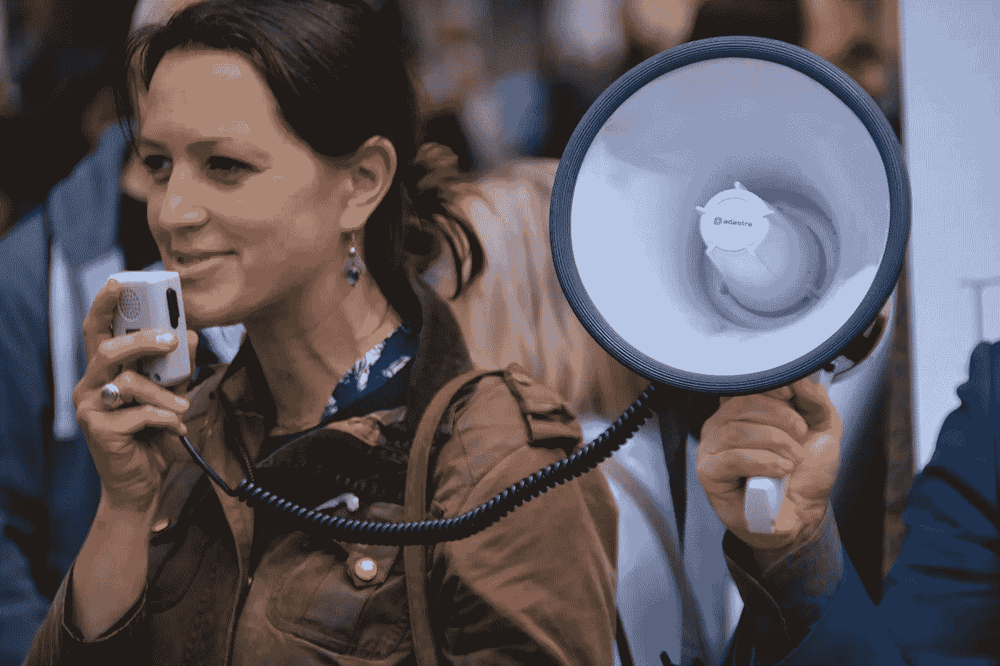

# 放逐这些懦弱的话，真正得到你想要的

> 原文：<https://medium.com/swlh/banish-these-wimpy-words-and-really-get-what-you-want-fcfc02906ffe>

你可能希望在生活的某个方面有所发展。

对于我们的人际关系、事业、健康和幸福，我们都有**梦想**和**目标**。

你有过设定目标却没有达到的经历吗？没关系，我们都有。

你可能从一开始就破坏了你的努力。

我注意到人们说话的方式让他们无法达到目标。

我甚至抓到**自己**在做这件事，我被训练得更清楚！

目标越是在舒适区之外，或者超出了相信它的能力，我就越注意到这些软弱无力的话。

# 软弱无力的话。

我想…

我会努力…

也许…

可能…

希望…

有一天…

我要去…

# 它发生了。这些话是无意中说出来的。

潜意识中的恐惧和怀疑开始发出声音。

它们是偷偷摸摸的，所以它们以看似无辜的词语出现，夺走了我们的力量。

但是我们很聪明，也很清楚，所以我们可以听出这些单词，并马上做出纠正。

即使感觉不可思议，或者几乎不可能，说出你的意图，

> 我是…

我告诉宇宙你已经准备好了。你很有能力。你是说**生意**。

不是“我要…”

> 我是

“我要”并不能完成任务。那是**拖延症**在说话。那是怀疑。

如果你很难相信自己的宣言，那就称之为**“提前说实话”**。

# 以下是我最近为自己设定的三个个人健康目标:

> 我每天至少在 7 点前醒来。
> 
> 我每天锻炼一小时，一周五天。
> 
> 我只吃非加工食品。

它能保证我不会犯错吗？不

**是否明确**告诉世界我想要什么？是

这是否让我更有信心，更有可能坚持我的目标？是

# 我们中的一些人被教导不要太直接。

> 你以为你是谁？不要太自大了！不要抱太大希望，你只会失望。

女性通常会意识到，直截了当不像淑女，但男性也不能幸免。

如果你觉得说话如此直接很尴尬，开始先只对你自己宣布你的目标。

当你越来越有勇气的时候，在你取得了一点点进步之后，大声地与他人分享。(人们急于在你开始做某件事之前告诉你为什么不能做，但是一旦他们看到你已经开始取得进展，就很难停止这种势头。)

见鬼，在评论区分享吧！公开宣布它们**真是一个强有力的行动！**

*****你值得拥有真正的终身幸福，这种幸福无论世界上发生什么样的疯狂都无法从你身边夺走。*** [***读我的书，开心过***](https://happyeverafter.info/) ***。我们现在都可以利用这一点。*****

*****拜访我*****

***所有图片均来自 pixabay.com 开源网站***

******

## ***这个故事发表在 [The Startup](https://medium.com/swlh) 上，这是 Medium 最大的企业家出版物，拥有 358，974+人。***

## ***在这里订阅接收[我们的头条新闻](http://growthsupply.com/the-startup-newsletter/)。***

******