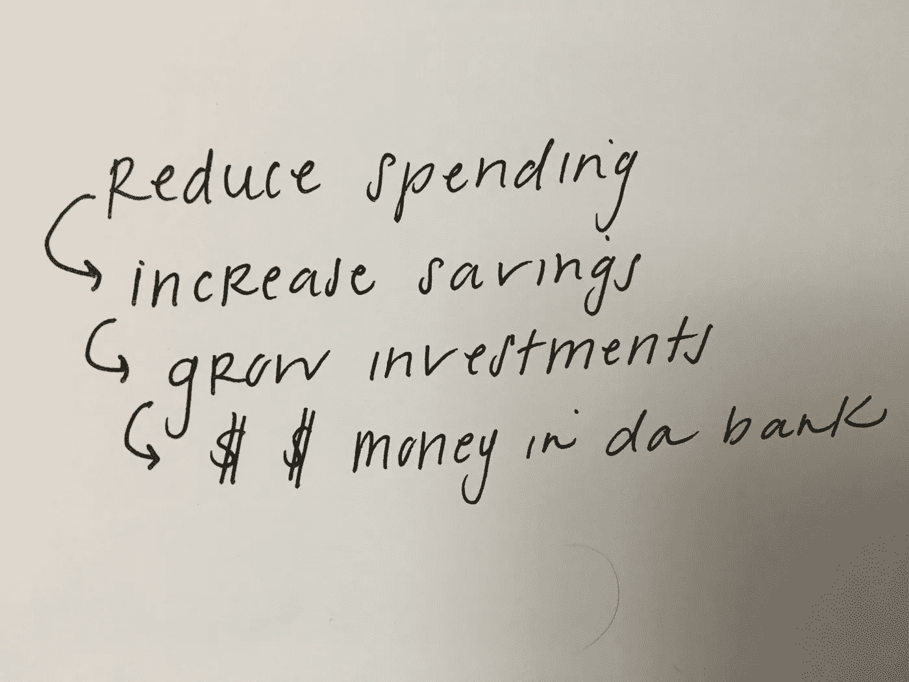

# 基本的理财指南

> 原文：<https://medium.com/swlh/basic-b-tchs-guide-to-growing-money-75611b2c5f01>

我最近痴迷于学习金钱。这不是我从小到大学到的。现在我 29 岁了，已经读了几本关于这个主题的书，让我和你们分享一下钱是如何在最基本的意义上增长的整体结构。

增加财富有几个先决条件。首先，你需要有收入。第二，你需要建立一个紧急储蓄账户，里面有 3-6 个月的生活费，作为万一发生什么可怕事情时的退路。

第三，你必须把偿还债务作为首要任务。债务利率通常很高，偿还债务是浪费金钱。不惜一切代价避免债务，除非它与家庭或教育有关，但即使如此，也要明智地选择。

戴夫·拉姆齐的书《金钱大变身》是处理债务和建立紧急账户的绝佳资源。我从他那里学到的最有价值的一课是，当你负债时，你不可能变得富有。如果你有 10 万美元的债务，即使你有 7.5 万美元的存款也没关系。摆脱债务让你进入收益的积极面，让你更接近财务稳定/富有。

关于还债，有很多话要说，我不是想把前提条件过于简单化，而是想说的是钱的增长，所以我要继续了。

一旦你满足了先决条件，赚钱的机会就真正开始了。增加财富有两个主要步骤:

1.  第一步，减少每月开支，这样可以增加你每个月可以存的钱。
2.  第二步，明智地投资储蓄。明智投资基本上意味着用你的储蓄去购买那些会升值的东西。

目标是创建一个足够大的投资组合(储蓄+投资=投资组合),以产生自己的收入。这被称为“被动收入”，因为你是在赚钱，而不是在工作。这增加了你的总月收入，允许你每月投入更多的储蓄，从而增加你的投资组合。从而形成一个循环。你越投入，它越成长；它越成长，就越被动地为你赚钱。如果你能获得足够高的收入，你就可以在不需要传统工作的情况下度过余生。

为了让这个账户价值高，你得把你存的钱投资进去。存钱只是第一步，你必须用它来投资，产生被动收入，这样你就可以赚更多的钱，而不仅仅是工作。有两种主要的投资方式:

1.  把你存的钱投资到股票上。你要么需要在这方面自学，要么与在这方面受过教育的人合作，以确保你的投资是明智的。在《富爸爸，穷爸爸》一书中，作者说在学习投资时你必须冒一些风险，每个人都会有损失。然而，这是学习游戏的一部分。如果你想学习，在你学习的时候，从低风险的情况开始。记住，这不是快速赚钱，这是一个长期的游戏。总的来说，如果你玩得明智，这是一个很好的增加你储蓄的方法。
2.  把你存的钱投资到房地产上。学会观察不同的市场，在房地产价格低的时候投资，因为房地产通常会随着时间的推移而升值。投资房地产的人喜欢在房地产市场低迷、东西更便宜的时候购买，希望市场会好转，最终房子会卖得更高。

拥有投资房产的人也喜欢从小处着手，一步步发展。例如，他们可能从购买一所房子开始，然后出租或改造它，当他们出售它时，他们立即将这笔钱投入另一个财产，如复式公寓，然后是一个小公寓，然后是一个存储设施，等等。从始至终，他们都在从那处房产中赚钱，要么是通过出租，要么是因为它在升值。此外，如果他们在出售前一处房产的几个月内将钱投入下一处房产，只要这些钱仍用于投资，他们就不必为赚来的钱缴税。

3.合作也有好处，它会给你很大的税收减免，从而让你每个月有更多的钱来投资。然而，我还没有真正理解它。更多信息来了。

所以，我们的目标基本上是存钱，这样你就可以把钱投资到资产上，增加你的资产，这样你就有了被动收入。

有这么多关于如何减少开支和省钱的好书和想法。这些是我应用的最重要的经验:

*   规则 1:不要过度限制自己。没有人喜欢破产的感觉，你也不需要。这并不是说除了必需品之外，什么都不要，而是说你要在花钱上更加挑剔(T2)。
*   减少总体支出，尤其是与住房相关的支出。住房和汽车通常是每月最大的吸金大户。少买你买得起的东西，可以让你存更多的钱。多骑自行车/走路。
*   广告和我们的消费文化不欣赏储蓄。你不可能既拥有所有最新、最酷、最贵的东西，又能合理储蓄。储蓄比拥有所有东西更有价值。
*   你不应该买立即贬值的东西。这包括新车、非常昂贵的衣服、新玩具(船、滑雪装备)等。大多数东西一买就贬值。如果下跌 20 美元，那是一回事，但如果下跌 1000 美元，那就太多了。为了避免这种情况，买一两个旧型号，或者买二手的，这样既能买到你想要的东西，又能省钱。
*   意识到储蓄比消费更有趣(大多数时候。想象一下，你可能是一个富有的人。
*   意识到当你不经常买东西时，你实际上是在帮地球一个忙。你占用更少的环境资源，产生更少的污染和垃圾。如果你停下来想一想，我们扔掉了多少东西，却没有任何好的理由，那是在掩饰。
*   想办法不要或凑合着过。我想要一个电饭煲，但是我不需要电饭煲，这样可以节省橱柜空间、去商店的次数和金钱。
*   欣赏极简主义，对你带进家里的东西非常挑剔。当你喜欢省吃俭用时，存钱就容易多了。
*   买质量。当我买靴子时，它们很贵。但它们也能持续几个季节，从长远来看，还能降低成本和消耗。购买耐用且永恒的商品。时尚转瞬即逝，优质的主食可以持续很长时间。
*   修复你的质量项目，而不是替换它们。补鞋，重新系紧首饰，修补破洞，把你最喜欢的钱包的带子缝回去。

这样想吧，当你不投资那些你并不真正关心的一次性物品时，你投资的是你非常关心的东西，一个储蓄账户。$$$$.

创建预算:

通过与朋友的交谈，我了解到我有一种不同寻常的预算方式。我将与你分享它，因为它对我有用，我喜欢它。我曾经在富国银行工作，在那里我设立了 7 个不同的储蓄账户。每个月的发薪日，我都会自动将一定数量的钱转到这些账户中。经过几个月的储蓄，我攒的钱足够买任何我想买的东西，而且不影响我的整体预算。这种方法需要偶尔的耐心，但它很好，因为我不用把东西放在信用卡上。根据你的目标，你可能会有不同的储蓄账户，但总的来说，这些都是为了*不寻常但却是意料之中的购买。*

老公积蓄:用来给老公买特别的礼物(篮球赛门票，新鞋等。)

旅行:用来买机票/Airbnb。一个月 100 美元，日积月累。

房子:用来为房子买特别的东西(比如一张新沙发或地毯。)

汽车:当我需要新轮胎、换油、修理或注册时使用。

昂贵的东西:用来请我去按摩、美容，或者偶尔买昂贵的饰品。

圣诞节:用作每年 12 月的礼物预算。

长期:我的大部分积蓄都放在这里。它用于转入投资账户。

除了我存入每个储蓄账户的钱之外，我每周还会把一定数量的钱转入我的“消费”账户。这是我用来支付食品杂货、汽油和我的小心脏一周梦想的任何东西的钱。如果用完了…那就完了。再也没有星巴克，再也没有快乐时光，直到下周五，我的零花钱再次被转移。这是一个很难平衡的问题…但是过一会儿，你就会习惯了。

所以你所有的储蓄+你所有的固定账单+你所有的每周津贴=你的总收入。随着你收入的增加，增加你的储蓄，而不是消费。

仅此而已。这基本上是我到目前为止学到的所有东西。还有很多要学，但是基础正在建立。为我们所有人的好运和更多的教育干杯。干杯。

❤

## 这个故事发表在 [The Startup](https://medium.com/swlh) 上，这是 Medium 最大的企业家出版物，拥有 289，682+人。

## 订阅接收[我们的头条新闻](http://growthsupply.com/the-startup-newsletter/)。

