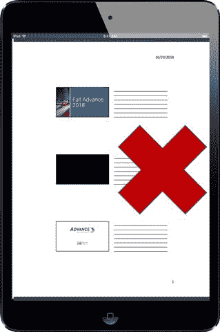
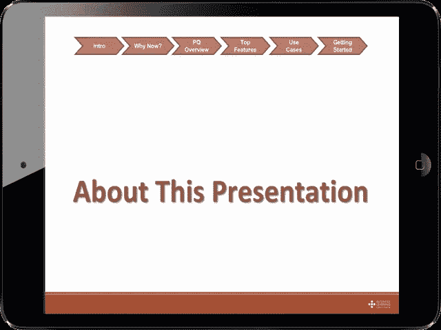

# 提供数字内容的基本技巧

> 原文：<https://medium.com/swlh/basic-tips-for-providing-digital-content-7e4f12531712>

## 现在是 2018 年，我们必须变得更好

**Handout Viewed on iPad — NO!**

我下周将参加一个继续专业教育课程，刚刚收到一封电子邮件，通知我可以下载课程材料。

> **"节目素材**
> 
> “俄亥俄州注册会计师协会 ***在我们的研讨会*** 上实现了无纸化。该材料可以通过该协会商店上的链接获得。**计划中不提供印刷材料**。

> 我无纸化办公，所以这很棒，对吧？
> 
> 没那么快。

这个演示文稿被下载到我的 iPad 上，每页包含三张幻灯片——在我的移动设备上几乎无法使用。

# 有什么问题(或者机会？)这里？

1 —我们许多人在移动环境中工作，不想打印演示文稿。

2 —会议协调员假设所有与会者都将打印文档。不提供用于数字用途的单独文档。

3-演示者错过了一个提供交互式、数字友好文档的大好机会，这对与会者非常有用。

# 以下是一些注意事项(只是一些…)

*   ***提供多种下载选项***——一页多张幻灯片(供想要打印的人使用)和支持数字功能的版本。
*   ***每页一张幻灯片。这似乎是显而易见的，但是数字文档的页数并不重要。***
*   ***包含讲义中提到的相关内容的超链接*** 。*与会者可能想点击链接了解更多信息。*
*   ***使材料互动*** —触摸导航(点击区域区域返回目录页，链接目录便于章节导航等。)
*   在幻灯片上包含超链接目录或 ***导航栏*** 。

**Sample Navigation Bar on Presentation Handout**

正如[汤姆·彼得斯](https://tompeters.com/)在[中传达的卓越红利](https://tompeters.com/writing/books/excellence-dividend/)，*“卓越就是下一个五分钟。”*

> 让我们做得更好。我们必须做得更好！

## 关于唐

> “是时候改变了”

## 让我们连接

[LinkedIn](https://www.linkedin.com/in/dontomoff) ， [Flipboard](https://flipboard.com/@dtomoff) ， [Twitter](https://twitter.com/@dtomoffcpa) ， [Snapchat](https://www.snapchat.com/add/dtomoff)

## 这篇文章发表在 [The Startup](https://medium.com/swlh) 上，这是 Medium 最大的创业刊物，有+383，719 人关注。

## 订阅接收[我们的头条](http://growthsupply.com/the-startup-newsletter/)。

