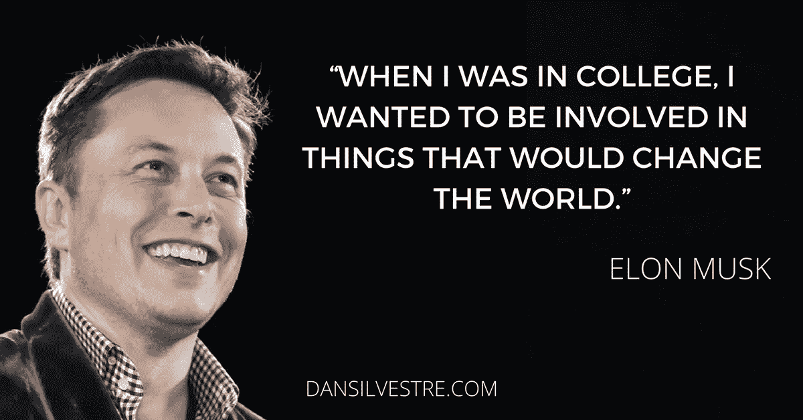

# 分批完成任务会带来丰硕的成果

> 原文：<https://medium.com/swlh/batching-your-tasks-brings-fruitful-results-c168b4886534>

我们该学习如何以正确的方式处理多项任务了！

[https://dribbble.com/Martin_Kundby](https://dribbble.com/Martin_Kundby)

伙计，我觉得我拖得太久了。

周围的每个人都说“杰森，你工作太努力了”。嗯，事实上不，我不是。

我需要达到很高的标准，但有时我觉得自己只达到了最低标准。

本周，我在杜鲁门学院开设了一门商业课程，像往常一样，老师们通常会马上切入主题。感谢我读的书，我做的研究，以及来自 Medium 的文章，让我对商业中发生的事情有了很好的理解。

面对这种给我拖延感觉的风暴，我不得不采用“*重叠任务*方法。

在读了[丹·西尔维斯特](https://medium.com/u/9550824f03cb?source=post_page-----c168b4886534--------------------------------)的一篇文章《疯狂成功的 10 大生产力》后，我有了一点理解。

> 马斯克战略性地执行多项任务。只要有可能，他就把几个任务结合在一起，这种生产率黑客称为*批处理。例如，他在吃饭时回复电子邮件，或者在午餐时开会。*
> 
> 这是埃隆在这个问题上的一句话:
> 
> “但我发现，我能够和(我的孩子)在一起，还能收发电子邮件。我可以和他们在一起，同时还能工作……否则，我就无法完成我的工作。”
> 
> 另一个例子是在电话会议或面试时查看电子邮件和发票。
> 
> 应用这个生产力秘密
> 
> 研究证实，多任务处理通常不如单任务处理有效率。大脑在导航不同任务时需要时间进行调整，也称为*任务切换*。切换让你感到疲惫和没有效率，而不是任务本身。
> 
> 但是如果你批量处理需要*相似心态*的相似任务，你可以有效地处理多个任务而不会丢失你的工作流程。换句话说，你的大脑一次只专注于一种任务。
> 
> 这里有几个例子:
> 
> 一口气列出你下周所有的博客文章
> 
> 一次处理所有电子邮件、空闲时间、电话和其他通信
> 
> 同时更新几个相关的工作表
> 
> 为了找到更多可以叠加的活动，写下当天和一周的所有常规活动，并确定哪些可以一起叠加。尝试批处理几次，必要时重新安排任务。
> 
> ~阅读章节致谢:[丹·西尔维斯特](https://medium.com/u/9550824f03cb?source=post_page-----c168b4886534--------------------------------)

现在应该以不同方式完成的事情:

*   主题相关的多任务(例如，彩色铅笔、记号笔和蜡笔都是重点，而手机、笔记本电脑和平板电脑则在不同的时间一起关注

在过去的几天里，我一直在整理我的工作。我会一边做经济学课上的作业，一边为 ShareMe 做商业模型，或者读一本关于设计思维的书。

我记得当我准备写一篇题为“我有时想知道并问自己为什么我在英语课上得了 C，但我喜欢我的文章”的文章时。

这就是我所说的:

> 我有时会想，如果我的老师说她“喜欢我在校外写的东西”，我为什么会在英语课上得 C。直到今天，我仍在质疑自己。77%….我知道我不值得那样。
> 
> 但是，有一样东西阻止我停下来写作，那就是媒体的平台。有了 Medium，我有了一个吸引人的社区，他们愿意花时间阅读我的文章，并帮助我的文章呈现给其他人阅读。
> 
> 你在学校做错了什么？
> 
> 嗯！这个问题问得好。几乎没有什么事情会让我跌到 77%。
> 
> 事实上，学生需要尽“最大努力”完成分配给他们的写作任务(在大多数情况下，学生并不感兴趣
> 
> ~ 2018 年 1 月 10 日起稿

问题是因为我从来没有同时处理过相关的事情。

我曾经研究人体解剖学，同时也研究企业家精神，显然我会失败。

开始了。

所以你明白我的意思了。已经测试过了，所以不要做。

整个学期中，我的某些分数并不好，只是因为我把事情搞混了。

这适用于生活中的任何环境。做太多的事情会让你困惑，所以相应地计划事情，分批完成你的任务以取得丰硕的成果。

如果你喜欢我的文章，请不要忘记粉碎 50👏让这篇文章浮出水面。不要贪心，自己留着吧！！

## **如果你错过了我的上一篇文章:**

*   [扩大知识面的悖论](/swlh/the-paradox-of-expanding-your-knowledge-8ed457230095)

## 相关文章*除了本文，请阅读以下内容:

*   [许多创业公司起步时的扭曲](/the-expeditioner/the-distortion-in-starting-many-startups-1d23b03e48fd)

## 关于作者的更多信息:

我今年 16 岁|是一名 Android 开发人员|文档出版公司的首席执行官|内容营销人员

*   如果你有兴趣和我一起跟进，请查看我的网站[www.jaysondombele.wordpress.com](http://www.jaysondombele.wordpress.com)
*   如果你对我的 ShareMe 创业感兴趣，请查看下面的链接:[www.jdombele.wixsite.com/shareme](http://www.jdombele.wixsite.com/shareme)
*   如果你想在 LinkedIn 上关注我，请点击下面的链接:[www.linkedin.com/in/jayson-dombele-195a55155](http://www.linkedin.com/in/jayson-dombele-195a55155)
*   想要了解政治、商业、科技等方面的新闻吗？https://documentedpress.wordpress.com/

任何问题，业务查询或关注，请随时发送电子邮件给我@:jdapple4357@gmail.com

## 这篇文章发表在[《创业](https://medium.com/swlh)》上，这是 Medium 最大的创业刊物，有 287，184+人关注。

## 在这里订阅接收[我们的头条新闻](http://growthsupply.com/the-startup-newsletter/)。

