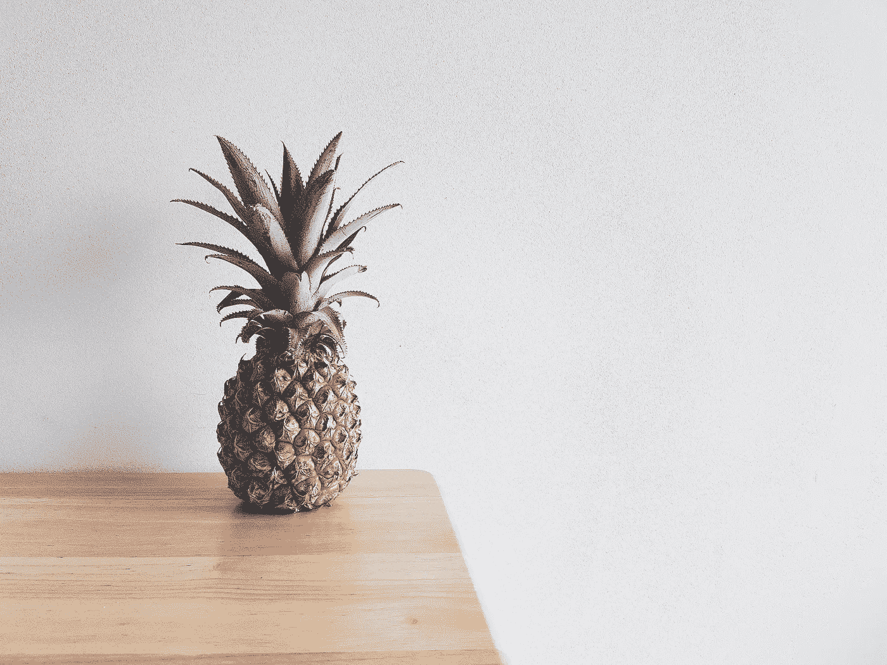

# 做一个菠萝

> 原文：<https://medium.com/swlh/be-a-pineapple-60e3c7b8e695>

Photo by [Aurélien Sinte](https://unsplash.com/photos/eudGUrDdBB0?utm_source=unsplash&utm_medium=referral&utm_content=creditCopyText) on [Unsplash](https://unsplash.com/?utm_source=unsplash&utm_medium=referral&utm_content=creditCopyText)

决定写些什么总是一场斗争。有些日子，像今天，我太累了，想不出任何合理的好东西——以及解释它的词语。

今天，我想和你分享为什么，以及如何，你应该像一个菠萝。圣诞节，我收到的礼物之一是一个电池组。因为家人太了解我了，所以挑了一个最适合我性格的完美。“站得高，戴着皇冠，内心甜蜜”是这么说的。

你听过更好的建议吗？在这个世界上，有如此多的信息、文章、视频、对话，人们四处流动，鼓励着如此多的事情。用这个，做这个，想这个，做这个。但真的，很简单。

做一个菠萝。

# 1.巍然屹立

你周围发生了很多疯狂的事情。海浪正汹涌而下。人们在拥挤。站直了。保持头脑清醒。提醒自己你已经得到了这个。克服你面临的每一个困难的一半是记住你仍然有力量站起来，并且骄傲地站起来。

> 站直了。不要让任何人打倒你。你比你所知道的更有价值。做一个倡导者。为自己挺身而出，也为其他需要的人挺身而出。充满力量、尊严、独立和优雅地生活。有时生活会像飓风一样向你袭来，你会觉得自己就像迷失在波涛中的一粒沙子。别让自己淹死。站直了。(艾丽莎·胡佛)

我谅你也不敢去想迄今为止你所经历的一切。为了迎接新的一年，我一直在回顾 2017 年以及我所经历的、克服的、学习的和为之奋斗的一切。

太不可思议了。

我建议你也这样做。想想你所经历的一切，你所经历的所有成功——个人的，精神上的，心理上的，任何你能想到的。你在许多战役中获胜。以同样的态度进入休息。你不仅仅是一个征服者。你能做到的。

放下你过去的错误，意识到你已经取得了多少胜利，然后继续前进。

> 让过去死去吧。如果有必要，杀了它。这是成为你命中注定的人的唯一途径。(凯洛·伦，最后的绝地)

像菠萝一样挺立。

> 听着，保持警惕，在信仰中挺立，勇敢，坚强。(哥林多前书 16:13)

# 2.戴王冠

在我的一生中，我最喜欢的电影一直是《公主日记》。如果没有这部电影，我想我不会成为今天的我。像大多数女性一样，我以前也渴望成为一名公主。尽管有这个梦想，我怀疑我永远不会成为其中一员。

然而，这并没有消除戴皇冠的重要性。请注意，我说的不是一顶有形的王冠，尽管它们留在身边很好，但我说的是一顶象征性的王冠。

在我解释之前，请允许我快速参考一下这部电影。在电影中，米娅,“公主”被她最好的朋友告诫她必须如何接受王冠。为什么？因为它有能力造成。现在，她的朋友不是在谈论权力的负面含义。当你有了王冠，当你掌权，你就有能力让世界变得不同。

> 我不想统治自己的国家，我只想过十年级。(《米娅，公主日记》)

但是当我们不是皇室成员的时候我们该怎么做呢？

请允许我解释一下，我亲爱的朋友。

走向光明——走向人们会看到你的地方。继续你的游戏。以一种表明你自信的方式穿着，我保证，你会感到更加自信。这是第一部分。然后，进入领导角色，成为一个对他人来说是“道德指南针”的人。给大家做个好榜样。展示什么是可能的。

你是你王国的中心。你在你朋友群的中心。不管你是否意识到，所有的目光都在看着你。拥有你的王冠。自豪地穿上它。再加上昂首挺胸。

做一个女王，一个公主，一个国王，一个王子，无论你想做什么。

当人们看到你的时候，过一个让他们变得有灵感并渴望戴上皇冠的生活。用优雅、爱和仁慈来管理你的人民——就像电影里一样。记住你真正的影响有多大。

戴上你的皇冠。

> 万一我还不够古怪，让我们再加一个头饰吧！

# 3.内心甜蜜

这一个是相当自明的。千万不要作假。永远不要让别人相信你不真实的一面。

就像灰姑娘说的，凡事要有勇气，要善良。永远不要低于你通常坚持的标准。

> 你以你认为的方式行动。(劳拉·詹金斯)

你内心的感受就是你将要向世界描绘的。内心要如此甜蜜，当你向别人展示你的真心时，别人会情不自禁地微笑。爱无止境。给别人比他们应得的更多的原谅和第二次机会，因为这些是你自己得到的。

也许有时候你外表有点粗鲁，但总是让你的真实意图和你对这个世界的爱闪耀出来。

凡事都要向基督显现。内心甜蜜。

做菠萝需要勇气。事实是，菠萝是不同的，它们不像其他水果。

> 勇气不是没有恐惧，而是判断出有比恐惧更重要的东西。勇敢的人可能不会永远活着，但谨慎的人根本不会活着。从现在开始，你将在你认为你是谁和你能成为谁之间的路上旅行。关键是允许自己踏上旅程。

世上没有完美的菠萝，但你可以成为一个真正的好菠萝。有勇气，敢于与众不同。凡事挺胸抬头。无论你在哪里，别忘了你的王冠。最重要的是，尽可能的甜蜜。

这就是如何成为一个菠萝。

**爱你的凯蒂**

## 这篇文章发表在[《创业](https://medium.com/swlh)》上，这是 Medium 最大的创业刊物，有 277，994+人关注。

## 订阅接收[我们的头条新闻](http://growthsupply.com/the-startup-newsletter/)。

