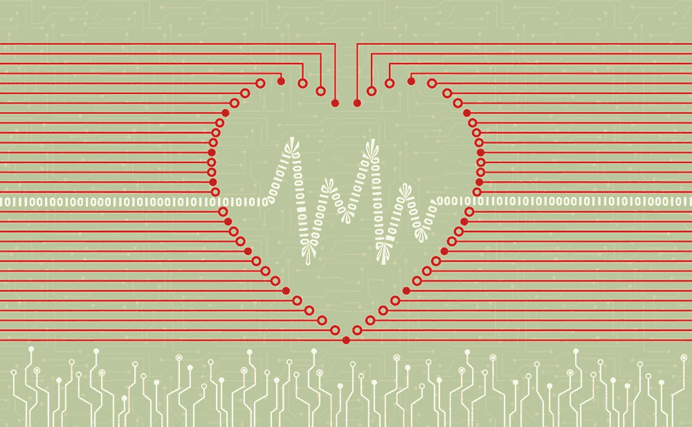
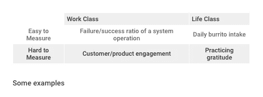

# 做得更好:为什么改进的唯一方法是衡量它

> 原文：<https://medium.com/swlh/be-better-at-being-better-why-the-only-way-to-improve-it-is-to-measure-it-ab2fb8d6c127>

*这是为生活和工作建立成长心态系列 6 部分中的第 2 部分*

很少有问题比“我们如何改进它”更接近人性。这是我们作为进化物种的核心优势之一。一个允许我们用农业超越饥荒，用印刷术和互联网使知识民主化，并轻松跨越大陆的时代。几乎总是这样，“创新的”或“巧妙的”是授予某人的一个令人钦佩的术语。在工作和生活中，企业家精神的本质就是不断改进。那么，作为一个雄心勃勃的分析者和亲密的人类，我们能不断改进吗？我们能不能开发一个优雅而简单的框架，围绕着在工作和生活中如何改进？更重要的是，我们的框架能预测改进吗？

但是首先。有一些微妙地改善。要移动指针，你必须知道哪个方向显示得更快*。要让数字上升，你必须知道哪条路是向上的。改进的定义本质上是一种比较。如果没有一个基线来衡量，无论是净收入，积极的偷听评论，还是每天的快乐和感激，就没有办法知道事情是否发生了变化。重要的是不要把运动误认为进步。*

## 变得更好的四个步骤

虽然用敏捷业务开发来研究“工人阶级的情况”还相对年轻，而面向增长的产品开发(或者更通俗地说，“增长黑客”)更是如此，但已经有数千年的研究，由大量学生在处理“生活阶级的情况”的姐妹领域中完成——自我改善的心理学。许多生活类改变方法的概要版本遵循四个步骤；

1.  认识到消极的模式，
2.  打断他们，
3.  用积极的模式代替消极的模式
4.  用签到来强化积极的模式。

工作和生活有很多共同点，在这一点上，对称性是显而易见的。例如，在采取残酷的分析立场时，第一步看起来可疑地像是测量的必要性。后两步暗示了与敏捷开发惊人的相似。最后一步可能是另一个学期的回顾或每日/每周/每月的检查。

## 变得更好的四个步骤

度量还有一些额外的微妙之处，因为有容易度量的东西，也有难度量的东西。然而，一旦被测量并保持在头脑的最顶端——传统上通过用墙板宣传它们来完成——卡尼曼、特沃斯基和其他人所做的大量研究表明，当它们出现时，我们将被引导看到优化和机会。测量不仅是改进的必要条件，而且测量也是改进的预测。

总的来说，不管问题是容易还是难衡量，工作还是生活类，我发现有三个指导性问题可以帮助澄清我们应该衡量什么。巧合的是,“漏斗”也是这样形成的；

1.  我们想要达到的预期效果是什么
2.  预期效果的标志是什么
3.  我们如何衡量预期效果的指标
4.  当获得更多的亲密时，必要时重复出现。

## **应用**

既然我们已经在软件工程和自我完善心理学之间建立了相互尊重、理解和信任，让我们通过检查两个经典的工作类问题来应用它，同时也承认生活类问题也可以这样被解构。

一个经典的、容易衡量的工作类问题是系统操作的失败/成功比率。这个特殊的例子可能与工程公司有关，世界各地的工程公司都有专门的墙板。

> **想要的效果是什么？**

高成功率/失败率

> **高成功/失败率的标志是什么？**

系统操作成功

> **我们如何衡量系统运行的成功？**

捕获错误日志消息、全面的系统集成测试等。

随后，一个经典的、难以衡量的工作类问题是客户/产品参与度。这比前一个例子要困难得多，因为它依赖于对客户如何感知业务价值、这种感知如何转化为产品行为以及最终该行为如何在系统本身中表现出来的理解。然而，使用我们的框架，我们可以消除一些歧义。

> **想要的效果是什么？**

高客户参与度

> **什么是高参与度的标志？**

高客户价值活动的可预测节奏

> **我们如何衡量高客户价值活动？**

记录客户执行某项高价值活动的频率。

*此时我们知道我们没有足够的信息，所以我们递归*

> **什么是高价值活动**

上传照片(例如)

> **上传照片的行为表现是什么**

跟随相关的应用内通知，导航到上传照片流，导航他们的图库，然后选择要上传的照片

> 我们如何衡量这种行为

记录所采取的这些步骤的数量，以及客户在每个必要步骤上花费的时间长度。

*以此类推。*

## 复杂的部分

当然，对于这个例子，能够提出有意义的问题依赖于知道什么是“高价值活动”——即，知道客户发现在这个产品中上传照片对他们是有价值的。它还依赖于对实现该价值的“关键路径”的理解。在很大程度上，有两类事物可以被测量和理解，每一类都有自己完整的专用领域:系统——数字的、抽象的、比特的宇宙——和人，模拟的、实际的、原子的宇宙。

当测量系统时，为了再次将我们自己完全置于现实和适用性中，事件研究或“大数据”是首选。这些事件可以是会话事件(比如客户的会话持续时间和产品导航)，也可以是工件(比如上传的照片)。同样，在衡量人时，人种学、心理学和人类学(通俗地称为“用户研究”，或“厚数据”)领域是最相关的。这些学科中的每一个都被完整地单独记录下来，但是这两者之间的共同点仍然缺少一张地图。

对改进的研究永远不会结束——但是通过更密切地关注我们如何进行改进，我们至少可以提高我们对改进的认识。应用心理学和产品开发共享的领域仍然相对未知，但我们仍然可以在它们之间绘制一条路线，借用数千年的存在问题，并应用一种新颖的分析天赋。在工作和生活中，反思是进步的关键——而应用反思的表现就是衡量。通过解构我们衡量的方式和内容，我们可以将我们的轨迹引向无法实现的完美目标。

*有什么反馈吗？想再讨论一下吗？你是否正在构建一些东西，并寻求如何获得更多牵引力的建议？打我*[*Harrison @ dahme . ca*](mailto:harrison@dahme.ca)