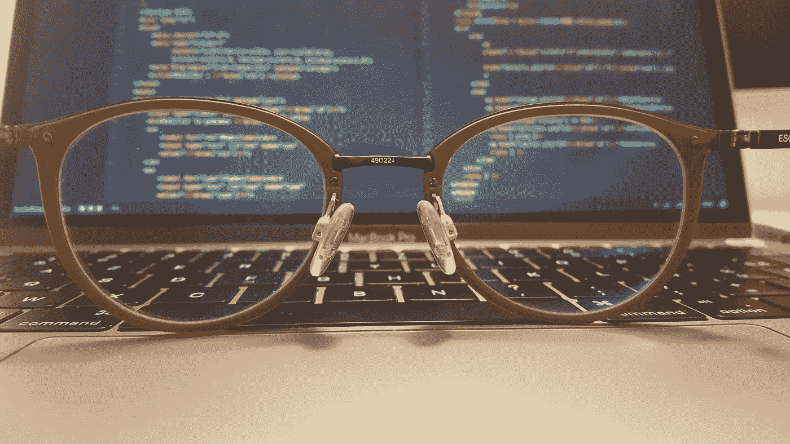

# 擅长一件事，不要事事平庸

> 原文：<https://medium.com/swlh/be-good-at-one-thing-not-average-at-everything-877d90a68cce>

*Credit to* [*Jessica*](https://goo.gl/EHsSdH)

随着时间的推移，网络在不断发展和改进，随着时间的推移，已经有太多的东西需要学习。

对于任何新来的人来说，这是非常可怕的，而且很快就会变得令人不知所措。

两年前，我开始在一家网络代理公司做勤工俭学的学生，没有具体的经验，也不知道真正的网络开发是如何完成的。第一天，我对发现新事物感到兴奋，但最害怕的是摆在我面前的艰巨任务。

最糟糕的部分(或者最好的部分，取决于你是一个半满还是半空的人)是，你对 web 开发的各个方面发现得越多，你就越意识到你实际上知道的是多么少。

# 试图了解一切

新开发人员最容易陷入的一个陷阱是试图理解和做很多事情，因为，让我们承认，每个人似乎都走在你的前面，而你必须达到的“优秀”水平似乎越来越远。

作为一名开发人员，很容易失去注意力，陷入“[闪亮物体综合症](https://www.quora.com/Whats-shiny-object-syndrome)”中。篱笆另一边的草总是更绿，编程也不例外，因为总是有新的方法来构建东西，一个比一个更令人兴奋。

在我的第一年，我开始利用空闲时间学习如何提高 Symfony 开发人员的水平，但是我在尝试使用我能得到的所有东西时失去了注意力。从 C 编译器到 Node.js，除了 Symfony 我什么都学了，因为其他的都是新的，更令人兴奋。

只要 Github 上出现新的趋势，我就可以一直继续下去。我花了无数个小时观看、阅读、学习和呼吸代码。

事后看来，我把注意力分散得太分散了。当然，学习从来都不是浪费时间。尝试新技术，了解当前生态系统中的新趋势总是好的。

然而，当你专注于一件事的时候，你真的开始推动你的极限和你的工具的极限:**一个**框架，**一个**语言，**一个**项目，等等。而你会在这个过程中获得更深层次的知识。

# 从无所不能到擅长一件事

成功需要坚定的目标。你需要做更少的事情以获得更多的效果，而不是做更多有副作用的事情。”加里·凯勒的《一件事》

(我强烈推荐阅读加里·凯勒的《一件事》，这不是你通常的编程书籍，但非常有趣，令人大开眼界)

在我作为一名在职学生的最后一年，我开始将我看到“进步”的方式从“我知道的技术和语言越多，我就越好”的心态转变为“我对我已经知道的技术和语言理解得越好，我就越好”。

所以我把重点放在我所知甚少的东西上:PHP 的后端开发。准确地说，是用 [Laravel](https://laravel.com/) 进行后端开发。

在理解了基础知识并对框架有了大致的感觉后，我更关注于用我目前的知识来构建东西，而不是学习 [GitHub](https://github.com/) 上的下一个趋势。

我开始构建东西，有用的东西(至少对我有用)，那时我开始意识到，我一直在学习新的东西，但我没有学习使用新的工具，而是学习从我已经拥有的工具中获得最好的东西。

我提高了代码的可重用性，开始使用设计模式，在我的代码库中实现了核心概念，如 [DRY](https://en.wikipedia.org/wiki/Don%27t_repeat_yourself) 和 [SOLID](https://en.wikipedia.org/wiki/SOLID_(object-oriented_design)) ，学习了[测试驱动开发](https://en.wikipedia.org/wiki/Test-driven_development)等等。

总的来说，我成为了一名更好的 PHP 后端开发人员，同时也是一名更好的开发人员。因为，当您学习并熟练使用您的工具时，您就开始学习框架或语言之外的编程，并开始实现通用于您所知道的任何技术的一般概念。

随着我逐渐成为一名不错的 Laravel 开发人员，我也开始了自己的事业，成为一名 Laravel 自由开发人员，为了专注于我所知道的并不断进步，我会做任何项目的后端工作，并将任何前端或不合适的工作交给另一名自由职业者。

这样，我真的一次只专注于一件事，同时继续提高我的自由职业技能，我不再局限于自己的知识来做一个项目。我可以继续做并提高我所知道的，同时学习一些编程之外的有价值的课程，如项目管理和远程团队合作。

# 循序渐进的学习方法

当您对使用当前工具的能力有信心时，您可以开始在您的开发人员组合中逐步实现新的技能，但不是随机的技能，在最好的情况下，这种技能将完善您的技能，目标保持不变，“用您已经知道的东西变得更好”，并且您可以通过补充技能来实现这一点。

最终目标是始终以提高现有知识为目的进行学习，以提高整体水平。通过这种方法，您可以轻松地开始使用您当前的堆栈并实现您的新工具。对我来说，这是学习 [Vue.js](https://vuejs.org/) 为我的自由职业活动建立一个更完整的开发者档案。
对于后端开发人员来说，可以将服务器管理添加到他的投资组合中，以了解如何自己实现完整的 web 应用程序。
对于一个前端开发人员来说，设置并使用 [PostCSS](http://postcss.org/) 来提高代码质量和他的工作流程。

选择是无穷无尽的，目标总是一样的:朝着一个特定的目标提高你的力量。

*喜欢这篇文章？想看看我在做什么吗？可以关注我的*[*Twitter*](https://goo.gl/fJiHjJ)*[*insta gram*](https://goo.gl/Y77U6M)*和* [*Github*](https://goo.gl/m7WMo1)*

**特别感谢:* [*阿卜杜拉耶*](https://goo.gl/2Ezjbz)*[*缪*](https://twitter.com/AukRaiser) *和* [*让·巴普蒂斯特*](https://github.com/veronj)**

****

## **这个故事发表在 [The Startup](https://medium.com/swlh) 上，这是 Medium 最大的企业家出版物，拥有 291，182+人。**

## **在这里订阅接收[我们的头条新闻](http://growthsupply.com/the-startup-newsletter/)。**

****