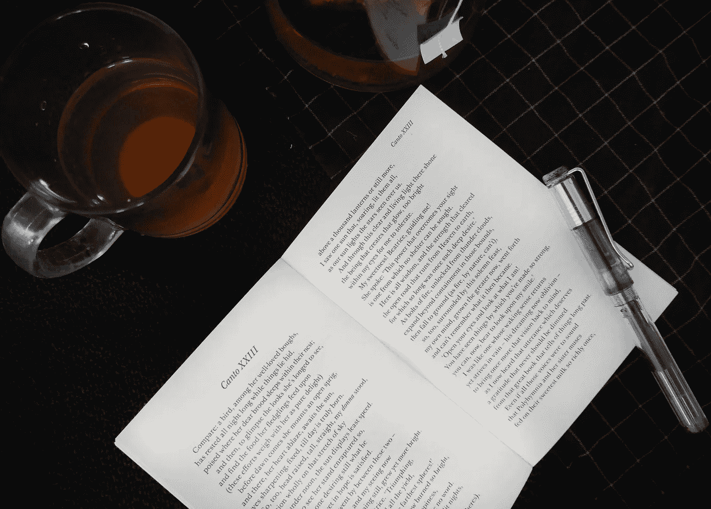

# 对自己更严格(否则别人会)

> 原文：<https://medium.com/swlh/be-harder-on-yourself-or-someone-else-will-d25a2fd94cf2>

# 我们中的许多人从小就听人说我们不应该对自己太苛刻。然后我们被扔进了一个对我们来说难以逃脱的世界。

重要的是我们决定了它的条款。如果你对自己很苛刻，你会控制自己的样子。你给成功下了自己的定义…