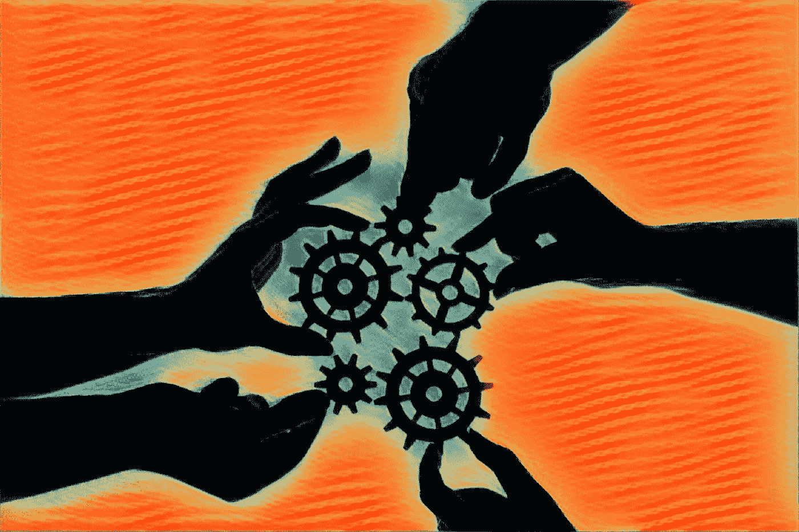

# 自私一点，为了别人

> 原文：<https://medium.com/swlh/be-selfish-for-others-167edcfdfdcc>

建造它&让它破碎

自私并不是我们所认为的敌人，它更多的是一个被误解/误用的概念，我们只是从英雄把别人放在第一位的一生的浪漫故事中投射到这个世界上。说实话，如果你真的要强调更大的利益，尽你的全部潜力服务他人，真正过上你需要把自己放在第一位的生活，为了他们。

世界上的创造者、思想家和工匠都是自私的，他们痴迷于创造原创作品，除了他们自己给世界的不可思议的礼物之外，没有任何目的。自然和进化从根本上来说是自私的，适者生存，完全不顾物种的持久性。

但是自私到底意味着什么呢？

这意味着你在乎。你如此关心你在做什么，创造什么，塑造什么，以至于你不能忍受看到自己在没有最佳能力的情况下运作。

这意味着你的首要任务是你的能量和幸福，作为对他人影响的指数乘数；你认为你的思想、身体和灵魂是一个好的分配系统，是一个积极能量生产的平台，去创造、激励和影响好的事物。你每天都诚实地、真实地、带着一种美德来生活。自私是强烈的！

如果你打算这样做，为了发挥你最大的潜力，你需要从最佳状态开始运作，尽你所能。如果你疲惫、营养不良、不活跃，你会限制你的潜力、存在、参与度和能量，这对每个人都是一种伤害。

感觉忙碌，感觉被需要，感觉完成事情是很好的，但是这不是一个长期的策略，你会精疲力尽或者在不到最佳状态下工作，错过机会。你需要有规律的睡眠、恢复、独处时间、营养、锻炼、社会接触，如果你要实现我们帮助、服务和发展你的天赋的潜力，就要把你自己和你的幸福放在所有这些方面的首位。

为自己服务，你才能为别人服务。

# 让它破碎

当比较系统的设计和实现时，许多词被研究和传播，强调“目标”的彻底失败和边缘无用性。

目标是立场。我们对未来和过去的美好想象。我们如此执着于这些永无止境的关于明天的梦想，关于未来和未来的梦想。目标驱动和支持我们的欲望和看似痴迷的冲动，去收集、消费和感受拥有感的情感。但是我必须跑题了…

系统形成习惯，影响行为，需要持续的监控和积极的参与。他们交付成果，并导致我们以前可能不知道的结果。为了让你开心，我在评论区留下了一些例子。现在，这里有一个系统需要考虑…

## 让它破碎。

就是这样。把它应用到任何事情上。挑战正直和目标。相信大自然的选择性生存，相信我们所关心的事物的力量和强健。

好奇的实验和质疑一切。拿掉保护毯，让你/我们的创作崩溃吧。揭示其真正的优势、完整性和局限性。去寻找和突破极限。生活、学习和发展，而不是仅仅依靠运气和一厢情愿。

似乎有点可笑。好吧，没有测试的假设怎么样？或者指着基于过去经验的想象中的未来点，并且仅仅凭直觉去假设它们的因果关系和目的？我们可以做得更好，为自己也为他人。通过设定意图来设计不仅能生存，而且能在受到挑战时茁壮成长的系统。所以当我们让它们断裂时，它们存活下来，甚至生长。

这是培养精神力量、适应力和对我们的知识体系和文化结构的局限性的鲁棒性的姿势。学会热爱这个过程，并定期让自己接触变化的力量。挑战假设，并移除/调整那些影响完整性的假设。

所以，忘记目标吧。顺其自然吧。让它破碎。为生活中最美好的事物设计系统，让它们不仅生存下来，而且茁壮成长；为我们自己和他人服务。

## 更多…

哦，你会喜欢一些例子。当然，我有什么可失去的…

“今年，我打算:减掉二十磅，变得更快乐，更聪明。怎么会？通过健康饮食和锻炼。通过更多地享受小事情，阅读和列举更多的知识。”

当然可以。听起来不错。但缺乏任何实质性、可持续性或承诺。

思考系统，而不是目标。“我只打算买新鲜的农产品。我会用现金购买任何含有精制糖、添加剂或防腐剂的东西。这意味着两个法案和硬法案。烦人。然后，我会思考或写下 30 分钟后我对那个人的感受。”

“我打算每周锻炼两次。每次我失手，我都会给陌生人五块钱。如果你真的想有所作为，也许 20 年。在我不去的日子里，我会步行 20 分钟，甚至把车停在离工作地点几个街区远的地方。”

“我会每隔一个晚上睡 8 个小时，把卧室里所有的屏幕都移开，故意在床头柜上放一本书或记事本。每当我看到镜子或走过门口时，我都会微笑或大笑。很可笑但是很管用。

“我每天都要和某人交谈或接触，问至少一个我已经知道答案的问题，就好像我不知道一样，这样我就能更好地了解别人是如何看待这个问题的。”

“我将注册并预付一个随机的班级或课程，或者关闭我的通知，只在一天中的特定时间回复电子邮件。我将每周阅读一篇长篇文章或学术期刊，而不是新闻、博客和社交网络。或许甚至可以写一些有意义的东西，或者努力打电话给我平时不会联系的人。”

“我打算每天早上或晚上睡觉前读 10 页。我要写下四个有意义的句子或我一天都在思考的问题。”

这些是系统的组成部分。这些可能真的有用。这取决于你和一天的结束，但让它变得更容易和更自动化会有所帮助。如果他们不这样做，你就会明白为什么，并可以调整，迭代，并在你寻求的大方向上做出增量变化。

# 垃圾想法

“我宁愿做一个有动力的失败者，也不愿做一个自满的胜利者。失败者学习，制定行动计划，做决定，调整，追逐。赢家就是赢家，好无聊。”

无知中的美

自杀是人类独有的。没有其他物种会伤害自己。牛，过着完全平静的生活，从来没有结束生命的遥远企图或任何明显的痛苦，他们渴望结束…人类的思想是怎么了？尽管我们很聪明，但似乎我们无法理解无知中的美。

风中的思绪

一个想法与一阵风或水中的波纹没有什么不同，它就在那里，它加强然后离开。更吸引人的是行为，而不是某种符合角色和故事的任意意义，我们正在把它附加到或达到附加它。"心和思想会消失，消失。"

头版新闻

头版新闻的存在是因为头版的存在。我们为它创造了一个空间、场所和需求。就像标题是因为我们创造了它们，对它们的需求和期望。我们看到的很多东西都是我们想要的、创造的或拥有的(都是过去式)的产物或残留物，而不是我们真正寻求和渴望的东西——空间尚未被创造，而这正是我们追求、好奇和创造的东西。

来自加里五世。

学习“宏观耐心”意味着玩宏观目标的长期游戏，并明白需要几十年才能达到目标。在这个过程中，你需要尽可能地快速、失败、学习、体验，同时保持专注和耐心于你的宏观目标或追求。而真正的“追求”是这个词，而不是目标，目标是任意的，你需要在爱上的过程中，由结果决定。让你自己置身于你喜欢做的事情和喜欢的人之中，会让一切变得更好，更容易实现，因为你会更享受其中。

生命的意义

似乎只有当我们自己感觉不完整或接近终点时，我们才会问或渴望答案，根据我对这些情况的研究，意义本身是相对的，来自于我们与他人和环境的关系和联系的质量，这是我们在过去的时间里积累的。因此，意义或目的是通过享受关系和连接的体验来创造意义。玩得开心，和别人一起做。

## 这篇文章发表在《创业公司》杂志上，这是 Medium 最大的创业刊物，有 300，118 人关注。

## 订阅接收[我们的头条](http://growthsupply.com/the-startup-newsletter/)。

