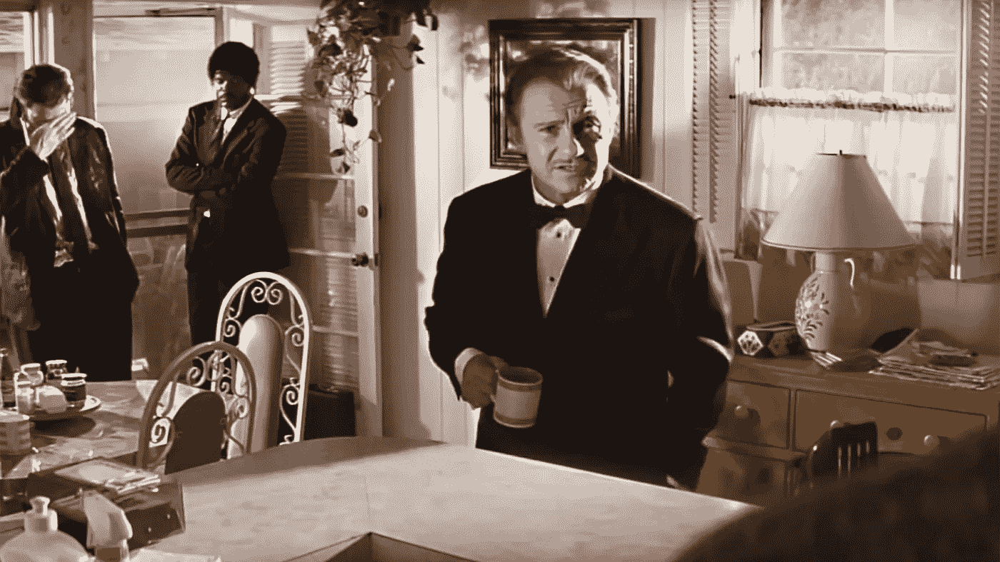
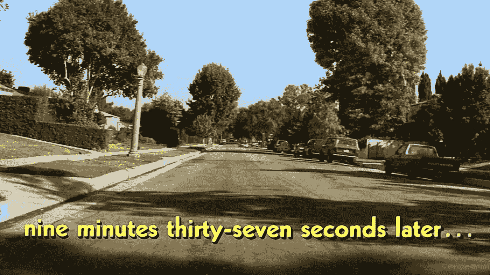
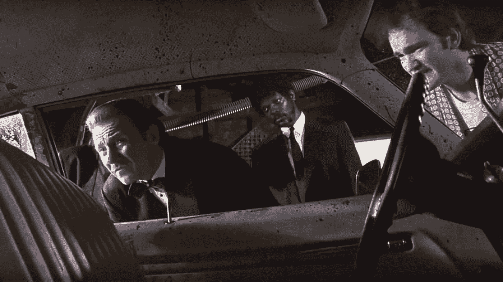
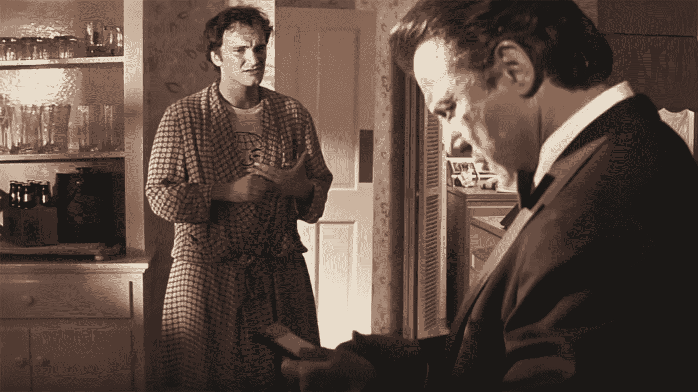
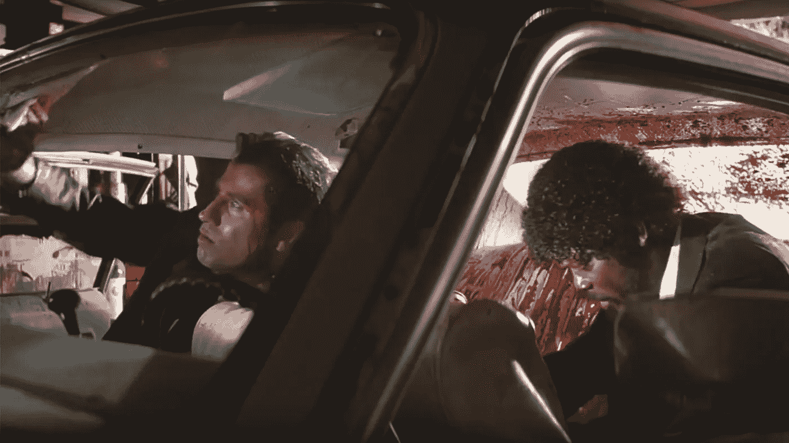
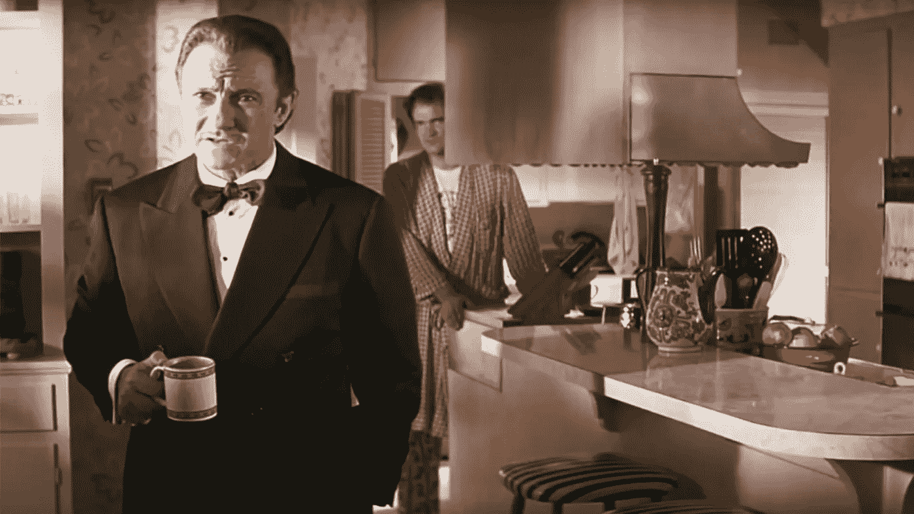
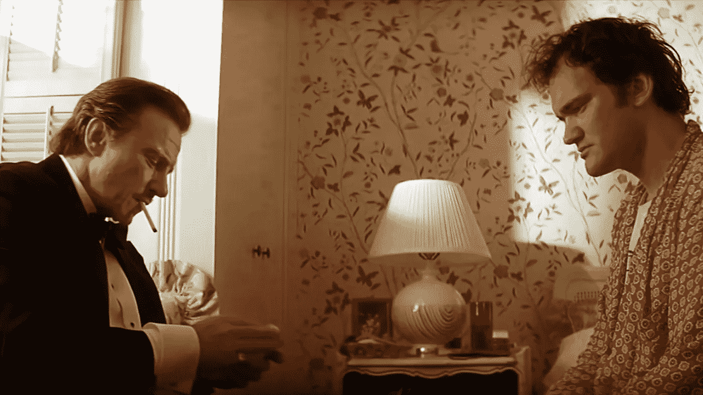

# 做一只狼

> 原文：<https://medium.com/swlh/be-the-wolf-1252cb33e90>

## 看看设计师能从低俗小说的温斯顿·沃尔夫身上学到什么

虚构的人物有时能在职业上激励我们。很少有人比“狼”温斯顿·沃尔夫对我的影响更大，他是昆汀·塔伦蒂诺经典电影《低俗小说》《T3》中极具魅力的导演。由哈维·凯特尔扮演的狼被召唤去匆忙解决一个混乱的局面。他不仅设法完成了工作，而且完成得优雅而有风格。他是在压力下保持冷静的典型。

如果你不熟悉这部电影，或者你需要复习一下，看看下面的视频，你就会明白我的意思了。我发现设计师可以从这位严肃的表演大师身上学到很多东西。

The Wolf in action

# 可靠

The Wolf always is on time

可靠性是任何专业人员都应该具备的最重要的特征之一。狼明白这一点:他声明他将做什么，什么时候做，然后他交付。他不会过度承诺或骄傲自大——相反，他会收集事实，然后自信地陈述什么是可行的。

可靠性在设计师的角色中也至关重要。我们必须可靠，并在期望的时候交付期望的东西。只需要一次失败就能消除别人对你可靠性的信任，所以设定期望值并持续执行是很重要的。

# 评估形势

The Wolf assessing the situation in the car, which shortly before was the scene of an accident

当在紧张的期限内面临一项复杂的任务时，很容易一头扎进去，边干边整理。通常情况下，这会导致效率降低，最终增加工作量。

通过识别利益相关者、定义角色、目标和任何其他有助于您清晰了解未来的信息来评估情况是非常重要的。当你这样做的时候，你可以做出全面考虑问题的决定。

# 保持冷静、沉着和镇定

狼被要求去解决由朱尔斯和文森特造成的局面，它有可能出现令人难以置信的错误:易怒的利益相关者，非常紧张的最后期限，以及要解决的复杂问题。如果这还不够有压力的话，失败将导致所有相关人员入狱。

设计师的工作往往压力很大，尤其是在时间紧迫的情况下。关键是保持冷静、沉着和镇定——没有人比狼做得更好。他镇定自若的举止向每个人保证，局势已经得到控制，如果他们听他的，他们将摆脱他们所处的环境。

# 做笔记

The Wolf taking referring to his notes, which he made upon being briefed on the situation

这是一个简单的要点，但却是重要的。当有许多活动部件时，很难记住具体的细节。如果你不仔细听和记笔记，几乎不可能解释所有讨论的内容。收集重要事实和细节的笔记对以后回忆细节是至关重要的，它会让那些依赖你的人产生信任。更不用说，笔记有办法成为下一步的重要清单。

# 如果需要，委派

Vincent and Jules cleaning the car

在确定了利益相关者、清楚地了解了目标并了解了车内的情况后，狼很快就分配了任务。他明白，如果他试图自己完成，目标是无法实现的——他必须让他的团队参与进来:Vincent、Jules 和 Jimmie。

一个优秀的设计师之所以优秀，部分原因在于对细节的关注。我们希望看到任务以我们给予它的关注程度完成，这通常会导致我们自己承担任务。结果是我们把自己拉长，看不到整体战略，因为我们太专注于眼前的任务。如果需要，将任务委派给团队成员并相信他们的能力是很重要的。

# 优先考虑

当狼告诉文森特和朱尔斯去洗车时，他给了他们非常具体的指示。当务之急是把尸体放进后备箱。下一个优先事项是清洁汽车，但优先清洁“真正脏乱的部分”。最后一步是用亲切的主人吉米提供的毯子盖住室内装潢。

更聪明地工作的一个基本步骤是[知道你的优先事项](/@jonyablonski/thoughts-on-productivity-679502eecde3)。虽然这看起来很简单，但可能比听起来更难。我们经常把紧急任务和重要任务混为一谈，我们用无助于我们长期使命、价值观和目标的项目来填充我们的任务列表。避免这种情况的方法是评估每项任务，确定其优先级，并首先解决重要的项目。

# 给出明确的方向

当狼给出方向时，它清晰而简洁。他不会浪费时间阐述不重要的细节，也不会含糊其辞。他的指示非常明确和中肯:朱尔斯和文森特要把尸体放在后备箱里，快速清洗汽车，吉米要去拿不是白色的被子和毯子，然后朱尔斯和文森特要用这些被子和毯子伪装汽车内部。

提供明确的方向可以节省时间，而时间是宝贵的。它提供了对期望什么、为什么期望以及何时应该完成的理解。那些被你委派任务的人会欣赏这种清晰，因为这将节省他们的时间和精力，并减少需要再次完成任务的可能性。

# 要坚定

The Wolf responding to Vincent’s need for self-preservation

面对文森特的挑战，大灰狼并没有退缩——它很坚定，并表明了自己的目标。他清楚地表明为什么他是直接的，以及合作的结果会是什么。

> 如果我对你无礼，那是因为时间是一个因素。我想得快，说得也快，如果你们想脱身的话，我需要你们快点行动。所以拜托，把糖放在上面，把车擦干净。

无论是设计评论、客户评审、功能讨论，还是项目经理的交付时间表，很多时候设计师也必须坚定。当这种情况发生时，请记住将对话集中在团队的共同目标上。

例如，您决定剪切产品注册页面顶部的图像滑块，以简化用户转换。市场对此并不满意，因为他们喜欢这些图片，但是这些图片并没有鼓励用户注册。在这种情况下，设计师应该坚持自己的立场，但要在精简共同目标的背景下进行，这就是增加用户注册。

# 感同身受

The Wolf compensating Jimmie on behalf of ‘Uncle Marcellus’ for his best linen

狼明白他必须同情他的利益相关者。在这种情况下，吉米和他的妻子在文森特和朱尔斯离开之前回家的爆炸性结果。他立即确认了事实:车库里有一具没有头的尸体，邦妮将在四十分钟后回来，如果她发现他们还在那里，她会很不高兴的。

后来，狼代表“马沙叔叔”慷慨地补偿吉米，因为他拿出了他最好的亚麻布，那是他已故的叔叔康拉德和婶婶珍妮的结婚礼物。他向吉米保证，他的家人会理解这种情况。

这里的关键是，尽管压力很大，但狼明白移情是获得利益相关者信任的关键。他承认吉米所做的牺牲，并献上了他自己的牺牲。最后，他提供了一些合理的保证来减轻吉米的担忧。

设计师还必须知道如何与我们的利益相关者和用户产生共鸣。理解他们的顾虑是提供有效解决他们所面临问题的解决方案的关键。

# 狼清单

这里有一个控制任何给定项目或“情况”的步骤清单:

1.  自我介绍
2.  确定你的利益相关者
3.  确认事实
4.  陈述角色和目标
5.  评估形势
6.  识别风险
7.  区分任务的优先级
8.  开始工作，必要时委派任务
9.  有备用计划

**挖这篇文章？**通过分享来表达爱意，[在 Twitter 上关注我](https://twitter.com/JonYablonski)获取更新，或者[继续阅读](/@jonyablonski)更多关于设计和前端开发交集的文章。

## 这个故事发表在 [The Startup](https://medium.com/swlh) 上，这是 Medium 最大的企业家出版物，拥有 289，682+人。

## 订阅接收[我们的头条](http://growthsupply.com/the-startup-newsletter/)。

