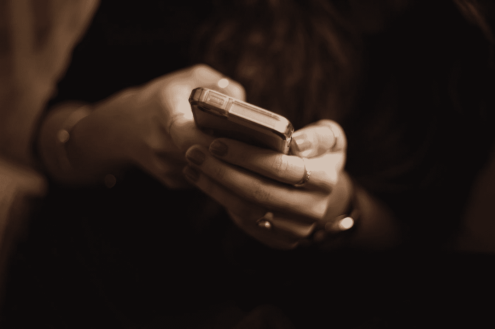
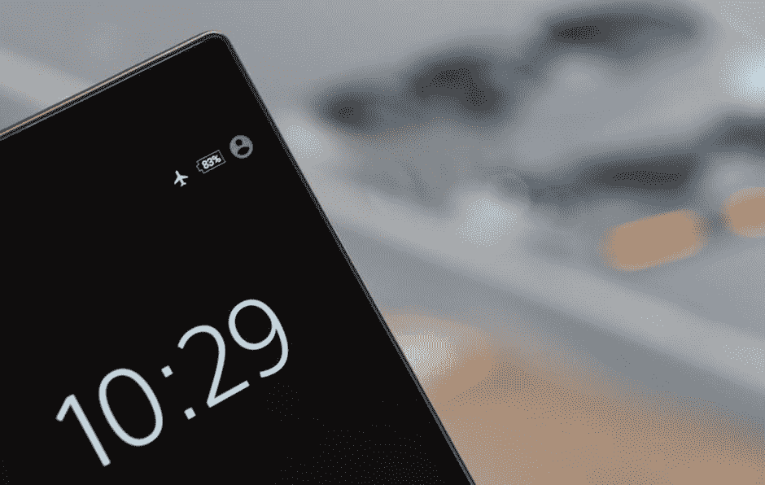

# 工作效率提高 10 倍——消除干扰，提高注意力

> 原文：<https://medium.com/swlh/become-10x-more-productive-kill-your-distractions-and-improve-your-focus-ddfa6c7397c8>

Photo by [Priscilla Du Preez](https://unsplash.com/@priscilladupreez?utm_source=medium&utm_medium=referral) on [Unsplash](https://unsplash.com?utm_source=medium&utm_medium=referral)

从第一代 iPhone 发布到现在刚好十几年。对大多数人来说，这被认为是第一件“现代”技术。它的诞生标志着世界及其人民一个新的互联时代的开始。

学生不再需要通勤去图书馆寻找资源。职场人士不再需要跋涉数百英里与地球另一端的同事交谈。

如果我现在想和朋友聊天，我可以用各种方式和他们聊天，不管他们在哪里——打电话、语音聊天、即时消息。在今天的十年内，我们可能会有全息通讯。可能性是无限的。

我们发现自己身处一个由物联网(IoT)推动的互联世界。我们可以通过手机、平板电脑和笔记本电脑几乎随心所欲地获取世界资源——关于我们社会、人类甚至世界的无穷无尽的信息。甚至我们的汽车和家庭都连上了互联网。

虽然计算机和服务器是为了处理这种巨大的信息流而建造的，但人脑却不是。我们不断被社交媒体、短信、未接来电、电子邮件和电话通知拉向一百万个不同的方向。

面对来自我们周围世界的所有这些“噪音”，我们发现很难专注于对我们来说重要的事情，并且更容易分心。

但与此同时，我们仍有比以往更多的工作要做。学生们发现自己在努力维持巨大的工作量和良好的成绩以进入顶尖大学。企业家以向世界展示他们所创造的东西为生，他们通常一直在管理社交媒体、商业运作和他们的产品。

我们面临的来自周围世界的干扰，尤其是互联网，使得我们很难集中精力完成大量的工作。

我们已经形成了一种短期的注意力持续时间，以至于任何手机通知都可以把我们的注意力从工作上转移开。反过来，我们再也无法高效工作了。我们无法集中注意力。

世界联系越紧密，我们就越容易分心。我们越是屈服于这些干扰，我们的注意力持续时间就变得越短。我们的注意力持续时间越短，完成工作所需的时间就越长。你可能已经明白我的意思了。

但是我们可以战胜这些干扰。这些习惯大大提高了我的工作效率，我认为它们对每个人都适用。

> “提高工作效率的最好方法不是增加你的注意力，而是减少让你分心的事情。”

# 你的手机是你最大的干扰

在我们今天的社会中，几乎每个人都有一部智能手机——一部可以访问互联网及其资源的小型电子设备。虽然这让我们能够获得有用和有见地的信息，但也让我们能够随时进入一个令人分心的世界。社交媒体已经成为许多人的嗜好，手机游戏甚至比最发达的主机游戏更受欢迎。

今天，克服手机带来的分心是保持注意力集中的一个重要部分。

## 1.把你的手机调成飞行模式

当你想完成一些严肃的工作时，可以考虑打开飞行模式，关闭 wifi 连接。

这可以防止出现任何可能干扰您工作流程的通知，如消息和社交媒体通知。

这体现了“眼不见，心不烦”的理念。如果你完全不在意分心，那么你一开始就不会分心。

不要担心那些通知会找上门来——当你结束工作时，它们仍然会在那里。

## 2.整理你的手机，让分心的东西更难进入

当我打开手机时，首先看到的是我所有的社交媒体应用程序——脸书、Instagram、Twitter、Snapchat、Linkedin 等。

社交媒体应用程序的创建是为了给开发者创造尽可能高的收入。将这些应用程序放在你的主页上，你会产生点击进入你的社交媒体的诱惑，并因此变得分心和低效。

如果说我对人类行为有所了解的话，那就是我们不太可能去做劳动密集型的事情。这甚至适用于移动应用程序的滚动。通过将我的社交媒体应用程序放在手机的第五页，我使它更难访问，因此更容易抵制。通俗的说，越难接触的东西，我越不会去做。

尽可能把最容易分散注意力的应用程序放在手机上最不显眼的地方，也许是放在手机随机页面上的随机文件夹里。通过增加被发现的难度，你就更容易抵制社交媒体的诱惑。

## 3.调节你的音乐

调节音乐时，请遵循以下准则

1.  避免歌词——与其跟着音乐中的歌词，不如跟着作业或项目中的歌词。你很可能无法同时关注这两者，你很有可能在两者之间转移注意力。
2.  保持慢节奏——快节奏的音乐很棒，但是会让人分心。当你试图跟上一首快歌的节奏时，很难专注于你正在做的事情。
3.  调低音量——这是显而易见的。如果你的音乐阻止你听到自己的想法，你就无法集中注意力。
4.  限制你的播放列表——我们更容易被新的有趣的声音和歌曲分散注意力。将你的工作播放列表限制在你以前听过的歌曲上，让你的注意力集中在工作上。

虽然我使用移动应用程序 [Tide](https://itunes.apple.com/us/app/tides-near-me-free/id585223877?mt=8) 来集中音乐，但如果你想要一个完整的播放列表，我听说过 Spotify 上的[黄油](https://open.spotify.com/user/spotify/playlist/37i9dQZF1DWVzZlRWgqAGH)播放列表。

如果这些智能手机提示对你不起作用，并且你仍然发现自己心不在焉，那就把你的手机完全收起来。这再次延伸出了“眼不见，心不烦”的概念，但却使得分心的事情更不可能发生。

# 将你的工作区和娱乐区分开

这条建议可能是生产力和自我发展中最被低估的建议之一。人类很自然地使用联想来确定我们遇到的物品的性质。这使我们能够确定什么是好的，什么是坏的。

味觉和嗅觉就是一个很好的例子。假设我们在一家超市，那里有一个摊位免费赠送一种新型香肠的样品。

如果给我们一根又香又辣的香肠，那么我们更有可能尝试免费的样品。如果香肠闻起来“变质”或未煮过，那么我们就不太可能尝试免费样品。

换句话说，我们已经把香肠的气味和它的味道联系在一起，而不是一开始就品尝它。通过建立联系，我们将自己置于做出正确选择和决定的最佳位置(在这种情况下，我们降低了食物中毒的风险)。

现在想象你是一个职业人士，一个企业家，或者像我一样，一个大学生，程序员和博客作者。

对我的工作效率最有害的事情之一是当我被任何我认为是“玩”的事情分心时——社交媒体、视频游戏等等。在这种情况下，我让“玩”溢出到我的“工作”中。

与其用一个区域来工作和娱乐，不如考虑用一个区域来工作和娱乐。例如，我的“玩耍”区域是客厅。它可以使用电视，更好的互联网连接来播放视频，还可以使用厨房。我的工作区域是卧室角落里的桌子。我可以接触到我所有的作业，学习用品，以及任何我可能需要写的东西，编程或者工作。更重要的是，这是一个远离家庭其他成员的安静有序的空间，让我能够清晰有效地思考。

将“玩”与“工作”分开是区分两者的主要好处，但另一个关键好处是反过来——将“工作”与“玩”分开。

从深度密集的工作流程中重新充电的最好方法之一是 100%关闭你的思维。这意味着没有(或很少“紧急”)工作通知、电子邮件和消息。

在你的工作区域“玩耍”会让你更难放松——你把自己置身于生活中压力最大的地方。这使得完全放松和恢复变得更加困难。

# 行动呼吁

非常感谢您的阅读！如果你喜欢这篇文章，一定要在下面留下喜欢和评论。所有股份都是升值的！请务必在 [Twitter](https://twitter.com/dylankfernandes) 上关注我，了解未来帖子的更新！

## 这个故事发表在[的创业](https://medium.com/swlh)上，这是 Medium 最大的创业刊物，有 315，628+人关注。

## 订阅接收[我们的头条新闻](http://growthsupply.com/the-startup-newsletter/)。

