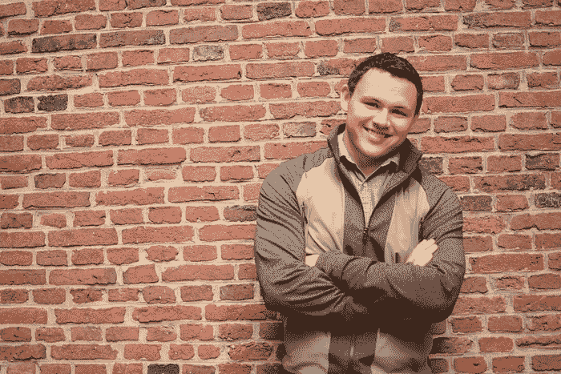
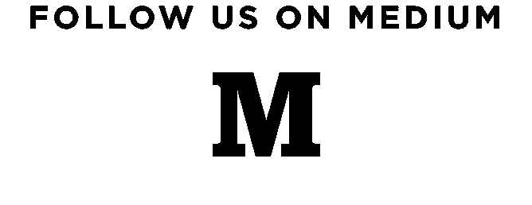
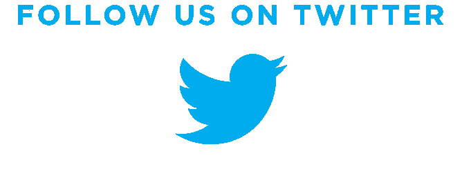

# 启动前:

> 原文：<https://medium.com/swlh/before-the-startup-4180b792d7ca>

在我开始[ResumeRuby.com](http://resumeruby.com)之前，我在大学里关注的 5 件事——没有它们我是不可能完成的。

## **1。成为清晰的沟通者:**

*“良好的沟通就像黑咖啡一样令人兴奋，之后也一样难以入睡。”*

在过去的两年里，我强迫自己定期写作。它几乎在我生活的每一部分都创造了奇迹。

当你给误解留下一点空间时，大多数事情都会变得简单。这就是清晰沟通的美妙之处。

不要担心:如果你想成为一个更好的沟通者，你甚至不需要发表任何东西——但是如果你想成为一个更好的沟通者，你需要练习。你甚至不需要写原创内容:我发现重写老派的销售信函有很大的价值，可以强迫自己去尝试和思考他们的想法。

如果要我用几句话来概括优秀沟通者的特质，我会说:

*   找到你的声音——它应该类似于你对一个密友说话的方式
*   当有疑问时，结束句子。清晰的交流是简洁的。
*   培养深层次的同理心。你如何展示某样东西的背景非常重要。这和你无关，而是和你说话的人有关。
*   研究 20 世纪伟大的文案，重读你最喜欢的作者(谢谢，[工作坊](https://thisisworkshop.com/))
*   学习视觉传达的基础变得越来越重要。许多这些技能可以很好地转移到其他媒介上。

无论你是“技术型的还是非技术型的”，在开始创业之前，具备沟通能力是需要掌握的一项基本技能。

## 2.秀，不要说

*(这部分的另一个标题是“培养真正的技能”。)*

操“*秀，告*”。

告诉对你谈话的人没有任何作用(除非你证明你是一个伟大的沟通者，你实际上只是在展示)。

> 哦，你对设计很有眼光？可以用 photoshop 做设计工作吗？
> 
> 你是个好作家吗？你是为我们下一次 Instagram 活动撰写文案的优秀沟通者吗？
> 
> 具体来说，你使用什么过程和框架来展示你的“管理技能”？你领导过什么团队？

不要告诉我你“擅长使用社交媒体”,我可以去你的推特账户看看你有两周没用了。

人们“告诉”他们擅长什么，因为这让他们能够足够模糊地解释他们擅长什么，而不用给出任何具体的例子。

如果你要开始创业，你就要有真正的技能，让你的公司变得伟大。它还能让你找到同样擅长自己工作的合伙人。每当我收到一封“帮我找一个技术合伙人”的电子邮件时，我都会感到不安，因为如果你甚至没有花时间发展自己的技能，我就不会从商业角度推荐你。

我发现最好的方法就是一个接一个地做兼职项目。

帮你自己一个忙，养成展示而不是讲述的习惯。发展有形的、有价值的技能，你会吸引其他优秀的人来创办你的公司。

行动胜过千言万语——尤其是在创业中。

## 3.变得无情地有自我意识

*和/或找个人给你持续的、诚实的反馈。*

虽然这是很难开发的东西，但我认为它太重要了，不能不包括在内。

自我意识让你几乎可以立即关闭自我提升的反馈回路。能够认识到自己哪里需要努力，哪里有实力，这一点至关重要。

加里·维纳查克说这是最好的，所以我会让他这样做的荣誉:

## 4.培养无障碍的态度

*在创业公司中，结果几乎能治愈一切。*

勇气。决心。永远足智多谋。一首关于伟大创始人的常见歌曲并非用词不当。

市场不在乎你是一名学生，也有一份兼职工作，或者你可能有价值 1 万英镑的债务。

你不会受到市场的阻碍。每个人都有自己的问题，你需要克服自己的问题。

如果你想成为一名创始人，确保你永远不会发现自己在找借口。无论环境如何，无论事情看起来多么“不公平”，最好的创始人都会让事情发生。

让你周围的人不要用一大堆废话来回答你的反馈，并如实告诉你。如果你现在不养成接受现实的习惯，你认为你将如何熬过创业 5-10 年的磨砺？

 [## 生活不是从明天开始

### 从明天开始，这个世界上没有一件事情会变得更好。

medium.com](/p/346106c08591) 

## 5.掌握自己的流程

*连自己都经营不好，怎么经营公司？*

成为一名优秀的初创公司创始人需要一直保持高水平的表现。尤其是如果你是创始人，你必须以身作则。

这个游戏中的顶尖玩家，似乎又一次以一致的方式描述了最好的企业家:表现优异。

虽然这很大程度上是你的自我意识；)在《如何最好地工作》一书中，我发现关注以下几点很有帮助:

*   删除所有使用时间过长的“生产力”应用。太多的功能通常只会降低你的速度。
*   用 [RescueTime](https://www.rescuetime.com/) 审核你的互联网使用情况，屏蔽你用来拖延的网站
*   阅读——这太棒了。
*   每天在同一时间醒来，花一天的第一个小时做同样的事情(仪式)
*   每天找一个方法清理你的大脑(锻炼、调解、散步)

永远记住:杰出的人在被认为杰出之前很久就表现出了杰出。

## 采取行动:

*这里有一个系统的问题可以参考。请随意留下您的答案并发表评论:*

*1。你打算如何训练自己成为一个更好的沟通者？*

*2。你会带来什么有形的、独特的价值？*

*3。你用什么系统来改善自我提升的反馈回路？*

*4。当你发现自己开始找借口时，你会怎么做？*

*5。为什么你目前组织自己的系统是最有效的？*

I have a small number of consulting spots open at mitchrobs.com.

## 米奇正在打造[resumeruby.com](http://resumeruby.com)而[撰写关于创业、技术和生活的](https://medium.com/@mitchrobs/latest)。

## 如果你喜欢这篇文章，请分享:)

*发表于* **创业、旅游癖和生活黑客**

-