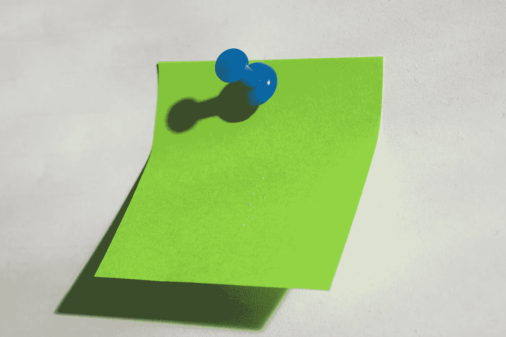

# 如何不懈地发掘新价值

> 原文：<https://medium.com/swlh/before-you-get-comfortable-relentlessly-uncover-new-value-9941f5f6f30c>

快点。拿一叠便利贴跟我走。我们将帮助您发现隐藏在您下一个计划中的*新价值*。

但是等等。便利贴？有如此多的软件工具我们可以用来代替纸和笔。其中一些软件工具真的很棒。

笔和纸怎么可能被用来帮助解决任何真正重要的事情呢？便利贴不就是大忙人保持条理的拐杖吗？！

正确使用，便利贴将帮助你和你的团队发现难以置信的*新价值*。当你掌握了便利贴，我允许你回到你的软件工具——如果你还想的话！

# **新值定义**

让我们定义*新值*。新价值是你最初没有意识到或认为可能实现的优势或收益。我不是在说从你已经预期会带来价值的事情中榨取一点额外的效率。我说的是新的，意想不到的价值。价值，否则你可能会完全错过，因为你继续朝着一些较小的结果。重视这一点，当你发现它时，你会为它对你的客户、企业、利益相关者等的巨大好处而激动不已。

# **我们要去的地方不需要软件工具**

*新价值*听起来很棒吧？但是为什么我们需要低级便利贴的帮助才能到达那里呢？

最终，便利贴的功能稀缺和白纸极简主义将最有助于发现价值。这里有几个重要的原因:

## **1。空白的石板迫使人们进行深刻而具体的思考**

也许你已经做了一些分析，充实了一些概念。也许不是。也许你很清楚你所做的所有假设。也许不是。你怎么知道的？

在你和你的团队面前除了空白的纸什么都没有，你必须知道你在说什么。我们正在开始什么样的旅程，为什么？没有假装，这很好。把未知的拿出来，尽快解决。

## 2.开始工作太容易了

努力不等于价值。

开始工作非常容易。人们被指派。你有几个会议。你在你的软件工具中开始一个新的“项目”。团队成员开始着手他们的工作。

挑战在于很难合作。很难让每个人都参与进来，深刻理解一个问题，并为解决方案做出贡献。

## 3.当你意识到工作不太对劲时，放弃工作太难了(T21)

扔掉甚至编辑和重新安排你在电脑上完成的工作是痛苦的。在许多情况下，团队宁愿不去发现需要重新开始、重新思考、重新打字、重新配置的新信息。尤其是在需要特殊权限来删除或重置的情况下。

在工具里打字感觉如此…永久。折腾或者换工作感觉很浪费。便签纸是空白的，一直保持空白，直到团队开始交谈并写下东西。把纸扔进回收站更容易。

## 4.在学习之前自动化是一个陷阱

关于自动化，比尔·盖茨有一句名言:

“业务中使用的任何技术的第一条规则是，应用于高效运营的自动化将放大效率。第二，自动化应用于低效率的操作会放大低效率。”

在您有机会亲自学习之前，不要构建解决方案(即自动化)。

# **现在，召集团队，让事情发生**

在定义所需工作之前、期间和之后，致力于发现和交付价值。你需要团队中有人在这里扮演唱反调的角色。一个会毫不留情地挑战团队去挖掘更深层次的人。

你需要组织成不超过 6 到 8 人的小组。向你的团队成员传递空白便笺。

***讨论、辩论、迭代。利用便利贴的空白处，迫使你进行深刻的、原创的、具体的思考。草草记下。使用这些步骤来帮助找到你的心流:***

## 1.记下你想要的结果的描述，以及为什么它们很重要。

要求每个团队成员写一个短语来描述该计划的结果以及它们为什么重要。这是对未来的一个简短的展望，应该清楚地表明为什么事情会因为你的预期结果而变得更好。

利用这段时间进行讨论，让每个人都得出相同的结论，至少了解你们团队的发展方向和原因。可以尝试用多个版本来描述这个未来的真相。

请记住，团队成员并不总是对他们的工作成果及其价值有基本的了解。他们也不知道如何或感觉有能力自己发现价值。改变这一点。

## 2.将工作与结果分开

不可避免的是，上面第一步中的一些描述将面向工作。很难*而不是*去思考需要完成的任务。

当人们很自然地写下面向工作的任务时，将这些便笺分离到一个完全独立的空间。不要让任何工作项目或任务进入描述结果的便笺中。

## 3.讨论并同意哪些结果描述是准确的

从设计上来说，因为你在第一步中试验了一些想法，你会有一些便利贴，你会认为这些便利贴没有切中要害。

在所有的想法都很好理解之后，你可以做两件事情中的一件。扔掉不准确或没有帮助的便利贴，或者把它们移到一个指定为“也许以后”的区域，如果那是一个更准确的分类的话。

## 4.纠结于为什么结果很重要

此时，您已经确定并细化了预期的结果。你已经将这些结果与完成工作所需的任务分开了。这个团队在对未来的憧憬上是志同道合的。

你现在对你的预期结果以及它们为什么重要有了一个清晰的认识。沉迷于结果，直到你有一个纯粹的观点。在此基础上，您可以进一步提炼和发掘新的价值。

## 5.相信你在一场你能赢的游戏中

现在你开始检查你正在做的事情的核心和原因，并发现新的价值。

这一步的一个方法是问为什么，然后再问为什么到目前为止陈述的原因。一直问为什么。你几乎不能过分。相信你在一场你能赢的游戏中，新价值的想法将开始浮出水面。

多拿几张空白的便利贴。添加和改进获取新价值的结果。

只要你还在发掘新的价值，就一直重复下去。

# **你好，新值**

好奇和协作的对话确保每个人都有机会发现新的价值。

无论你是在解决一个孤立的问题，还是一个会让你的公司登上十亿美元独角兽名单的问题，用一张不起眼的便利贴这样的空白处挑战假设，可以帮助你释放实现目标所需的深层思考。

## ***这个帖子有用吗？请点击*** ♥ ***并发布微博。***

在推特[上与丹尼联系](https://twitter.com/dnnybrndt)。