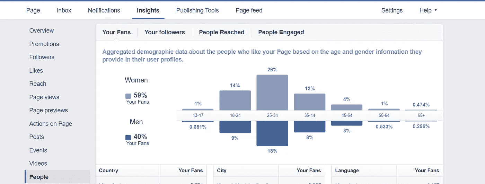
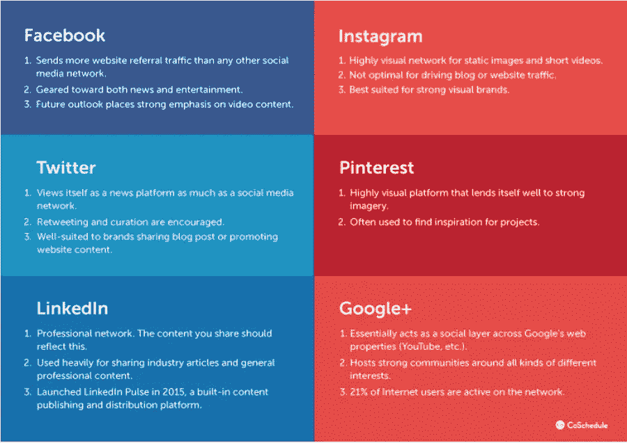
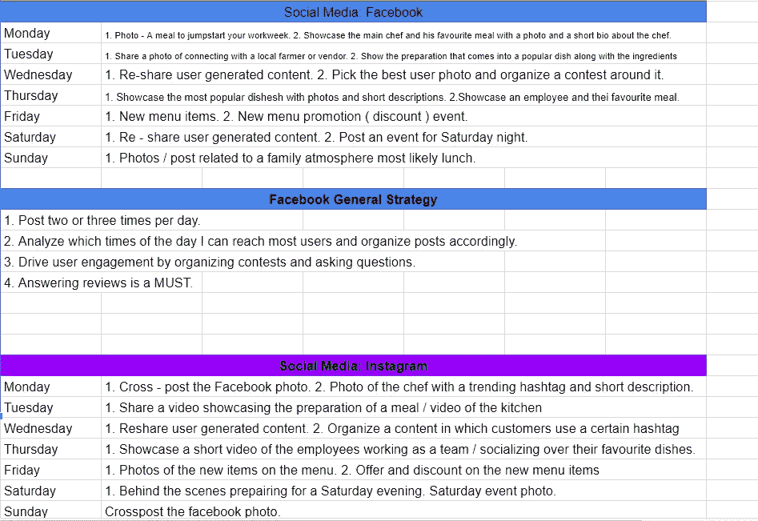

# 初学者指南——如何创建社交媒体内容计划。

> 原文：<https://medium.com/swlh/beginners-guide-how-to-create-a-social-media-content-plan-46f8f6210a24>

## 1.从“这不可能发生在我身上”到“我不相信事情会这么简单”。

多么可怕的标题不是吗？如果我告诉你实际上并不像纸上写的那么可怕，会怎么样？其实不是纸，因为…没人再用纸了，除了那些，嗯…用的人。但是，嘿，你不能没有纸，不是吗？！至少没有卫生纸他不会——他*怪异的眨眨眼。(嘿，我从来没有在一个团体中是有趣的家伙，这是我的笑话得到的最好的。)

除了愚蠢的介绍，地球上几乎每个试图创建社交媒体内容计划的人，或者随后一起听到这三个可怕的词的人，可能都有过“好了，该弃船了”的想法。

但是这并不像我在愚蠢的介绍中说的那样可怕。第一次接触社交媒体内容规划时，我也有同样的想法……直到我真正打开 Google Sheets 并创建了一个表格(有几十个现成的模板可供你使用，或者像我一样，你可以创建自己的模板。老实说，我的看起来像一个 3 岁的小孩被独自留在家里，带着一堆蜡笔和一面空白的白墙，但是，嘿，它完成了任务。)

## 2.如何入门？

首先，你要做的是决定你将出现在哪些社交平台上。并不是所有的社交媒体平台都适合各种业务。你如何决定哪些平台？回答:跟着你的观众走！

“谢谢队长明摆着的，好像我我没有想到这一点。但是我怎么知道我的观众在哪里呢？! "—可能会想到。如果你不知道你的观众在哪里，至少你有一个问题。但是不要担心，这个看似可怕的问题有一个简单的解决方案。

***测试。测试。测试。***

最简单的开始方式是看看你的竞争对手出现在哪些社交媒体平台上，以及他们的表现如何。

**101 竞赛刺探指南。**(我有一个朋友的朋友的朋友在克格勃——所以我才知道这件事。)

1.  在所有社交媒体平台上进行快速搜索。
2.  关注他们在社交媒体平台上发布的内容。照片、视频、状态更新等等。
3.  小心订婚。分享、评论和反应。
4.  发布频率。
5.  用户/追随者计数。
6.  用 Excel 或 Google Sheets 或你选择的媒介(双关语)创建一个表格，写下有用的信息。

一旦你分析了你的竞争对手在社交媒体上做了什么，是时候看看我们是否能做他们做的，但做得更好。开始问以下问题。

1.  我可以分享比他们更相关的内容吗？
2.  我能写出比他们更吸引人的内容吗？
3.  我能比他们更频繁或更持续地发帖吗？
4.  我的社交媒体空间上是否有空间发布来自相关可信来源的内容？

但是并不是所有的事情都是为了变得更好，发布更好的内容等等。你可以尝试另一种方法。想想你能做些什么不同的事情。有时候，从不同的角度做事会有很大的不同。

最重要的是，记录你做的每一件事。

## 3.选择与你的商业目标一致的社交媒体目标。

就像商业中的其他事情一样，你在不同平台上的目标必须相互一致。在社交媒体上寻找新的线索，而你的商业目标是提高品牌知名度或留住客户，这可能不会给你带来多少结果。

出现在社交媒体上也能以许多不同的方式直接帮助你实现商业目标。这里只是一些，所以你可以更好地了解我在说什么。

1.  **提高品牌知名度** —出现在社交媒体上并持续发布相关内容将会增加你在潜在客户面前的曝光率。更重要的是，如果你创造了对很多人都有帮助的精彩内容，你的社交媒体追随者会倾向于分享你的内容，从而大大增加你的曝光率。
2.  **帮助您与客户沟通** —与新老客户联系和沟通从未如此简单。获得持续的反馈并回复至关重要。您现在可以获得脸书的即时反馈，并直接回复您的客户。
3.  **增加品牌信任度—** 与过去相比，现在增加品牌信任度更加容易。如果你致力于通过社交媒体向你的客户提供价值，通过不同形式的内容，你会赢得他们的信任。现在一切都是为了付出，付出，再付出。所以一定要在你的社交媒体上有相关的、有帮助的内容。这几乎是将关注者转化为顾客的一种有保证的方式。

因此，相应地选择你的社交媒体目标。选择正确的可以在许多不同的方面启动你的生意。

## 4.创建一个追随者角色。

人物角色是一个想象中的人，他最有可能成为你的追随者，或者对你在社交媒体上说的话感兴趣。把更可能转化为顾客的少数人作为目标，比把与你的品牌毫无关系的普通人群作为目标要好。

> 这不是关于所有的人，而是关于正确的人。

最简单的方法就是看看你的脸书观众喜欢什么，他们是谁。

1.  转到您的脸书页面。
2.  打开视野

如你所见，我的典型追随者角色如下:

1.  名字:乔恩·邦·乔维(老兄，如果你看到这个，请喜欢我的页面。)
2.  性别:女性/男性
3.  年龄:25-34 岁(18-24 岁和 35-44 岁年龄组彼此非常接近，并且占了很大的比例，所以不要忽视他们。)
4.  职业:这可以是一个概括。
5.  收入:取你所针对的行业的平均薪资或工资。
6.  位置:这可以是一个特定的位置，也可以是目标位置周围更大的区域。您可以在图中所示的人口统计图表下方看到您的关注者数据。
7.  使用脸书 [Audience Insight App](https://www.facebook.com/iq/tools-resources/audience-insights) ，你还可以看到你的目标受众喜欢什么页面，喜欢什么品牌。

## 5.设置您的社交媒体语调。

知道如何与你的社交媒体关注者交谈是很重要的。这一点都不用复杂。只要分析你的追随者如何与你的品牌互动，以及在你的社交媒体资料上如何相互互动。当你这么做的时候，跟踪你的竞争对手的社交媒体资料，看看你的目标受众是如何在那里交流的。

相应地调整你的品牌基调，你应该能够更好地与你的受众交流信息。

此外，注意你的竞争对手如何与他们的追随者沟通。看看你如何能做得更好，或者你如何能使用你的语调从人群中脱颖而出。

## 6.选择正确的社交媒体平台

这可能是最重要的部分，所以你应该慢慢地仔细阅读(也许现在是喝杯咖啡的时候了？).

并不是所有的社交媒体平台都适合各种内容。它们都有自己的优点和缺点，所以你可以相应地调整你发布的内容。这很大程度上取决于你的品牌和你试图向你的追随者传达什么。

credits: [CoSchedule](https://coschedule.com/blog/social-media-content-strategy/)

这是一张很棒的照片，说明了什么样的内容在不同的社交媒体渠道上有效。慎重选择你的内容！

## 7.内容创作

当谈到内容创作时，你应该依靠你的创造力和你的目标受众的偏好和喜欢。关于这一步的一些建议是:

1.  测试哪种帖子最适合你的目标社交媒体。
2.  发布不同的内容。用照片、视频和 GIF 图片做出改变。
3.  每天发布，如果你发布得更频繁，社交媒体网站会向更多人展示你的品牌。
4.  分析你的听众在一天中的哪个时间最活跃。通常在下班后、傍晚以及大约 12:00pm-14:00pm 发布，但是这些数字会有所不同。
5.  把你的内容与无偿和有偿结合起来。例如:脸书上只有 2%的流量来自有机的、未发布的帖子。
6.  在发布帖子时，将它们锁定在你的核心受众，不要过度概括。
7.  如果你在脸书上传视频，不要通过 YouTube。脸书优先考虑直接发布在他们视频平台上的视频。

## 8.制定一个内容计划时间表。

互联网上有许多现成的下载模板，但是，它们通常需要注册或登记，并且比你自己制作的模板有更多的限制。我个人的建议是启动 Google Sheets 或 Microsoft Excel，随心所欲地进行设计。

然而，如果你想要一个现成的，检查一下[智能表](https://www.smartsheet.com/social-media-templates)，或者[协同日程](https://coschedule.com/blog/social-media-strategy-template/)。

另一个好主意是看看[其他](https://climbings.com/how-to-create-a-content-marketing-strategy-in-2020/)公司是如何制作社交媒体内容时间表的，并从中挑选创意，同时根据自己的需求实施。

Here’s what I’ve done for mine.

这是我为自己的企业制定的计划。但是，您可能需要考虑:

1.  将您计划发布的照片(内容)添加到相应的日期和帖子中。
2.  添加时间表来进一步组织你的计划。

这只是一个可能的预览。

## 底线。

对于你能做什么，或者你应该做什么，没有一个通用的规则。不断测试不同的内容和不同的设置，并根据您得到的结果进行调整。

祝你好运，玩得开心！

## 这篇文章发表在 [The Startup](https://medium.com/swlh) 上，这是 Medium 最大的创业刊物，有 271，813+人关注。

## 订阅接收[我们的头条新闻](http://growthsupply.com/the-startup-newsletter/)。

