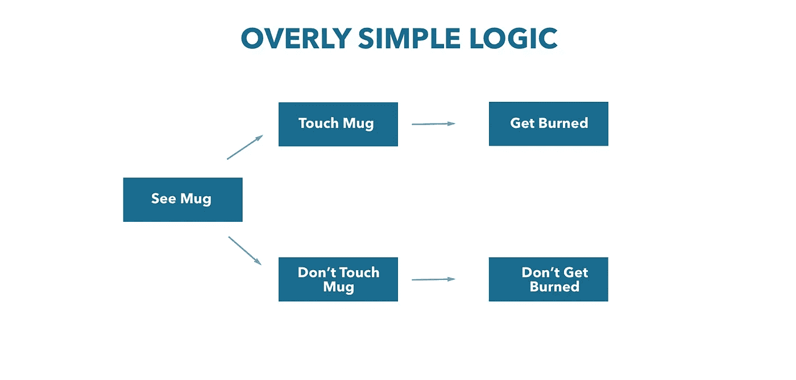
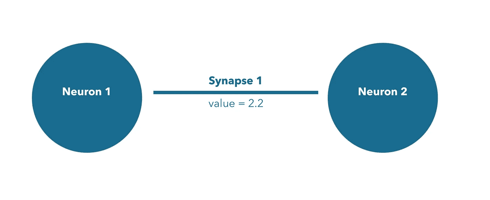
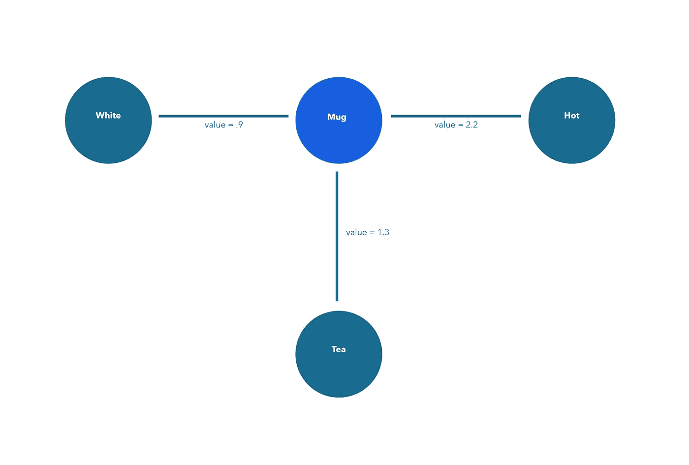
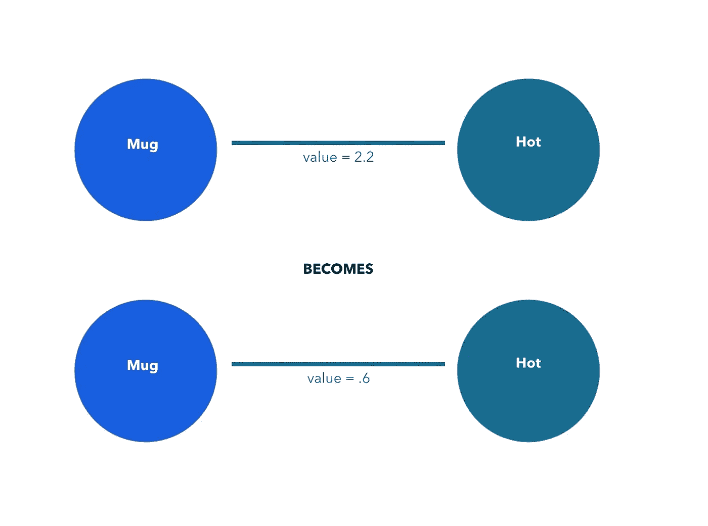

# 神经网络初学者指南

> 原文：<https://medium.com/swlh/beginners-guide-to-neural-networks-c98f496eec64>

电脑变得越来越智能。有人担心天网，有人因自动驾驶汽车而兴奋。我们大多数人都不确定哪种可能性更大。这一块是给后一组的。

## 智力

作为一个孩子，如果我们碰了一个杯子，它烧伤了我们，我们就不会再碰它了。在触摸杯子之前，我们不知道它会伤害我们——现在，我们可能会反其道而行之，永远不要触摸杯子，即使它没有装满热液体。然后，我们看到有人拿起一个杯子，没有被烧伤。我们的世界框架已经改变。现在我们知道有些时候杯子凉到可以触摸。这种基于对我们周围环境模式的认知来调整我们对世界的理解就是智慧。和我们一样，计算机也通过同样类型的模式识别来学习。

## 神经网络

传统的计算机程序有逻辑树。如果这发生了，那就发生了。系统的所有潜在结果都是预先设定好的。

Logic trees can be very complex, but are unchanging.

然而，神经网络是在没有特定逻辑的情况下建立的。它是一个被训练来寻找和适应数据中的模式的系统。它是模仿我们大脑的工作方式。神经元(想法)通过突触与其他想法相连。每个突触都有一个值，代表两个神经元之间发生连接的可能性。

## 神经元解剖学

神经元是一个单一的概念。这是一个杯子。它是白色的。又或许，是茶。也可以是“热”的概念。所有这些都是可能的神经元。所有这些都可以联系起来，就像这杯茶一样。它不仅是一个白色的马克杯，它也是茶，它也很热。

Each neuron is a circular node, the synapses are the lines connecting the neurons. The value put to each synapse represents the likelihood that one neuron will be found alongside the other.

但是，并不是所有的杯子都有和这个一样的特性。还有许多其他神经元可以连接到马克杯。例如，咖啡可能比茶更常见。连接每个神经元的突触的强度决定了一个神经元连接到另一个神经元的可能性。越热的杯子，突触越强。这个系统越来越了解杯子摸起来很烫的可能性。

然而，在一个杯子很少被用来盛热液体的世界里，杯子摸起来很烫的频率会降低。随着时间的推移，这种减少会降低连接杯子和热量的突触的强度。

这个小而看似不重要的马克杯描述代表了神经网络的核心结构。逻辑树是预先确定的，因此需要知道然后手动输入杯子触摸起来烫的可能性。一个神经网络，简单地响应确认或否认与神经元“杯子”相连的神经元“热”的频率的数据

这个概念是我们想到的最接近我们大脑工作方式的概念。我们碰了碰桌子上的杯子——它很烫。我们认为所有的杯子都是热的。我们碰了另一个杯子，这次是在橱柜里——它不烫。橱柜里的杯子是不烫的。随着时间的推移，我们成长和进化，我们的大脑接受更多的数据。我们确定了一个准确的概率来判断我们将要触摸的杯子是否会很热。计算机学习的方式完全相同。当我们有经验时，它们就是我们的大脑——检查经验是否是预期的，当经验是意外的时，它们有望成长和适应。

瑞安·谢弗(Ryan Sheffer)是一家致力于自动实时发现新闻的人工智能公司 [Zero Slant](http://www.zeroslant.com) 的首席执行官。你可以在 ryan@zeroslant.com 找到他