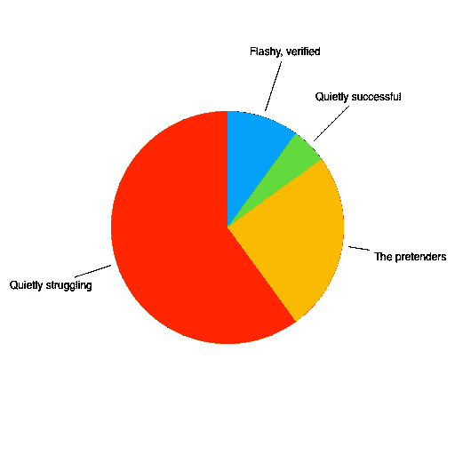
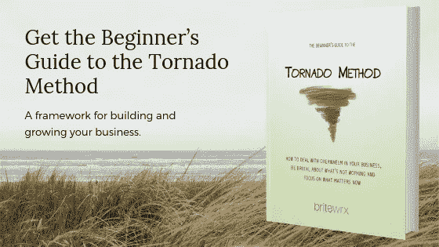

# 在互联网成功的烟雾和镜子背后

> 原文：<https://medium.com/swlh/behind-the-smoke-and-mirrors-of-internet-success-d467e9eee3aa>

Photo by [Steven Libralon](https://unsplash.com/photos/Do1GQljlNk8?utm_source=unsplash&utm_medium=referral&utm_content=creditCopyText) on [Unsplash](https://unsplash.com/search/photos/pretend?utm_source=unsplash&utm_medium=referral&utm_content=creditCopyText)

弗兰克·阿巴内尔是假的。

但不是一般的赝品，而是世界上最著名的赝品之一。2002 年由莱昂纳多·迪卡普里奥和汤姆·汉克斯主演的电影《如果你能抓住我》讲述了弗兰克·阿巴内尔的真实故事，他在 19 岁生日之前，通过冒充泛美航空公司的飞行员、佐治亚州的医生和路易斯安那州教区的检察官成功实施了价值数百万美元的诈骗。

就像弗兰克·阿巴内尔能够欺骗很多人一样，我们今天看着互联网，很难判断不同的人声称的成功有多少是真实的。他们承诺，如果你购买他们的产品，做他们所做的事情，就会成功和富有——但是有多少是真的呢？在互联网上，我们都可以看起来很成功，不管事情是好是坏。

# 四种互联网成功

在过去的八年里，我开始注意到人们在互联网上宣称成功的方式和内容。获得支持这一点的数据是困难的(毕竟，互联网让你很容易表现出成功，即使你并不成功)，但模式显示有四种成功:

*   华而不实、经验证的成功；
*   悄悄的成功；
*   伪装者；和
*   静静的挣扎着。

没有数据支持，当然不可能知道每种类型的成功有多少。但我敢打个小赌，它看起来像这样:

Not based on any data — but I believe a good approximation of what’s really behind the smoke and mirrors of Internet success

## 华而不实、经证实的成功

这些是真正成功的企业家，他们喜欢向世界展示成功。有些人甚至每月公布他们的财务状况——[企业家着火](https://www.eofire.com/income/)的约翰·李·杜马斯就是最好的例子之一。

这些信息很有帮助，因为它不仅显示了约翰的收入在这些年里是如何增长的，还提供了他的收入在不同来源之间是如何分配的明细。

## 悄然成功

更难追踪的是那些默默无闻的成功人士——像来自[的 Sean D'Souza 这样的心理战术](https://www.psychotactics.com/)的人从 21 世纪初就已经出现了。这些企业家很成功，但并不炫耀——他们对自己的现状很满意，并吸引了多年的忠实追随者。

## 伪装者

然后是伪装者。你看到的这些网站有很多宣传，很多承诺和大量弹出窗口。他们引诱你注册一个免费的电子邮件课程，这个课程将揭示互联网成功的秘密，随后是强力推销，不要错过的课程，这些课程将保证你获得数不清的财富。

炒作如此强烈，以至于很难判断这些企业家是否真的实现了他们承诺的价值。这是我们小心行事的地方。

## 静静的挣扎

还有最大的群体——奋斗者。这些企业家正在创业，但不忍心(虚假地)表现出可笑的成功。他们不会大肆宣传，不会做出虚假的承诺——他们只是低着头，努力让它发挥作用。

# 你应该假装直到你成功吗？

我们大多数人都属于“默默奋斗”的那一类。我们看着那些华而不实的被证实的，悄无声息的成功，在那里我们可以找到他们，甚至是伪装者，我们悄悄地嫉妒，担心我们永远不会到达那里，并想知道有多少炒作是真实的，以及我们是否也应该假装。

那我们该怎么办——假装直到成功？即使我们不成功也要表现得很成功？大肆宣传吗？

你在尚未成功的企业背后投入多少宣传是个人的选择。有些人认为，即使你还没有那么成功，你也必须用宣传来吸引人们注意你的成功。其他人不相信炒作——他们宁愿埋头打造自己的产品和服务，慢慢建立市场意识，并在更长的时间内取得成功。

无论你决定采取哪种策略，你都必须表现得自信，即使你还没有取得巨大的成功。原因如下。

## 即使你不在你想去的地方，你对你的客户仍然有价值

你提供的产品或服务是有价值的。无论你是商业教练、室内设计师还是任何其他类型的专业人士，你的产品或服务都能改变他人的生活。

> 不要把你提供的价值和你目前的不成功混为一谈。

人们很容易陷入“我不成功，所以我没有价值”的陷阱。我们很自然地将成功与价值等同起来——如果我们成功了，我们卖的东西必须对他人有价值。

但这是一个错误的等式。

仅仅因为你还没有成功，并不意味着你的产品和服务没有价值。许多企业家在他们所做的事情上很出色，但当他们开始时，他们不知道营销、销售或撰写销售文案。这些是你仍然需要学习的技能——但这并不意味着你的产品和服务没有价值。

> 如果你不相信你所拥有的能够解决他们的问题，你将会伤害到你的客户。

所以，相信你所能提供的，学习你还不具备的技能来获得成功。

## 没有信心就卖不出去

想象你走进一家汽车经销店。一位销售人员走近你，你开始谈论陈列室里的汽车。但是销售人员不相信他或她的产品——他们不太清楚它们有多可靠，他们不相信它们是按照高质量标准制造的，他们认为你在其他地方也有很多选择。

你会从这样的人那里买东西吗？

当然不是。为了建立你对他们产品的信心，他们必须表现出自信。他们不仅要对自己的产品了如指掌，还必须表现出这样的信心:如果你购买他们的产品，你会做出正确的决定。

你也必须这样做。

你必须*知道*你的产品或服务提供了价值。如果你不相信你能有所作为，你会显得犹豫不决，不相信你能解决他们的问题。你会忍不住和自己讨价还价，降低价格。你会发现很难报价并坚持你的价格。

> 为了有效地销售，你必须相信自己，相信你的产品或服务。没有这种信心，你就无法销售解决他们问题的方案。

所以提问。确保你的产品或服务适合他们。然后用你对产品和自己的信心向他们展示你有正确的解决方案。

# 为了你自己，你必须自信

你永远不会有 100%的客户成功率。有些人会大获成功，有些人得不到他们想要的好处，有些人则介于两者之间。人是不同的，结果总是会有所不同。

但是从长远来看，你对自己的信心会让一切变得不同。

你需要对自己有信心来度过困难时期。你需要自信来继续在早上起床，埋头做你知道会改变他人生活的项目、产品或服务。你需要自信才能坚持下去。

这种信心并不总是存在的。每个企业家都会经历我们怀疑自己，怀疑自己成功的能力的时候。不要绝望——如果你有价值，你可以围绕它创业。你可能不得不改变你的观点，重新创造自己一百次——但是如果你有信心，你有价值——你就能成功。

所以，为了你自己，要有信心。成功会随之而来。

# 不一定是烟雾和镜子

你不必假装你不是的东西。你不必大肆宣传或学习强行推销的艺术。你可以做你自己，平静地相信你所拥有的对他人是有价值的。然后你可以学习营销和销售的艺术，以及建立成功企业的所有其他方面。

> 其他人对你的财务成功(或失败)并不感兴趣。有趣的是你有能力改变他们的生意或生活。

这就是你不需要假装自信的地方——你可以真正自信。如果你有这种信心，你会建立信任，发现更容易销售和不低估你的服务。

# 弗兰克·阿巴内尔现在是一名安全顾问

弗兰克·阿巴内尔的主要罪行是支票欺诈；他变得如此有经验，以至于联邦调查局最终在抓捕其他伪造支票者时向他求助。

在开始为联邦政府工作之前，他在监狱里呆了不到五年。他目前是联邦调查局学院和外地办事处的顾问和讲师。他还经营着一家金融欺诈咨询公司 Abagnale Associates。

弗兰克从空想变成了体面的职业。你不必从烟雾和镜子开始建立你的生意——但你必须培养让他成为成功罪犯的一个东西——自信。

对自己和自己的价值有信心。你有一个角色要扮演，你会有所作为。

*原载于 2018 年 12 月 17 日*[*【blog.britewrx.com*](https://blog.britewrx.com/behind-the-smoke-and-mirrors-of-internet-success/)*。*

## 这篇文章发表在 [The Startup](https://medium.com/swlh) 上，这是 Medium 最大的创业刊物，拥有+400，714 名读者。

## 在此订阅接收[我们的头条新闻](http://growthsupply.com/the-startup-newsletter/)。

