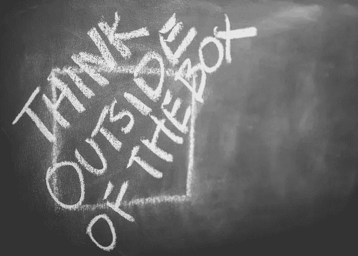

# 2018 年做企业家

> 原文：<https://medium.com/swlh/being-an-entrepreneur-in-2018-60059b6e3010>

随着人工智能、人工智能和区块链的崛起，现在似乎是投资上述高科技选择之一并创建自己的小企业的完美而合理的时机。你所需要做的就是找到愿意为微薄的工资和加班工作的人，然后你就可以开始称自己为“初创企业”了。

事情就是这样，对吧？

开玩笑——不，不是的。

随着技术的不断发展，拥有自己的企业并成为下一个杰夫·贝索斯或马云似乎比以往任何时候都更有可能。然而，如果是这样的话，为什么我们没有迸发出新的想法，并试图创造一个新的，比如说，亚马逊？是什么阻止了我们？

事实上，**在 2018 年成为一名企业家并不像你想象的那么容易**。

据 Fitsmallbusiness.com 的[报道，46%的企业失败是因为无能，30%是因为缺乏管理经验，11%是因为缺乏经验，其余的是因为欺诈、自然灾害和疏忽。总而言之:2017 年，几乎一半的小企业都失败了。](https://fitsmallbusiness.com/entrepreneurship-statistics/)

此外，如果我提到 [30%的企业家每周工作 50-59 小时](https://www.thealternativeboard.com/new-survey-shows-work-life-balance-is-possible-but-not-likely-for-entrepreneurs/)，你还会认为这是一份“轻松的工作”吗？一周工作 60 个小时来制造几乎有 50%失败几率的东西？听起来只有疯子才会冒这样的风险。

有些人会说他是一个疯子，而另一些人则认为他是一个真正的企业家。

成为一名企业家不是一夜之间就能轻易做出的决定。事实上——这个决定需要大量的自我质疑、自我怀疑和担忧。然而，如果你在所有这些折磨之后成功到达了彼岸，并且仍然想开始一个小生意，这可能是你准备好踏上这个神奇旅程的一个信号。

成为一名企业家需要承诺、大量的努力、耐心和对自己的信念。它需要坚强的意志和巨大的雄心。一个真正的企业主知道市场在不断变化，做生意需要尽快适应这些变化。

> 那么，2018 年对创业者来说意味着什么？在这个时代，成为一名企业家实际上意味着什么？

在这篇文章中，我将谈论**六个技巧和诀窍**，它们将帮助你了解企业家是什么样的，并帮助你成为你一直想成为的创始人。

# 永远不要低估网络的力量

永远不要低估它的力量，即使 20 年后也不要！作为一名企业家，你必须无处不在。不言而喻，你应该参加所有的聚会、讲座、会议和任何你觉得能从中受益的活动。

为什么？因为作为一名创业者(不仅仅是 2018 年)意味着要一直寻找新的知识来源和拓展视野的方法。不仅如此，通过参与创业/技术社区，你有机会结识一群拥有你需要的经验的人。幸运的是，他们中的大多数人都愿意给你一两条建议，告诉你如何管理你的团队，成为一名领导者，并创造一种健康的公司文化。

> *还有，一定要记住——****人脉不是一蹴而就的*** *。它创造了人与人之间的关系。所以，在你见过几个企业家朋友并交换了联系方式后，不要犹豫，给他们打个电话，一起喝杯咖啡。在面对面的交流中，人们倾向于分享很多东西。*

坚持不懈，在社区中找到自己的位置。没人说在 2018 年成为一名企业家很容易，对吧？

# 尽快验证你的想法

如今，没有人有时间花几个月的时间来构建一个产品，然后验证它。相反，验证你的想法应该是你的首要任务。为什么？因为你将会得到你一直在问自己的问题的答案:*我的产品/服务有机会成功吗？我的梦想真的会实现吗？*

我们给你的建议是，一旦你觉得准备好了，就把产品(或 MVP)展示给它的潜在客户。这样，您将获得急需的反馈，如果验证顺利，您将能够开发产品并根据用户的意愿进行调整。

成为一名企业家就是要积极主动。

这就引出了下一个技巧。

# 勇敢总是会得到很高的回报

一旦你觉得产品已经完成并可以上市，就推出它吧！勇敢点，放手去做。

成为一名企业家需要勇敢和大胆。但是，不要搞错了:**勇敢并不等同于赌徒**。勇敢需要精神上或身体上的力量，表现为不顾危险、威胁的情况下仍愿意做某事。在残酷的市场上验证你的产品/服务，有时感觉它是由愤怒的食人鱼组成的？听起来很勇敢！

> 请记住，大多数企业家表现出的勇气是不让任何人阻止他们前进。即使他们失败了，他们失败是因为他们自己的决定，而不是因为他们害怕成功。

关于这个问题，我可以给你最后一个建议。一旦你最终决定发布你的产品，**在发布前开始营销**。为发布做好准备，并保持积极的态度。让你的营销计划发挥魔力。

# 密切关注市场变化

如果有人知道企业家是什么样的，那肯定是尼尔·帕特尔。在[他最近的一篇文章](https://neilpatel.com/blog/entrepreneurship-trends/)中，Patel 提到了市场的变化——在 2018 年，术语*颠覆性创新*是需要记住的最重要的事情。这是什么意思？

虽然这个术语从 1995 年就有了，但是在过去的几年里它达到了全盛时期。它可以被描述为一个创新的东西，由一个初创公司完成。那么，创新有什么特别之处呢？嗯，这种创新产品能够**对行业**产生巨大影响，甚至超过最大的行业竞争对手。正如尼尔所说，破坏性创新的一个例子是 Airbnb。

在我之前的一篇关于 [5 条商业经验](https://kolosek.com/5-business-lessons/)的博客文章中，我提到了 Airbnb 是如何差点犯下一个可能让它名誉扫地的巨大错误。由于开诚布公并承认错误，其创始人成功挽救了公司。这正是颠覆性创新:能够在市场上制造巨大的繁荣(并给行业领导者蒙上阴影)，并能够管理这种繁荣。其他例子包括脸书、Zoom、亚马逊等。

不要误解我的意思——成为一名企业家并不意味着拥有一个辉煌的、脸书式的商业想法，这种想法会从根本上动摇市场。你只需要认识到这个趋势，并意识到这样一个事实，在你思考你的想法的同时，另一个未来的企业家可能也有和你相似的想法，并正在寻找一种在市场上获得成功的方法。

总结一下:注意趋势，不要害怕趋势。

# 对远程团队说“是”

你知道吗，当员工远程处理项目时，他们的工作效率往往会提高 20%?不仅如此——他们能够睡得更多，这让他们感觉更好、更清醒。如果你正在考虑拥有一个远程团队，现在是时候加入这个潮流了。

你为什么要给它机会？好吧，如果关于生产率的陈述不能说服你，也许考虑一下**运营成本**会让你信服。作为一名企业家也意味着要关注成本。如果你仔细考虑一下，你可以为[节省几千美元的办公空间](https://remote.co/10-stats-about-remote-work/)，并将其投资于公司的其他基础设施。听起来没那么糟，对吧？

所以，在你急着租一间办公室之前，算一算，通读以下事实:

*   越来越多的行业开始接受远程工作。
*   有些人发现在家工作比其他人更容易。
*   在远程团队中，良好合作的关键是信任和开放的交流([Gethppy.com](https://gethppy.com/hr-infographics/managing-remote-teams))。

# 你不能避开 AI

据[福布斯](https://www.forbes.com/sites/davidpridham/2018/01/10/entrepreneurs-heres-good-news-for-2018/#316381d96659)报道，人工智能现在比互联网刚出现的时候还要大。从无人驾驶汽车和面向客户的服务，到对数据科学家的高需求，市场正朝着这一先进技术发展。

当然，不是每个人都可以拥有甚至想要建立一家类似于特斯拉公司的公司，但他们没有意识到的是，他们可能正在通过每天使用协作工具来追随这一趋势。

让我们面对现实吧——AI 就在我们身边**。如果你对创造自动驾驶汽车不感兴趣，只要关注这一特定趋势就行了。你永远不知道它如何能够帮助你的业务增长。**

# **一锤定音**

**在所有这些提示和技巧中，我必须强调一个你应该永远记住的。如果你是一个正在开发产品的新企业家，**不要让这些趋势吓倒你**。把它们用在你的优势上，证明任何人都可以在 2018 年成功，只要有一点运气和一颗勇敢的心。**

**到场是很重要的。2018 年做企业家，并不意味着要不惜一切代价追随最前沿的技术和趋势。这意味着要跟上最新的市场趋势，并结合旧的商业原则。**

**最后，这一切都归结于**倾听你的直觉**和市场/新趋势要说什么。**

**祝你旅途顺利！**

**谢谢你阅读这篇文章直到最后。大家怎么看，2018 年做创业者难吗？有没有我没提到的创业小技巧和窍门？在下面的评论区分享吧！**

***原载于 2018 年 4 月 27 日*[*【kolosek.com*](https://kolosek.com/being-an-entrepreneur-in-2018/?utm_source=ts)*。***

****

## **这篇文章发表在 [The Startup](https://medium.com/swlh) 上，这是 Medium 最大的创业刊物，有 319，583+人关注。**

## **在此订阅接收[我们的头条新闻](http://growthsupply.com/the-startup-newsletter/)。**

****