# 一个 iOS 数学游戏的 6 次迭代。做游戏太难了！

> 原文：<https://medium.com/swlh/being-an-ios-developer-why-i-stopped-trying-to-do-design-852c5eb5b678>

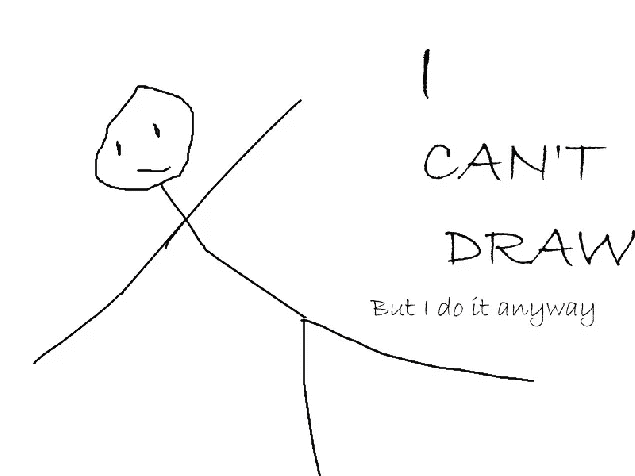

我是一名 iOS 开发人员，非常热爱开发小众应用。然而我的问题是:我 **不会设计东西。**

我是说真的，我从出生开始就完全不会画东西。我可以勾画想法，线框；但是要画出一个物体，嗯几乎不可能。当你是一个移动开发者，总是想做点什么的时候，你不会设计的事实真的很伤人。这意味着无论你做什么，最终你肯定需要一个设计师。如果这听起来对你来说很熟悉，我们在同一条船上。我们可以进[碰](http://twitter.com/thkeen)！

我做了相当多的应用程序，很多是为别人做的，很少是我和同事、朋友、设计师一起做的。如果你是一个用户界面和 UX 设计师，你可能知道很难画出一个不仅看起来漂亮，而且必须工作得很好，非常适合人们的手的东西。对于一个开发人员来说，试图同时实现这一点和编码更疯狂:**设计+编码**。这也是我对那些能做到这两者的人非常钦佩的地方。就像制作活版印刷的罗兰·布里切特。

# 1.概念

> ***还是那句话，不能把点点滴滴串联起来往前看；你只能向后看才能把它们联系起来……(史蒂夫·乔布斯)***

今年早些时候，我决定做一个数学游戏，因为我喜欢数字，我喜欢计算和训练大脑。我喜欢像《三》、《十字路口》、《西梅》、《暗影骑士》、《射击天空》、《不通勤》等游戏。我的游戏灵感来自电视上的游戏节目(见[倒计时](http://en.wikipedia.org/wiki/Countdown_%28game_show%29)或[Des chiffres et Des letters](http://en.wikipedia.org/wiki/Des_chiffres_et_des_lettres))，这应该是超级硬核，但我想让它变得如此友好，每个人都可以玩。

所以，我要带你们从我的第一个原型到最终产品。

# 2.原型

这款游戏经历了 6 次重大的重新设计。前 4 个是我做的，惨败。🤕

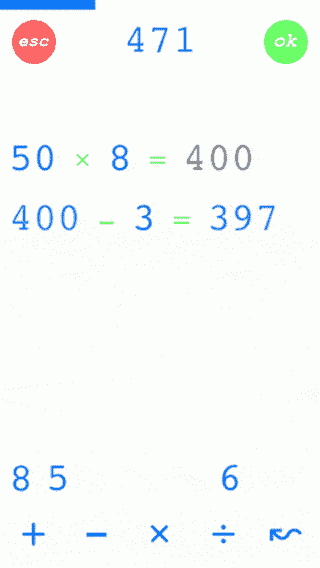

**App Prototypes evolution**

基本上将有 3 个主屏幕:菜单，游戏和结束游戏。

# 版本 1

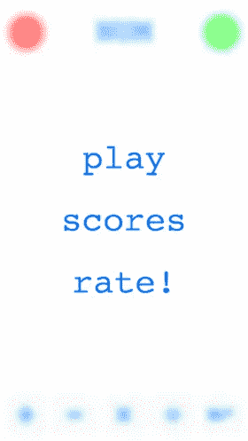

**Menu v1,** blur effect

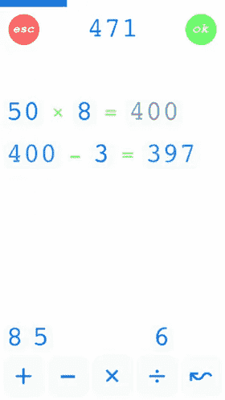

**Game Play v1,** white and plain, colours also suck

# 版本 2

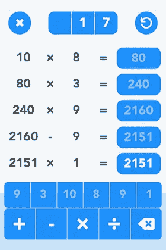

**Game Play v2,** rounded buttons with time limit

# 版本 3

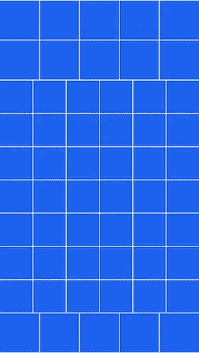

**Game Play v3,** playing with grid idea

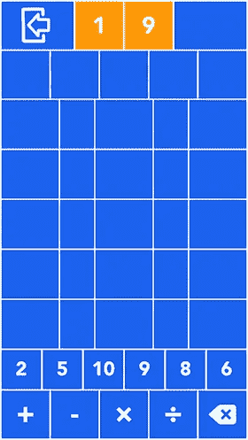

**Game Play v3,** with numbers and quit button

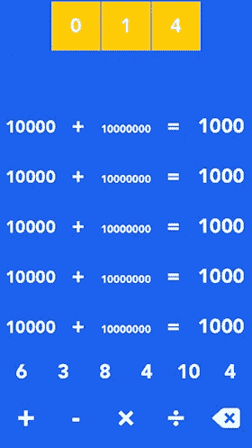

**Game Play v3.1,** tried killing the grid, but not much better

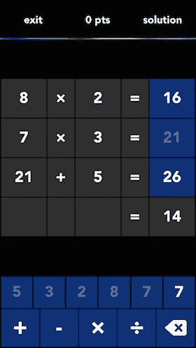

**Game Play v3.2,** dark theme with Solution button, felt a bit too techie

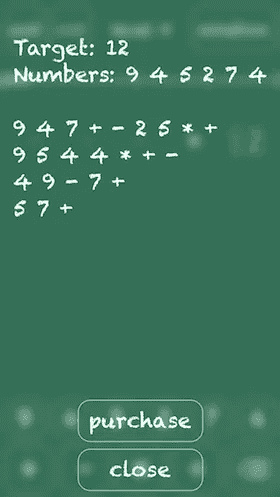

**Game Play v3.3,** tried with chalkboard style. Added Solution screen; still not right yet

# 版本 4

然后版本 4 就是我差点出货的版本。只是在我拿到我同事的另一个原型(版本 5)之后。后来我决定不再发货了。

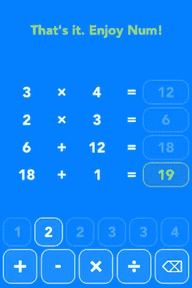

**Onboarding v4,** buttons with outlines and dimmed background. Not bad.

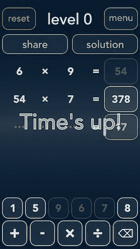

**Game Play v4**, dark theme

我非常喜欢这个版本。它可能已经被运走了。但是很明显，带有这种字体的数字仍然很难看。不好读，难记。所以 v5！

# 版本 5

这个版本不是我设计的，而是我同事设计的。他用四种主色的平面风格来代表四个操作员。字体最初是 *Gotham* ，但是我们改成了*avenirnnext*。对于数字来说，他们没有太大的不同。

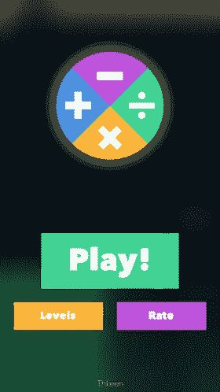

**Menu v5**

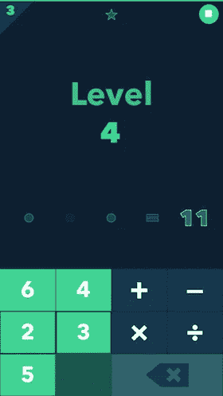

**Game Play v5,** numbers pad divided in 2 columns

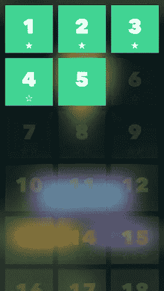

**Level screen v5 (new)**

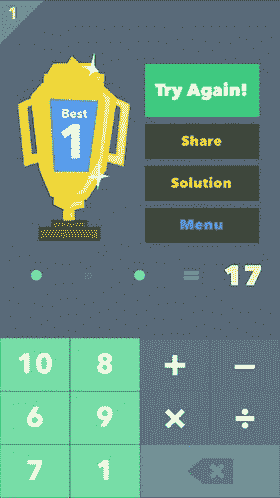

**End Game screen**

这很好，我在 2014 年 11 月初发布了这个版本。之后我继续迭代让游戏变得更好。这也是我寻找设计师的时候，所以我与[(*创业、流浪、生活黑客)*](https://medium.com/u/9e7f98b882b7# SWLH</strong></a><strong class=)

