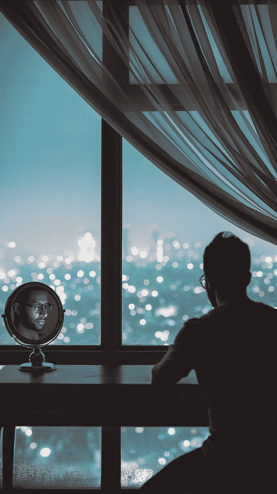

# 自私并不总是自私

> 原文：<https://medium.com/swlh/being-selfish-isnt-always-selfish-7272ab6735a2>

## 有时它也很聪明

“man sitting in front of black wooden table with face reflecting on round vanity table mirror” by [Edgar Pereira](https://unsplash.com/@eddy999?utm_source=medium&utm_medium=referral) on [Unsplash](https://unsplash.com?utm_source=medium&utm_medium=referral)

当我们想到一个自私的人时，它总是被一个消极的主题所包围。

很多时候，我们把自私等同于除了自己之外不关心任何人。然而，这并不总是正确的。

生活中充满了做出不同决定的机会。