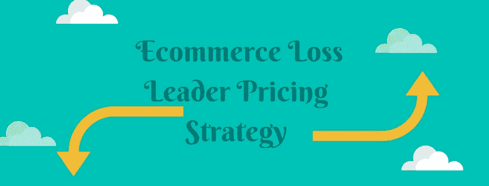
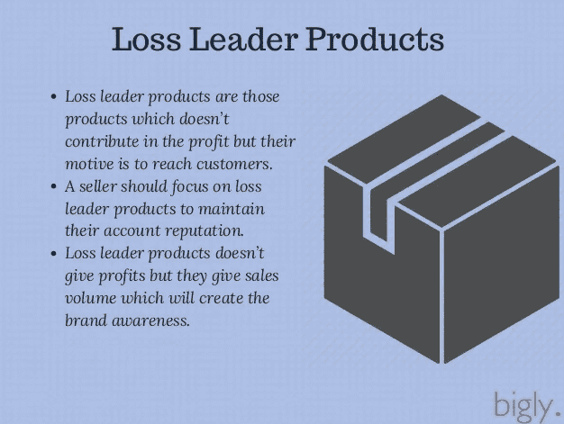
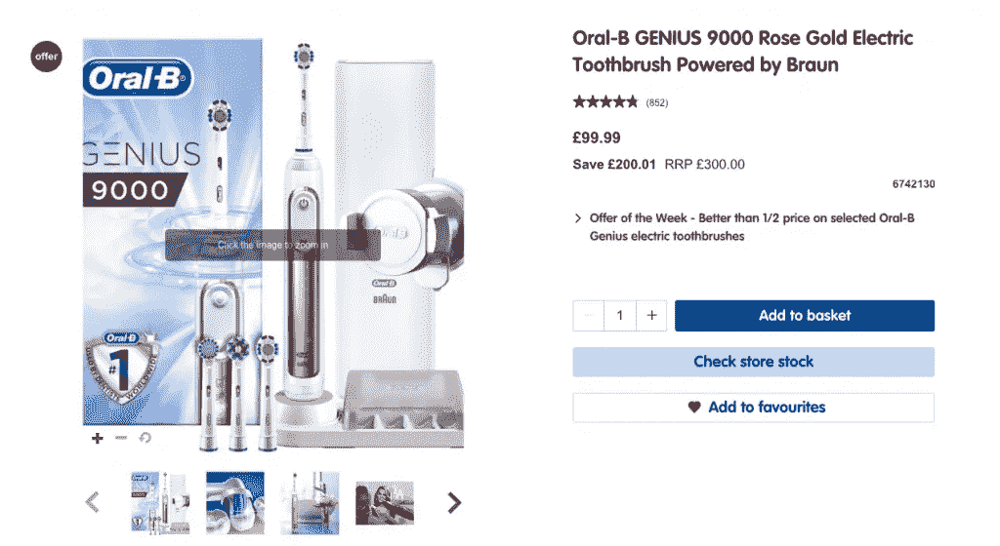
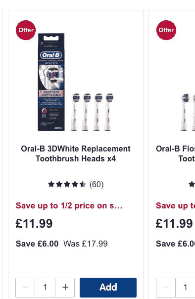
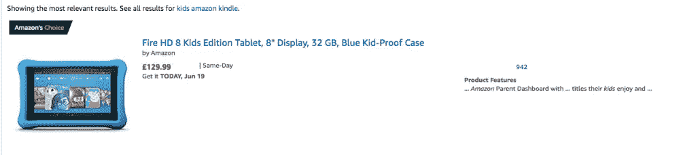

# 使用电子商务亏损领先定价策略的好处

> 原文：<https://medium.com/swlh/benefits-of-using-an-ecommerce-loss-leader-pricing-strategy-1fdd3b7e926>

如果你是 Prisync 博客的常客，那么你会知道我们试图告诉你[在你的定价中使用竞争到底的方法](https://blog.prisync.com/the-advantages-and-disadvantages-of-competitive-pricing-strategy/)的危险。我们积极寻求为您提供定价策略，允许您提高价格，同时保持[竞争优势。](https://blog.prisync.com/increase-competitive-advantage/)

但事情是不同的，这篇博文…

在这篇博文中，我们将从不同的角度来看待定价，并考虑采用积极的亏损领先方法来获得竞争优势。

电子商务亏损领先定价策略包括将你的一两件产品设定在较低的价格——这个价格实际上会让你亏损——以便让你的客户进门(或在你的网站上)。

你这样做是希望一旦他们出现在你的网站上，他们更有可能购买你的其他商品(正常定价的商品)。

在本帖中，我们将探讨亏损领先定价的优势和劣势、如何有效实施以及该策略的一些实际应用案例。

# 亏损的领导者不会竞相杀价

值得注意的是，尽管亏损领先定价的过程包括设定利润或低于利润的价格，但这与竞相杀价的方法不同(我们并不总是推荐这种方法)。

“竞相杀价”是指在没有任何策略的情况下降低价格，除了比竞争对手更低之外。发生的情况是，你最终将产品价格重新定得如此之低，以至于你几乎无法从中获利。

然而，亏本销售是以亏本销售特定产品的方式来吸引人们来到你的商店，并从其他产品中获得利润。

来源:[https://www . slide share . net/bigly tech/seller-strategies-to-be-successful-in-commerce](https://www.slideshare.net/biglytech/seller-strategies-to-be-successful-in-ecommerce)

# 亏损领先定价的缺点

从缺点开始是有意义的，因为这是一种在实现之前需要仔细考虑的方法。亏损领先定价的最大缺点之一是“樱桃采摘者”的概念。这些顾客会被低价产品所吸引，但不会停留在你的网站上购买其他商品。

因此，因为他们没有购买任何全价商品，你实际上是在亏本出售该产品，无法弥补全价商品的成本损失。

你不可能知道你的电子商务商店有多容易受到挑剔者的影响，但请记住，如果你的商业模式通常适合寻找便宜货的人，你可能更容易拥有挑剔的顾客。

# 亏损领先者的优势

亏损领先方法的主要优势之一是能够帮助你进入一个新的市场。尤其是当你是一个提供新产品的新品牌时，很难说服人们和你一起购物，尤其是在市场已经饱和的情况下。

尽管事实上人们倾向于坚持他们所知道的，亏损领导为你提供了一个机会，让更新的产品得到一些关注。这也意味着，对于选择购买更便宜、亏本产品的人来说，风险更小。因此，他们更有可能将你的品牌作为考虑因素。

其次，电子商务亏本定价是推广你店里其他产品的好方法。

亏损领袖的目标是让人们进门。然后，你利用你的其他资产，如客户体验、价值主张和优秀的产品选择，吸引他们也购买其他东西，目的都是为了弥补亏损领导者产品的利润损失。

# 亏损领先的例子

电动牙刷是亏本产品的一个很好的例子。这款电动牙刷售价 99 英镑

虽然我们不知道这些牙刷的制造成本，但我们可以假设他们的大部分利润来自可更换的牙刷头。

当您考虑电动牙刷时，您不会经常购买它们。所以品牌可以亏本出售，因为他们知道他们可以很容易地从牙刷头上收回损失的利润成本，为了更好的口腔卫生，牙刷头需要更经常地更换。

因此，如果你想实施亏本领先战略，并对此感到担忧，考虑一下你是否有任何附加产品，人们需要回到你的商店进行进一步的补充购买。

亚马逊 Kindle 是亏损领导者的另一个典型例子。虽然它最初是一个电子阅读器，但他们后来将其发展成为一个成熟的平板电脑。他们能够承担亏本销售，因为他们了解追加销售的力量。

如果你有 kindle，你很可能会想使用其他的附加软件，比如应用程序、电影、音乐、书籍等等。

但为了做到这一点，你首先必须在亚马逊网站(或应用程序)上，其次，为它们付费。

因此，很明显，亚马逊在给他们的平板电脑定价时考虑到了这一点，因为他们知道他们可以在其他地方收回成本。

亏损领导也不只是指所有的实物产品。如果你的任何产品都有数字元素，那么作为亏本产品提供主要产品可以让你处于竞争优势。

# 电子商务亏损领导者定价策略要点

在本帖中，我们探讨了亏损领先策略与竞相杀价策略的不同之处。我们已经研究了为什么你把亏本产品的价格定得不赚钱，但是我们也研究了这样做的一些好处。

仅仅因为亏损领导者的想法是不盈利，这并不意味着你不盈利，一点也不。它只是意味着你在那个特定的项目上没有利润。

我们还为您提供了一些亏损领先方法的良好用例示例，但这些并不是全部。亏本定价在新鲜食品、科技、硬件和工具行业也很有效。

但是请记住，每一种定价策略都有一个好的和一个坏的实施方法。因此，在你盲目地将特定产品设定为亏损之前，想想策略，你希望通过设定这么低的价格获得什么，你希望人们继续购买什么？

你试过电子商务亏本领先的定价策略吗？

## 这篇文章发表在《初创企业》杂志上，这是 Medium 最大的创业刊物，拥有 336，210 多名读者。

## 订阅接收[我们的头条](http://growthsupply.com/the-startup-newsletter/)。

