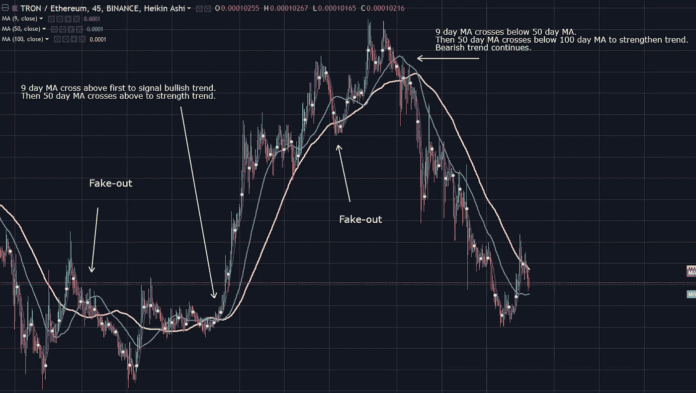

# 日内/波段交易者的最佳指标以及如何使用它们

> 原文：<https://medium.com/swlh/best-indicators-for-day-swing-traders-and-how-to-use-them-dd4b0ea6ff9>

# 介绍

这是对日内交易者和波段交易者的三个最好的交易指标的快速概述。如果你是一个新的交易者，那么很重要的一点是你要明白，没有任何指标或振荡指标能让你立即获利，所以不要去找一个能让你获利的指标或振荡指标。学习一些精选的指标以及有效使用它们的方法和策略。掌握它们，然后学习更多。

> ***“你掌握的指标越少，你的策略就越有利可图。然后更多你没有的指标。”***

我们开始吧。

# 移动平均线

简单地说，移动平均线只是根据过去的价格计算出来的线。它们很容易理解，对任何交易类型都非常有用，不管是日内交易，波动交易，还是更长时间的交易。

在你的图上应该总是有多条不同时间段的 MA 线。我个人使用三种均线:9 日均线、50 日均线和 100 日均线。这让我对市场有了更广阔的视角，并帮助我识别更强的趋势和反转。

**使用移动平均线的两种方法**

1.)识别趋势强度

简单地说，当前价格和趋势离相对均线越远，趋势就越弱，这有助于交易者发现潜在的反转，找到进场和出场点。在良好实践中，这种方法与其他指标(如交易量)结合使用。(下)。

2.)用交叉确认趋势反转

通常，移动平均线交叉可以是趋势反转的信号，例如，如果在上升趋势后，9 天移动平均线交叉低于 50 天移动平均线。那么看涨趋势可能正在反转，预示着看跌趋势。但是要注意，因为往往会有频繁的假出和交叉，让新交易者措手不及，你应该确保使用其他方法和工具来确认反转。

Image from [https://tradingview.com](https://tradingview.com) charting tools.

均线很重要，因为它让交易者了解市场状态，永远不要盲目交易。

# 相对强度指数

RSI 指标利用证券过去的表现和波动性，提供了对证券当前价格强度的相对评估。同样，这也是任何类型的交易者和/或交易风格的必备工具。

RSI 对安全性的评分范围是 1-100，您需要记住这一点，以获得以下提示。

**RSI 可以多种方式使用**

1.)识别超买/超卖情况

识别超买/超卖的情况有助于发现趋势反转或修正。当一种证券超买时，它可能预示着熊市趋势的逆转或修正，当一种证券超卖时，它可能预示着牛市趋势的逆转或修正。

这些情况的教科书数字是 70/30: 70 =超买/高估，30 超卖/低估。尽管为了减少假出局，一些交易者(包括我)在这些情况下使用 80/20。

2.)识别差异

交易者也可以用背离来识别趋势反转，背离就是不同或不一致(链接到下面的韦氏词典)。

看涨背离信号

当价格创出新低，但 RSI 没有(或等价)。

看跌发散信号

当价格创出新高，但 RSI 没有创出新高(或等价)

Image from [https://tradingview.com](https://tradingview.com) charting tools.

快速的大幅度移动会产生假信号。所以就像任何其他指标一样，总是用其他工具/方法来确认趋势。

# 卷

在交易中使用成交量确实很容易理解，但通常被新手交易者忽略。显然，它对良好的流动性很重要，但真正改变我交易方式的规则是这个。

> ***“趋势需要成交量的支撑，始终确保较大的成交量发生在趋势的方向上。”***

了解这一点大大提高了我的游戏。当价格上涨时，新的资金需要支持，所以你需要看到交易量上升。反之亦然。如果这种情况没有发生，那么这是一个高估或低估的迹象。

Image from [https://tradingview.com](https://tradingview.com) charting tools.

如上所述，你可以通过观察趋势峰值的成交量下降来发现趋势反转。

# 笔记

如果你觉得这篇文章有帮助，那么请留下你的支持。如果你没有，我不怕批评。如果你想让我介绍更多，还有很多指标对交易者非常有用。让我知道！

我用币安来交易，你可以用这个链接注册。【https://www.binance.com/?ref=11166092】

## 这篇文章发表在 [The Startup](https://medium.com/swlh) 上，这是 Medium 最大的创业刊物，有 333，253+人关注。

## 订阅接收[我们的头条新闻](http://growthsupply.com/the-startup-newsletter/)。

