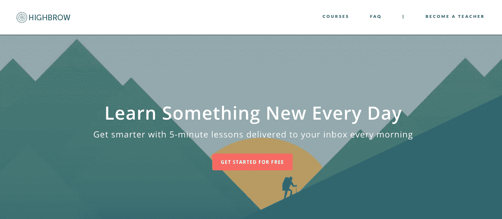
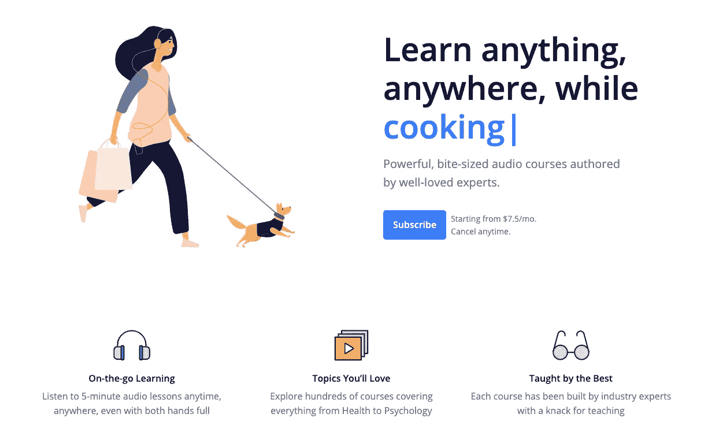
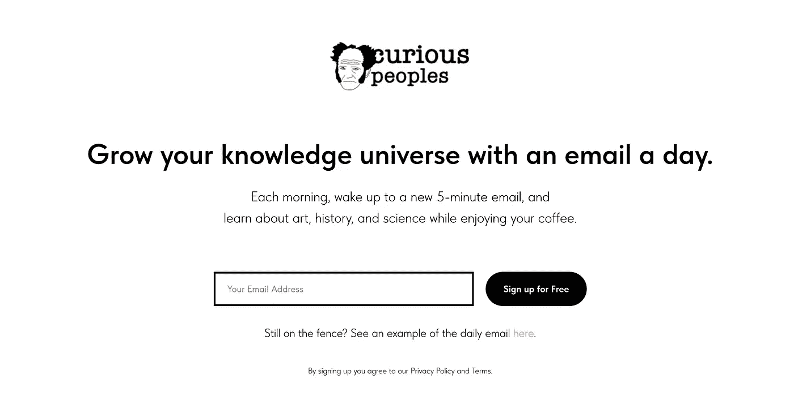
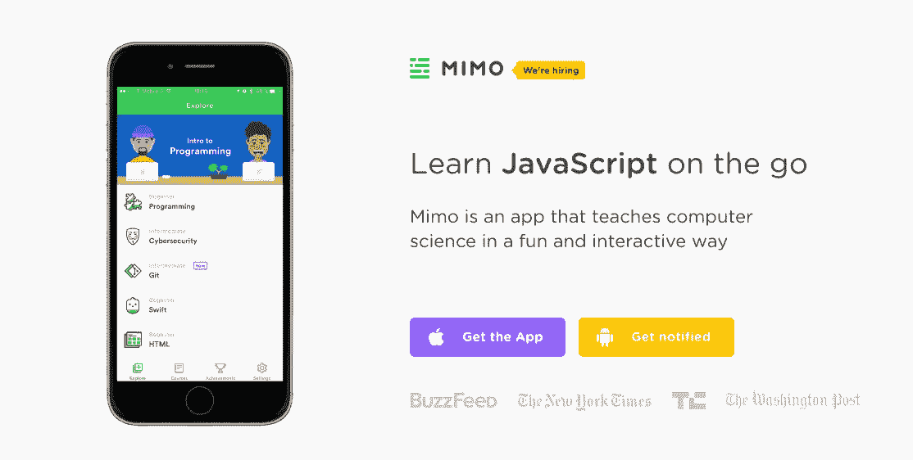
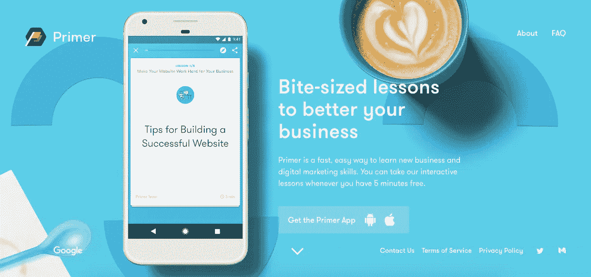
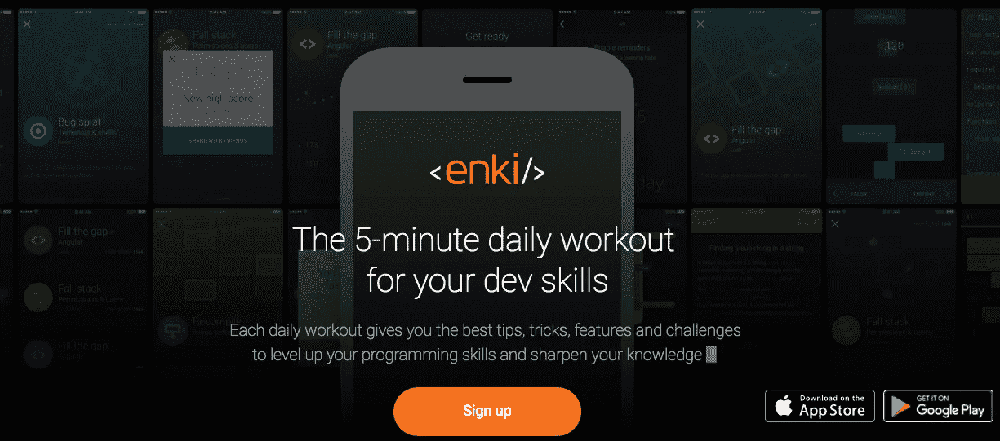
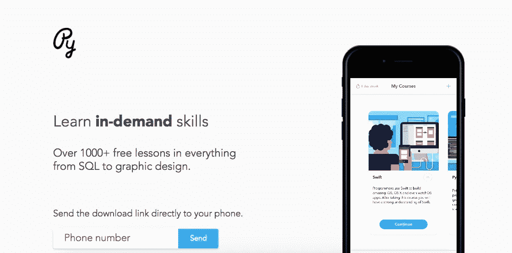

# 注意力持续时间短的人的最佳学习工具

> 原文：<https://medium.com/swlh/best-learning-tools-for-those-with-short-attention-spans-3feaf46838bb>

> "一旦我们接受了自己的极限，我们就会超越它们."
> 
> **——阿尔伯特·爱因斯坦**

今天的学生不同于他们之前的任何一代人。他们依赖科技发展，注意力持续时间极短。讲师和老师经常努力让学习者静坐足够长的时间来完成一堂完整的课。令人欣慰的是，越来越多的学习工具是为未来的学习者设计的。他们向学生提供一口大小的内容，这可以更好地吸引他们的注意力，并提高整体学习效果。下面是一些迎合注意力分散的学习者的顶级学习工具。

## 1.[曲高和寡](http://gohighbrow.com/)

每天早上，来自高端网站的内容会直接发送到你的收件箱。你可以在早上喝咖啡的时候进行五分钟的训练，以保持头脑清醒，知识渊博。课程为期十天，涉及各种各样的主题。你一次只能做一门课程，这有助于学习者增加记忆，让他们更有可能坚持某门课程。高雅艺术提供 300 多门课程，所以一定会有适合每个人的东西。

## 2. [Listenable](https://listenable.io/?utm_source=medium&utm_medium=article&utm_campaign=medium_article)

喜欢听播客？然后你会爱上 Listenable 上的音频课程！想学习沟通技巧并提升你的社交游戏水平吗？或者你想了解更多关于健康的知识？无论你对什么感兴趣，Listenable 上都有适合你的音频课程。

使用 Listenable，您可以在通勤、锻炼或遛狗时享受 5 分钟的音频课程。您可以从 3，000 多个由广受欢迎的专家创建的原创音频课程中进行选择。

## 3.[好奇的人们](https://curiouspeoples.com/)

《好奇的人们》是一份电子邮件时事通讯，每天帮助你扩展你的常识。每天早上，醒来时会收到一封 5 分钟的新邮件，一边喝咖啡，一边学习艺术、历史和科学。

## 4. [Blinkist](https://www.blinkist.com/)

Blinkist 提供 15 分钟课程的非小说类书籍。课程以应用程序的形式提供，你可以选择阅读或收听课程。这些书涵盖了从职业发展到科学的广泛主题。用户可以从免费试用开始，但是他们可能也需要付费。

## 5. [Nerdify Bot](https://bot.gonerdify.com/)

这个有趣的学习工具以问答的形式向你提供信息。你只要问它一个问题，它就会给你一个答复。然后你可以选择在你有了答案后学习更多，或者让它知道这个答案不是你想要的。这款基于聊天的工具随处可用，无需下载应用程序。它有助于方程、定义、绘制图表，并帮助您查找信息。

## 6. [Mimo](https://getmimo.com)

如果你想通过一个应用程序学习计算机科学，Mimo 是一个好地方。Mimo 教授几种编码方法，您可以随身携带学习经验。你可以通过一个互动的学习平台来学习如何建立网站和数据库，这个平台可以让你按照自己的节奏来学习。这对初学者和更高级的学习者来说是很棒的。

## 7.[初级读本](https://www.yourprimer.com/)

Primer 面向商业专业人士或有抱负的企业家。它提供了关于对企业最重要的主题的小而细的课程，比如建立一个网站，客户如何思考，以及广告方法。该应用程序以五分钟为单位提供课程，还提供互动活动，以帮助增加学习和记忆。您甚至可以拥有课程的精简版本，并保存部分课程供以后使用。它非常适合忙碌的企业主和企业家。

## 8.[伊奇](https://enki.com/)

如果你想要一个编程的挑战，恩奇可以帮助你。Enki 提供五分钟的“锻炼”来挑战你的编程技能和增加你的知识基础。用户可以通过完成训练(课程)来解锁挑战。这些挑战允许用户练习和测试他们的技能。使用这款受游戏启发的编程应用程序，学习充满乐趣。

## 9. [Py](http://www.py-app.com/)

Py 提供各种主题的免费课程，从编程到人文学科。这款应用可以让你在上下班途中轻松学习。您可以通过特定的课程跟踪您的进度，并根据主题领域的不同进行各种互动挑战。学习和练习你的技能，然后让你在应用程序中获得积分和升级。

如果你喜欢这篇文章，你可能也会喜欢这些文章:

 [## 30 个最好的网站来扩展你的常识

### 重要的是不要停止提问。好奇心有它存在的理由。一个人不能不在…

medium.com](/go-highbrow/the-30-best-websites-to-expand-your-general-knowledge-48c6d80fb367)  [## 只有内向的人会喜欢的 9 种产品

### “告诉一个内向的人去参加聚会就像告诉一个圣人去地狱一样。”克里斯·伊斯兰大教堂

medium.com](/go-highbrow/products-only-introverts-will-love-1385745166c5)  [## 零花钱学习:10 门免费的心理学课程

### 你是否希望扩展你在心理学领域的知识，但不想花费太多时间？几个…

medium.com](/go-highbrow/learning-on-a-dime-10-great-psychology-courses-you-can-take-for-free-a5358bd791)