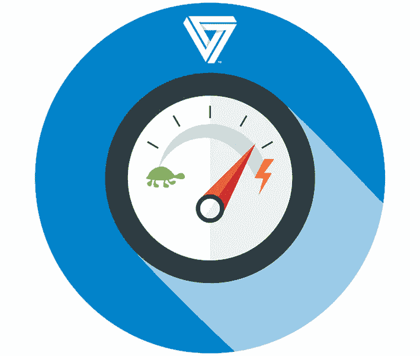

# 衡量 Rails 应用程序的最佳指标

> 原文：<https://medium.com/swlh/best-metrics-to-measure-for-rails-applications-84413043be5d>

Best Metrics To Measure For Rails Applications

Rails 已经为您跟踪和测量了大量的度量标准或关键性能指标(KPI)。你需要做的就是找出数据在哪里。

您熟悉 ActiveSupport 吗？ActiveSupport 是一个 RubyGem，它提供了 Ruby 语言扩展、实用工具等等。Arel 使用 ActiveSupport 的连接适配器连接到各种引擎、执行报价、连接池和进行类型转换。我想得太多了。现在，Arel 是许多 Rails 开发人员日常使用的库。Arel 充当框架的基本构建块，以构建更适合终端用户的 API。这些框架帮助我们构建和表示 SQL 查询。你可以说 Arel 是 Ruby 的一个 SQL 抽象语法树(AST)管理器。

> ActiveSupport 还附带了一个工具 API。这允许开发者为其他开发者提供挂钩。这些钩子是在数据库的 SQL 查询中调用的。使用自定义监听器订阅数据库，您会发现许多挂钩或事件。当您遇到一个时，Rails 会向您介绍有用的数据。当您定制这些事件时，您可以从数据中获得更多有用的信息。

如果你刚刚开始，利用谷歌分析。这是免费的，易于设置，并为您提供交通和使用信息。稍后，您可以确定对您的公司重要的 KPI，并采用有助于您度量它们的方法和工具。也有像 Redis 这样有助于分析的宝石。这些 RubyGems 用于像 ActiveSupport 这样的定制实现。你也可以看看 Segment.io，这是一个 SaaS 的数据仓库，连接着几十个受欢迎的 SaaS 产品**。像大多数分析工具一样，您需要安装 Segment 的 JavaScript 库来访问和运行报告。**

# **您应该衡量的 KPI:**

*   ****事件间隔时间** —对事件间隔时间的测量让您更清楚地了解经过的时间如何影响您的产品的用户体验。为了测量这一点，使用另一个钩子围绕一个动作的处理，它跟踪特定事件所花费的时间。你也可以通过谷歌分析跟踪事件。**

****

*   ****数据库&服务时间** —与数据库交互所花费的时间表明查询有问题，可能需要重写以优化性能。服务时间是外部交互时间。一个流行的应用程序性能监控工具 New Relic 可以帮助您解决这些问题。**

****

*   ****用户数量&请求数量** —这给你一个网站流量的总体概述。您可以通过运行一些 Arel 查询来衡量这一点，直到找到您一直在搜索的事件。使用 AREL 构建 SQL 查询。一旦你选择了你的查询，就对它们进行 rake 测试。如果您经常需要这些信息，请创建一个 Cron 作业，每小时、每天、每周或每月运行一次，并通过电子邮件将报告发送给您的利益相关者。您还可以使用 Mixpanel 来衡量用户指标，这是一项付费服务，具有许多您不必定制的出色功能，因此您的开发团队可以专注于构建更好的产品。**

****

*   ****排队时间** — New Relic 帮助您识别影响服务器响应时间的隐藏延迟问题。它会找到导致性能问题的应用程序代码。例如，以负责解密请求并产生适当输出的动作控制器为例。图表为您描绘了最慢的控制器动作。New Relic 是衡量排队时间的最佳工具，因为它可以让你放大具体问题，看看是什么导致了速度的下降。**

****

*   ****转化事件&基准测试**——采用谷歌分析的转化漏斗。简单地说，它跟踪由工程师或商业用户设置的事件。跟踪可以针对特定参数，如页面价值、每次访问目标值、目标转换、社交分享、用户行为等。关键是找出用户没有做你想让他们做的事情的地方，并做出改变，这样会有更多的用户转化。基准测试有助于你确定，与你之前的测试或你所在行业的其他公司相比，你做得如何。你也可以使用 MixPanel 作为 Google Analytics 的替代品。**

****

*   ****速度和内存限制** —通过一次性能测试，您可以更好地了解应用的速度和内存限制。MiniProfiler gem 和 Flamegraph gem 提供了有用的分析信息。**

****

*   ****处理请求所花费的时间** —在 Mac 上进行的日志分析为您提供了处理请求所花费时间的信息。它还提供了渲染时间和缓存细节的细节，以便您可以识别和修复瓶颈。**

****

*   ****慢速点**—Rails Analyzer Gem 附带多种工具，您可以使用这些工具来识别慢速点。你可以使用 Slim Scrooge Gem，这是一个优化层。**

****

*   ****网络性能** — Firebug 是 Firefox 的一个插件，可以为你监控网络性能。RailsPanel 是一个 Chrome 扩展，它让您对网络性能有了更多的了解。**

****

*   ****安全漏洞** — Breakman 是一个开源的 gem 和静态分析工具，它扫描你的 [**Rails 应用**](http://www.cognitiveclouds.com/custom-software-development-services/ruby-on-rails-development-company) 的安全漏洞。Breakman 是连续输送管道的理想工具。在每次提交时运行这个工具有助于识别在开发过程的任何阶段可能出现的漏洞。请务必查看 Breakman Pro 的高级功能。**

****

**我希望这有助于你定义需要跟踪的 KPI。**

***原载于* [***产品洞察博客***](https://www.cognitiveclouds.com/insights/) *来自 cognitive clouds:Top*[***Ruby on Rails 开发公司***](https://www.cognitiveclouds.com/custom-software-development-services/ruby-on-rails-development-company)**

****

## **这个故事发表在 [The Startup](https://medium.com/swlh) 上，这是 Medium 最大的创业刊物，有 300，118+人关注。**

## **在这里订阅接收[我们的头条新闻](http://growthsupply.com/the-startup-newsletter/)。**

****