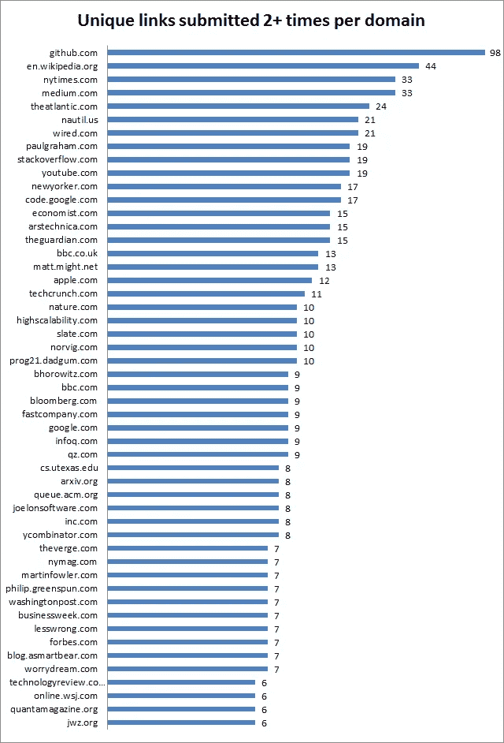

# 以下是有史以来最好的 50 篇黑客新闻帖子

> 原文：<https://medium.com/swlh/best-of-2015-pfffffffft-79d9b014f4de>

Image courtesy [**为什么比特币会失败**](https://medium.com/u/ae4b31df5232#08) 艾弗里·彭纳伦(4 次，129 分)*   杰米·扎温斯基(4 次，119 分)*   [**拘留我的搭档是格伦·格林沃尔德为*《卫报》* (3 次，1474 分)所做的恐吓**](http://www.theguardian.com/commentisfree/2013/aug/18/david-miranda-detained-uk-nsa) (2013)的一次失败尝试*   ****没有限速(3 次，1191 分)*****   ****[为什么 GNU grep 快](http://lists.freebsd.org/pipermail/freebsd-current/2010-August/019310.html)迈克·哈尔特尔(3 次，1158 分)*****   ****[**不要自称程序员**](http://www.kalzumeus.com/2011/10/28/dont-call-yourself-a-programmer/) by 麦肯齐(3 次，1110 分)*****   ****杰夫·莫瑟(3 次，871 分)HTTPS 连接的最初几毫秒*****   ****[**少女与软件**](http://www.linuxjournal.com/content/girls-and-software) 由苏珊的儿子们为 *Linux 杂志*(第 3 次，798 分)*****   ********被踏破(3 次，777 分)*********   ********科技的残酷年龄歧视由诺姆·斯凯贝尔为*新共和国*所作(3 次，645 分)*********   ******[谢尔平斯基三角](http://www.oftenpaper.net/sierpinski.htm)安东尼奥·马尔克斯-雷戈扎(3 次，629 分)*******   ******里克·加利科夫的苏格拉底式教学法(3 次，569 分)*******   ******每个程序员都应该阅读(至少两次)的 10 篇技术论文*******   ******[回复:[git pull]DRM-下一个](http://www.mail-archive.com/dri-devel@lists.sourceforge.net/msg39091.html)作者 Linus Torvalds (3 次，515 分)*******   ******[Amit Patel 为游戏](http://www-cs-students.stanford.edu/~amitp/game-programming/polygon-map-generation/)生成多边形地图(3 次，507 分)*******   ******游戏程序员必备的数学知识*******   ******[如何不按平均评分排序](http://www.evanmiller.org/how-not-to-sort-by-average-rating.html)埃文·米勒(3 次，490 分)*******   ******[Lisp 作为麦克斯韦方程组的软件](http://www.michaelnielsen.org/ddi/lisp-as-the-maxwells-equations-of-software/)由迈克尔·尼尔森完成(3 次，471 分)*******   ******[Benjamin c . Pierce 收藏的编程语言巨著](http://www.cis.upenn.edu/~bcpierce/courses/670Fall04/GreatWorksInPL.shtml)(3 次，471 分)*******   ******[Patrick Craig 的 5000 美元压缩挑战](http://www.patrickcraig.co.uk/other/compression.htm)(3 次，464 分)*******   ********图文并茂的博士学位指南(3 次，463 分)*********   ******[书籍程序员不会真的去读蜥蜴比尔的](http://www.billthelizard.com/2008/12/books-programmers-dont-really-read.html)(3 遍，460 分)*******   ******杰克·克伦肖(3 次，459 分)*******   ******[**你的身体没能撑到最后**](https://gravityandlevity.wordpress.com/2009/07/08/your-body-wasnt-built-to-last-a-lesson-from-human-mortality-rates/) 被布莱恩·斯金纳(3 次，454 分)*******   ****[**歌颂浪荡**](http://www.zpub.com/notes/idle.html) 伯特兰·罗素(3 次，431 分)*****   ****史蒂文·威滕斯(3 次，418 分)****

# ****是啊，所以要成为最好的*****

****在一年中的任何一天查看 HackerNews 的首页，你都不会发现像这样精彩的链接集合。(尽管我自己对代码一窍不通，但我还是非常肯定地这么说！有趣的、说教的、令人愤慨的——你在这里看到的每一篇文章都绝对是永恒的。你不必相信我的话:这些链接已经多次提交给 HackerNews，每次提交至少获得 10 分(这大致是达到首页所需的分数)。 [⁰](http://minimaxir.com/2014/02/hacking-hacker-news/)****

****一个故事被提交给 HackerNews 不止一次的情况很少见。更罕见的是，一个故事如此引人注目，以至于多次登上头版。****

# ****哪些博客最好？****

****深入挖掘一下这些数据，你会发现更多的惊喜。例如，谁是那些罕见的、永恒的作品的作者？****

********

****Subdomains are counted separately (e.g. bits.blogs.nytimes.com vs. nytimes.com), as are links with different parameters (e.g. article.html vs. article.html#XYZ). *You can discount the GitHub outlier at the top — people like to post their code snippets on HackerNews, but in this piece I’m focusing my analysis on written content.*****

****这是 50 家出版商，他们的故事已经不止一次提交给 HackerNews。****

****你会注意到，价值数十亿美元的媒体机构——英国广播公司( *9 个故事*)、彭博( *9 个故事*)、华盛顿邮报( *7 个*)、The Verge ( *7 个*)、华尔街日报( *6 个*)——写的永恒故事比保罗·格拉厄姆( *19* )、马特·梅( *13* )、詹姆斯·黑格( *10* )和本·霍洛维茨(*)等凡人写的还少*****

****Matt may(*13*)到底有什么特别之处，让他能够比 TechCrunch ( *11* )的整个编辑团队写出更多“永恒”的故事？有几个原因。首先，主要媒体中心的作家被要求一天发表多篇报道，而像 Matt 这样的兼职博主(他不需要写博客来支付账单)可以慢慢写一篇文章，直到它符合他的质量标准。当你为一个内容农场工作时，生产一些有持久价值的东西并不容易。****

****第二，Matt 直接为阅读 HackerNews 的人写作，而主流媒体则面向更广泛的受众。尽管如此，我们有理由期待，凭借他们的资金和资源，主流媒体可以抽出时间写十几篇对黑客有持久吸引力的报道。****

****这两个因素可以解释小型博客对大型媒体公司的胜利(在 HackerNews 的缩影中)，但它们也可以解释媒体本身的崛起。****

****通过降低对多产性的期望(因为投稿人可以随心所欲地不频繁发表)，Medium 鼓励其作者等到他们有值得写的关于的东西*后再发表*。没有博客需要维护，没有内容编辑需要安抚——Medium 让你从容不迫，决定你想把你的名字放在哪个故事后面。******

****因此，多么令人惊讶的是，这些都是人们喜欢一遍又一遍阅读的故事类型！！！在其存在的三年中，Medium 发表的“永恒的”故事和《纽约时报》一样多，尽管理所当然，Medium 每天发表的故事更多。****

****总之，我认为这个小实验提出了一些关于网络写作寿命的有趣问题。显然*有可能*写出多年保持文化相关性的东西——但是我们如何*确保*那些永恒的作品不会被遗忘？永恒的内容有可能与 Twitter 和脸书上闪亮的新内容平等竞争吗？而像 Medium 这样的出版商会发展出什么策略，才能让永恒的故事随着时间的推移不断找到新的读者？****

# ****乔·麦克尼尔是居住在加拿大蒙特利尔的作家。****

****如果你真的很喜欢你读到的东西(或者想在未来的实验中合作)，请在[推特](https://twitter.com/mtlbagelboy)上联系我。****

*****PS:由于这只是一个有趣的假日兼职项目，我进行的分析有一些限制，我在 HackerNews 评论* [*这里*](https://news.ycombinator.com/item?id=10806982) *中解决了这些限制。*****

*****PPS:如果您想下载完整的数据集，请点击***。******

******PPPS:非常感谢* [*迈克尔·鲍洛夫斯基*](https://twitter.com/misza222) *为这次分析处理数据。******

*******面包圈男孩的更多故事:*******

***** [## @ FairmountBagel 的兴衰

### 我当时很年轻。我太天真了。我发起了一场全市范围的百吉饼战争，不抓任何俘虏。

medium.com](/p/43bfcbea8505)  [## 我从史努比·道格身上学到了最好的营销课。

### 如何让你的品牌保持 20 年以上的年轻和相关性？medium.com](/p/b08fd5437a0b)*****