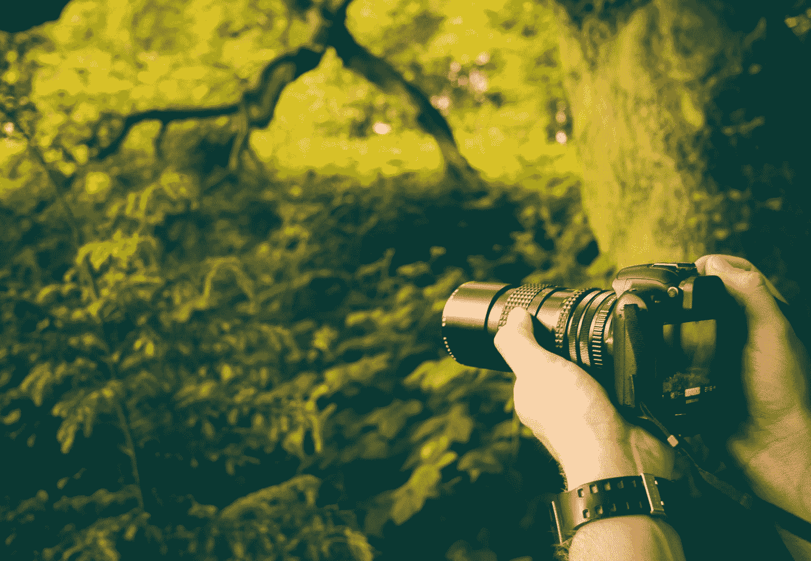

# 最佳在线摄影课程

> 原文：<https://medium.com/swlh/best-online-photography-classes-434ff3d14197>

## 适合初学和专业摄影师

“Man wearing a watch taking a photo of nature in the forest” by [Jamie Street](https://unsplash.com/@jamie452?utm_source=medium&utm_medium=referral) on [Unsplash](https://unsplash.com?utm_source=medium&utm_medium=referral)

# [DSLR 摄影基础](https://skillshare.evyy.net/c/336181/298081/4650?u=https%3A%2F%2Fwww.skillshare.com%2Fclasses%2FFundamentals-of-DSLR-Photography%2F1111783378)

我从这个开始，因为我觉得它更多的是关于基层知识，对于那些想从零开始进入这个领域的人来说。

顾名思义是摄影师拍的摄影入门课…