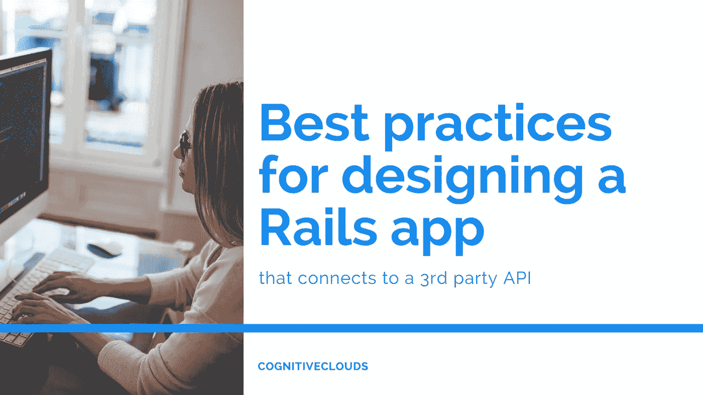

# 设计连接到第三方 API 的 Rails 应用程序的最佳实践？

> 原文：<https://medium.com/swlh/best-practices-for-designing-a-rails-app-that-connects-to-a-3rd-party-api-744a24162b35>

您是否需要一项服务来补充您目前的应用？或者你有一个应用程序的想法，但不想收集你需要的数据的麻烦？不管你的理由是什么，在许多 web 应用程序的开发周期中，第三方集成是不可避免的。最简单的方法之一是公开一个 REST API 以供使用。下面我们分享了一些设计 REST API 的要点，并将涵盖一系列确保代码可维护性的良好实践。

# 什么是 RESTful API？

一种被称为表述性状态转移或 REST 的架构方法建议 web 应用程序必须像最初设想的那样处理 HTTP。对于一个理论上纯粹的 REST API 来说，需要满足的标准不止三个，但是下面的标准在实践中已经足够了。

*   每一个单独的请求都不能与之前的请求有任何关联。也就是说，客户端状态不应该在请求之间存储在服务器上。
*   表示为数据(通常是 JSON 或 XML)的资源必须由资源端点返回。返回的信息应该足以让客户端识别并唯一地操作有问题的数据库行。
*   每个请求必须唯一地标识一个特定的资源。换句话说，修改数据库的每个请求应该只作用于单个表的单个行。只获取信息的请求应该从一个表中获取零行或多行。

# 在 Rails 中设计一个基本的 RESTful API 时，需要记住以下几点:

*   说到命名，虽然 Rails 允许您或多或少地互换使用 PUT 和 POST，但是您的 API 会被其他开发人员使用。记住这一点，一个好的做法是采用最小惊奇的原则，为更新放置，为创建发布，为更新打补丁并插入。此外，您的应用程序将由不同的开发人员维护，可能在您离开后很久。使用符合标准实践的方法会使练习变得更容易。
*   一旦你公开了你的 API，假设有人在使用它。因此，除了关键的错误修复，您决不能修改现有的 API。公开一个新版本，而不是改变现有的端点。一种方法可能是构建版本化的路径和控制器。此外，只有在 API 经过密集的内部测试之后，才公开它。
*   谈到路由参数，虽然可以根据目标资源的 id 列来识别路由，但它假定消费应用程序有更高程度的知识。利用可能不是唯一的，但像 name 这样的公共标识符可以减少需要公开的系统内部信息的数量，同时让客户端可以轻松地查找发出请求所需的数据。缺点是嵌套路由更长。
*   在处理提取通用 API 功能和认证时，一个基本的 API 控制器就派上了用场。通常的方法是要求对每个请求进行重新认证。这可能是确保无国籍的最简单的方法。
*   防御性编程是一种软件设计原则，它规定一个软件必须被设计成即使在不可预见的情况下也能继续运行。在 API 设计中应用这种实践很重要，因为您的 API 将向第三方开发人员公开，允许他们提交任意输入。在构建 API 时，本着防御性编程的精神，问问自己，用户能提交的最随机、最不期望或最恶意的输入是什么。然后编写代码来处理这个问题。
*   HTTP 状态代码，像 HTTP 动词一样，有明确的含义，尽管返回 404 或未找到、200 或正常、500 或内部服务器错误是如此容易。为了其他开发人员，使用有意义的状态代码。
*   一个灵活、枯燥、RESTful 的 API 允许我们在维护相同数据库模型的同时拥有 API 特有的行为。但是为了测试这一点，请求级规范是最合适的，因为每个请求都是一个无状态的事务，而且大部分提升都是在控制器级完成的。实现这一点的最简单的方法是控制器测试，它与控制器端点测试的通常模型没有太大的不同。基本上，我们创建 JSON 请求并将它们发送到端点。

*原载于* [*产品洞察博客*](https://www.cognitiveclouds.com/insights) *来自 cognitive clouds:Top*[*Ruby on Rails 开发公司*](https://www.cognitiveclouds.com/custom-software-development-services/ruby-on-rails-development-company)

## 这个故事发表在 [The Startup](https://medium.com/swlh) 上，这是 Medium 最大的创业刊物，拥有 292，582+人关注。

## 在这里订阅接收[我们的头条新闻](http://growthsupply.com/the-startup-newsletter/)。

