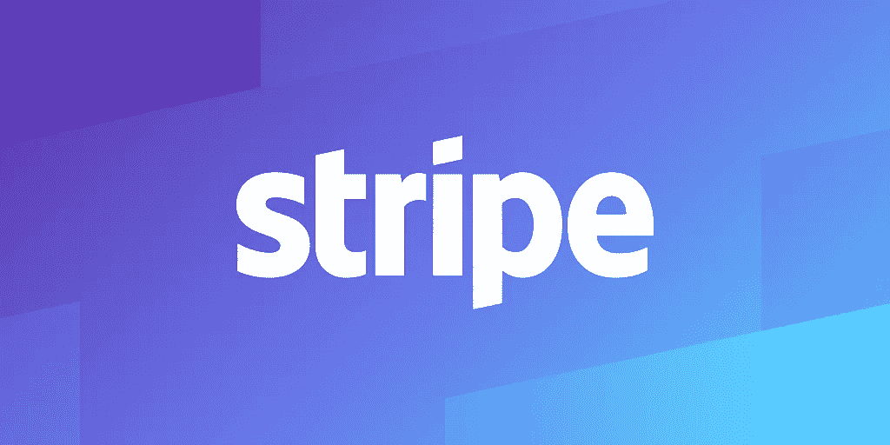
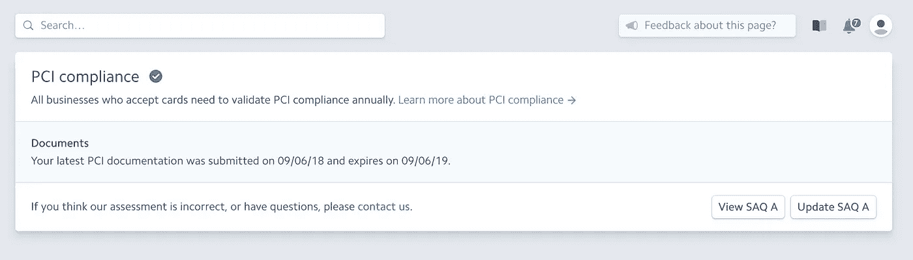
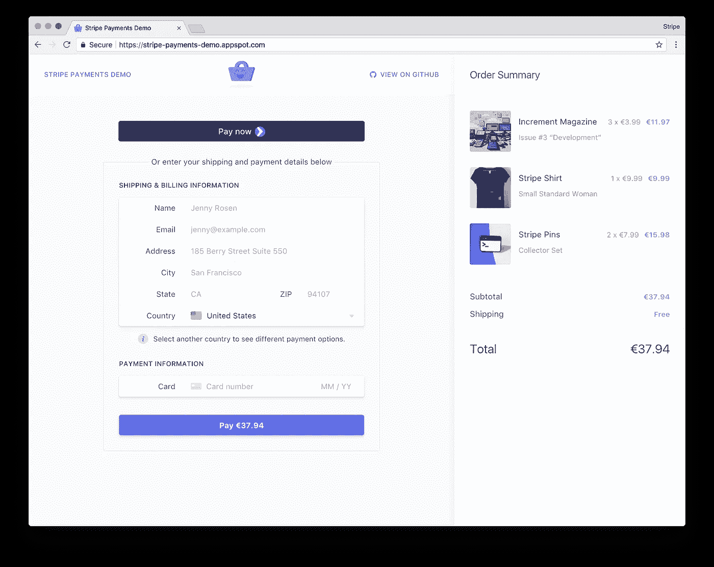
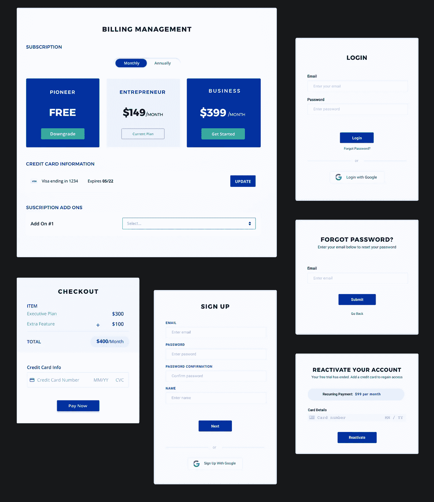

# 将条纹计费与 SaaS 集成的最佳实践

> 原文：<https://medium.com/swlh/best-practices-for-integrating-stripe-billing-with-your-saas-559747ae7062>

Stripe 已迅速成为市场上领先的计费解决方案之一，尤其受到销售软件即服务的企业的青睐。通过阅读本指南，您将了解如何确保 PCI 合规性，以及使用条带构建前端和后端集成的最佳方式。

# 安全性—确保 PCI 合规性

The Stripe PCI Compliance Dashboard

任何存储、传输或处理信用卡数据的公司都必须遵守[支付卡行业(PCI)数据安全标准](https://www.pcisecuritystandards.org/)。如果您使用[的安全标准](https://stripe.com/docs/security)与 Stripe 集成，您将自动获得 PCI 合规资格，他们将自动生成所需的[自我评估问卷](https://www.pcisecuritystandards.org/document_library?category=saqs#results) (SAQ)和合规证明，您可以从您的[合规仪表板](https://dashboard.stripe.com/account/compliance)下载。Stripe 建议遵守以下项目以保持 PCI 合规性:

> 使用 [Checkout](https://stripe.com/docs/checkout) 、 [Stripe.js 和 Elements](https://stripe.com/docs/stripe-js) 或我们的 [mobile SDK 库](https://stripe.com/docs/mobile)来收集支付信息，这些信息会直接安全地传输到 Stripe，而无需通过您的服务器
> 
> 使用[传输层安全性](https://stripe.com/docs/security#tls) (TLS)安全地服务您的支付页面，以便它们使用 HTTPS
> 
> 每年审查并[验证](https://stripe.com/docs/security#validating-pci-compliance)您帐户的 PCI 合规性

当与 Stripe API 集成时，您使用的密钥必须存储在一个安全的地方。避免在版本控制中存储密钥；这可能导致客户数据的安全漏洞，并可能给您的企业带来巨大的问题。

# 前端—使用条带元素

An Example Site Using Stripe Elements

对于一个 SaaS 来说， [Stripe Elements](https://stripe.com/elements) 是一个很棒的工具，可以创建一个很棒的结帐页面，以适应您的特定用例。他们有预建的 UI 组件，如信用卡输入和支付按钮。这些服务器在处理信用卡数据的同时，通过将数据直接发送到条带来维护 PCI 合规性，而无需通过您自己的服务器。它们可以根据屏幕大小进行定制，以适合您的业务风格，并且可以本地化为您客户的首选语言。

Stripe Elements 只是为客户提供一种输入支付信息的工具。作为一家 SaaS 公司，您仍然需要开发前端解决方案来处理其他功能，例如当客户升级或降级到不同的订阅计划、取消他们的服务或重新订阅时。

# 后端—使用条带 API 库和 Webhooks

后端的条带集成由两部分组成:主动集成和被动集成。**主动**是对 Stripe API 的直接调用，用于执行取消订阅等操作，**间接**是事件处理程序，用于响应 Stripe 中的事件，如信用卡支付失败。

进行 API 调用的最佳方式是使用官方的 [Stripe API 库](https://stripe.com/docs/libraries)。有了这个，您就可以开始构建处理您想要为您的特定 SaaS 覆盖的所有用例所需的逻辑。

[Webhooks](https://stripe.com/docs/webhooks) 是 API 调用，Stripe 可以将其发送到您选择的端点，以便在 Stripe 中发生事件时提醒您。这对于允许您对支付失败做出响应以及当客户的信用卡失败时自动限制对您的应用程序的访问非常有用。

构建集成时，请注意以下几点:

*   让你的 Stripe 密钥不受版本控制，以防止你的 Stripe 账户被黑客攻击
*   使用条带测试密钥进行所有开发，确保不会破坏您的生产客户数据
*   使用 webhooks 时，检查[条带签名](https://stripe.com/docs/webhooks/signatures)以确保请求有效
*   确保您的集成保持数据库中的用户与条带中的客户的一对一映射。一些企业错误地使用同一个电子邮件创建了多个客户，这可能会在以后尝试编写更复杂的集成代码时造成问题。
*   将 API 版本锁定为您开发和测试的版本；如果你没有被锁定在一个特定版本上，Stripe 可以改变他们的 API 并破坏你的代码；[以下是你的操作方法](https://stripe.com/docs/building-plugins#set-api-version)。

# 使用 Stripe 合作伙伴来避免开发

[Servicebot](https://servicebot.io) Generates PCI Compliant UI Components connected to Stripe

Stripe 做了很多现成的东西，但大多数 SaaS 公司需要的不仅仅是基本框架。定价页面和计费设置页面等功能，客户可以在这些页面上管理自己的订阅。

如果你不想花费大量资源开发和维护你自己与 Stripe 的集成，有 [Stripe 验证合作伙伴](https://stripe.com/works-with/type/platform/category/recurring-payments)可以提供现成的集成，你可以放入你的应用。 [Servicebot](https://servicebot.io) 通过生成定价页面、计费管理和结账页面等嵌入式组件，无需花费时间进行开发，即可轻松将您的 SaaS 连接到 Stripe。

# 结论

为 SaaS 构建条带集成时，需要构建许多移动部件。使用 Stripe 元素开发前端，使用 Stripe 的一个库开发后端，并处理 Stripe webhooks 发送的事件，这些都是可靠的 Stripe 集成的构建块。

如果您希望最小化 SaaS 计费解决方案的开发，您应该考虑 Stripe 合作伙伴，如[服务机器人](https://servicebot.io)

## 这篇文章发表在 [The Startup](https://medium.com/swlh) 上，这是 Medium 最大的创业刊物，有+ 370，107 人关注。

## 订阅接收[我们的头条新闻](http://growthsupply.com/the-startup-newsletter/)。

