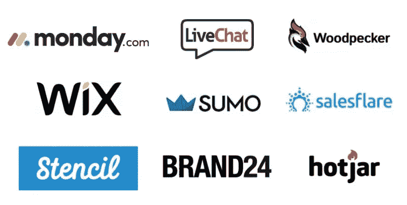
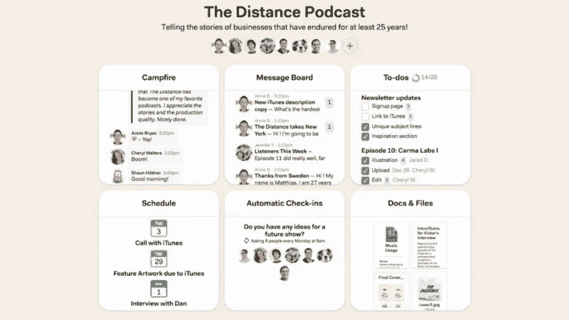
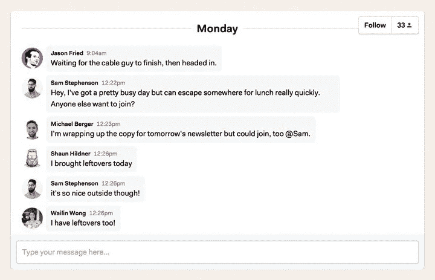
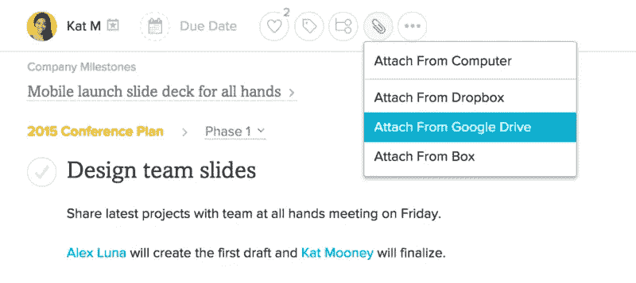
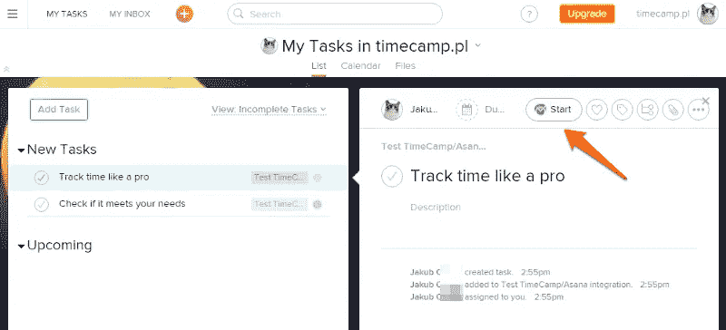

# 面向律师事务所的最佳项目管理 SaaS 软件

> 原文：<https://medium.com/swlh/best-project-management-saas-software-babfb6ef31c5>

今天，SaaS 的管理工具正在大多数办公室里得到应用。它们用于执行基本的日常任务。

从发送电子邮件或通信到多阶段流程，如工作时间管理、项目组织、销售或开具发票。

多亏了最新的技术**,它们可以以更有效和更简单的方式实现。**

法律界也不例外。找到一个法律办公室变得更加困难，因为 Dropbox 和 Google Drive 等应用程序并不用于存储特定案件中固有的文件和数据。

# 为什么项目管理 SaaS 软件是值得的？

管理工具可以指定为“工作区”。就在几年前，Microsoft Office 是创建文档的唯一程序。要求有执照，一年后就过时了。

如今，**不需要使用任何付费程序或工具来制作专业文档。**

云中应用程序的设计者，如 Office 365 或 Google Documents(以及许多其他应用程序),完全满足了现代用户的期望，并提出了最新版本的解决方案。

我们不需要关心更新(因为他们为我们做了)。

当然，目前市场上有数千种工具，每一种都有其独特的功能。这就是为什么我决定列出一个**顶级工具的清单，你肯定可以在你的法律办公室使用。**

# 团队——让他们成功实施项目

确保合适的条件是高效工作的必要条件。管理工具可以**在任何距离制造一个最佳背景，允许你的团队交流和实施项目。**

有很多，那么问题来了，选哪个？

有两种工具可以帮助律师和该领域的其他工作者完成任务，或者使事情变得更容易。 [Basecamp](https://picksaas.com/project-management/basecamp?utm_source=blog) 和 [Asana](https://picksaas.com/project-management/asana?utm_source=blog) 提供了**基本的编辑工具和直观的界面——实现复杂案例的关键。**

# 用 Basecamp 壮大你的法律公司

界面基于每个团队成员都可以使用的板。您可以与严格挑选的同事共享一切，并实时协作处理文档。

例如:在你的法律公司工作的四个团队中，每个人都在处理三个案件。每个案例都意味着大量的文档和数据…

正如经常发生的那样，它们被存储在不同的位置，然后您在查找特定信息上花费了太多的时间和精力。Basecamp 就是解决这个问题的东西。

*Basecamp interface*

Basecamp 的主要目标是促进项目管理，在以下情况下可能会发生什么:

*   创建团队公告板，例如:案例 X 的团队，销售团队— **你可以在团队之外添加某人**(使用即时消息提供与客户更有效的沟通方式)；
*   向团队讨论板添加项目；
*   处理日程和约会；
*   计划一个有截止日期的日历——由于与你的个人日历**相结合，有可能与其他团队成员比较你的计划**并有效地执行任务；
*   将必要的文档、数据和信息直接添加到应用程序中，或者从电子邮件或光盘中导入。

# 团队中的轻松交流

当你的项目已经计划好了，你需要确保有效的沟通来实现它。

有几个适用于法律文件的应用程序可以让你轻松地与同事交流。

首先是[Slack](https://picksaas.com/communication-tools/slack?utm_source=blog)——可以和 [Basecamp](https://picksaas.com/project-management/basecamp?utm_source=blog) 整合。这会导致**任何项目实施出现在 Slack** 上，反之亦然——来自 Slack 的信息将被添加到 Basecamp 的待办事项列表中。

也有可能使用内置聊天。当您只需要将文件添加到特定案例或发送消息时，这很有用。

*Chat window in Basecamp*

如果您在法律办公室使用聊天工具，但在外面通过电子邮件或短信与您的团队交流，Basecamp 将是一个解决方案，它可以在任何时间、任何地点提供更有效的交流方式。

现在，我们来谈谈障碍。首先是价格。Asana 和 Trello 都有免费的基础版本。Basecamp 只提供付费版本，这对一个小律师事务所来说是无利可图的。

其次，没有太多的可能性与其他 SaaS 应用程序集成。Zapier 在某种程度上解决了这个问题——通过将 Basecamp 与电子邮件或 Dropbox 集成。然而，Asana 在这方面远远超过 Basecamp。

# 由于集成，SaaS 管理应用程序正变得不仅仅是一个工具

在[picks as](https://picksaas.com/)中，我们将不同的应用程序组合在一起，以创建您的个人远程管理系统。

让我们假设你用 [Asana](https://picksaas.com/project-management/asana?utm_source=blog) 进行项目管理，用 [Slack](https://picksaas.com/communication-tools/slack?utm_source=blog) 进行交流，用 Google Drive 存储文件和文档，用 Outlook 发送电子邮件，用 [TimeCamp](https://picksaas.com/human-resources/timecamp?utm_source=blog) 进行时间跟踪。

在这种情况下，Asana 将成为“指挥中心”。在同一个地方，你可以访问你所有的工具，但你也可以一次性集成这个系统之外的各种应用程序。

# 制作待办事项清单，并将其分配给特定的团队成员

Asana 是 Basecamp 的主要选择。一个 SaaS 管理和交流工具，类似于 Basecamp，提供了广泛的功能，从任务可视化到聊天。

> 体式可以让你列出任务清单，把它们分配给特定的团队成员，同时就任务展开讨论。多亏了 Asana，每一个动作或状态的改变都可以通过电子邮件或直接来自应用程序的通知立即传达给其他团队成员。

Asana 和 Basecamp 的主要区别在于可整合的数量。更多关于体式整合的信息，你可以在这里找到。

让我们继续讨论最常见的集成及其优势。值得注意的是，他们也可以与[基地营](https://picksaas.com/project-management/basecamp?utm_source=blog)一起使用。

# 体式+松弛

优势:

*   直接从 Slacks 界面创建新任务并分配给 Asana 中的特定团队成员/项目；
*   对具体案例进行评论；
*   确定一个方案，分阶段实施；
*   关于新任务、项目、批注的时差通知。

# Asana + Google Drive

Google Drive 和 Asana 的集成让你可以直接从 Asana 界面从光盘添加文件。只需点击一下您想要添加到项目中的文件。

*Attachment button in Asana*

# TimeCamp 跟踪工作时间并开具发票

据我们所知，云存储被大多数工人使用，但他们中的一些人甚至不知道 [TimeCamp](https://picksaas.com/human-resources/timecamp?utm_source=blog) 的存在。

[TimeCamp](https://picksaas.com/human-resources/timecamp?utm_source=blog) 是一个**简单的在线时间跟踪工具，让你监控你和你的员工工作的时间**。它还能让你分析员工的工作效率和出勤情况。

此外，它还允许:

*   **监控并收集您的员工访问的网站**的信息；
*   为特定员工或整个团队生成报告 —显示他们的效率；
*   跟踪可视工作时间跟踪并开具发票。

工作时间监控在您按小时计费时特别有用。在这种情况下，来自应用程序的信息将决定团队在项目实现上花费多少时间。**你也可以为任务实施计划预算，确定小时费率，并在此基础上生成发票。**

当团队在没有电脑的情况下工作时，您可以使用 TimeCamp 的移动版本或手动输入数据。您还可以使用与日历的集成，从中您可以发送有关案例的信息。

# 当您将 TimeCamp 与其他解决方案集成时，它会提供更多机会

集成列表很广，但我们特别感兴趣的当然是 SaaS 的项目管理——Asana 和 Basecamp。

整合后，您在 Asana 或 Basecamp 中计划的项目将自动在 TimeCamp 中显示，因此您不必一个接一个地转移它们。

# Asana 和 Timecamp 整合

*TimeCamp button in Asana*

主要优势是**可以直接从我们目前使用的应用**中测量时间。如果是体式，安装后会出现一个按钮，可以打开 [TimeCamp](https://picksaas.com/human-resources/timecamp?utm_source=blog) 开始计时。

# SaaS 项目管理工具为你的公司创造了一个复杂的地方

现代技术可能是当今法律事务所生产力和效率的关键。

有几种类型的任务应用程序可以提高运行效率，例如:处理日程和约会，组织和存储与案例相关的客户数据和信息，通过移动应用程序远程访问存储的资源等。他们创建一个相关的“后台”来提高服务质量。

我在本文中介绍的管理工具是**为日常工作创造最佳条件是多么简单的例子。但是，与此同时，多种可能性并不意味着更多的职责或更长的工作时间。文档的移动变得快速而直观，因为 application 适合您繁忙的日程安排，而不是相反。**

此外，这些 **SaaS 管理工具创造了一种新的、更有效的沟通方式**，这对你的律师事务所的正常运作至关重要。

**定制的 SaaS 应用程序可以帮助开发律师事务所的身份**，并通过为客户提供独特的联系和体验使事务所脱颖而出。

在 picksaas.com 的***，我们帮助您找到最好的 SaaS 软件来发展您的业务。***

**我们发现、研究和分析 SaaS 应用。**

*   **>与我们一起* [*为您的销售、营销和项目管理实施自动化 SaaS 解决方案*](https://picksaas.com/saas-application-implementation/?utm_source=blog&utm_campaign=Monday) *。**

**

## *这个故事发表在 [The Startup](https://medium.com/swlh) 上，这是 Medium 最大的创业刊物，拥有 324，834+人关注。*

## *在这里订阅接收[我们的头条新闻](http://growthsupply.com/the-startup-newsletter/)。*

**