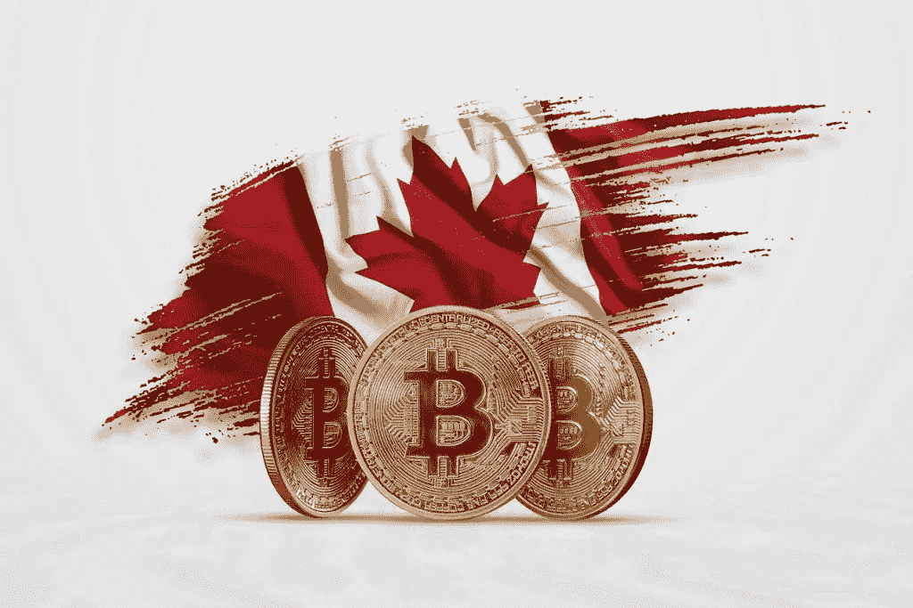

# 如何在加拿大购买比特币

> 原文：<https://medium.com/swlh/best-way-to-buy-bitcoin-and-other-cryptocurrencies-in-canada-8dc9e457ed8b>

加拿大人购买和安全存储比特币的简单指南。

如果你生活在这个星球上可以说是最伟大的国家，枫糖浆、松鸦和滑稽男子金凯瑞的故乡，这里有一个关于购买比特币和其他加密货币(cryptos)的最佳和最安全方式的快速指南(至少目前如此)。

在花了无数时间研究 Youtube 视频、Reddit 频道和阅读博客帖子后，我花了一段时间才找到最好和最简单的方法。希望我的小指南能帮你节省时间、金钱和压力。

首先，简单介绍一下背景。我在 2013 年从一群当时在挖掘比特币的朋友那里发现了加密货币。这些家伙在他们的公寓里有一整套设置，使用他们的游戏装备挖掘尽可能多的比特币和莱特币。老实说，我当时对此并不太感兴趣，尽管我的朋友们对整件事都超级兴奋。我从他们那里得到了一些关于它是什么和如何工作的细节，但我不想买也不想拥有它，认为它只是一个短暂的极客时尚。我真傻！

快进到 2021 年，加拿大加密市场更加成熟(相对而言)，越来越受欢迎。现在它的市值高达 2 万亿美元(截至此次更新)，每个人和他们的祖母都希望参与其中(好吧，祖母说通过，她就是不明白)。FOMO(害怕错过)对这一点很强烈，这是有原因的。比特币从 2013 年的 100 美元涨到 2018 年初的 2 万美元，回到大约 5000 美元，目前为 45000 美元。只能说我们生活在有趣的时代。

也就是说，购买和存储比特币、以太货币和加密货币并不像你想象的那么简单(我写这篇文章的原因以及你来这里的原因)，首先你需要了解一些事情:

1.加密货币与法定现金有一些相似之处，但并不多。
就像你把现金放在钱包里一样，你需要一个加密钱包(冷热钱包，更多细节见下文)来保存你的比特币或以太币。
你可以用它们买东西，因为相当多的地方接受比特币或以太或其他密码作为支付形式。

2.在加拿大，只有少数几个地方可以安全地购买/兑换比特币和其他加密货币。当谈到密码时，这是一个狂野的西部，与之相关的风险高于法定现金、股票和其他受到良好保护和监管的投资资产。

3.你应该只购买和投资你能承受损失的钱。就像你可能会丢失装有现金的钱包，或者你正在赌场玩，你应该做好心理准备，你可能会输掉所有的钱。如果你的密码丢失、被盗或者价格暴跌，这种情况就会发生。
加密货币是一种投机性极强的投资，波动性极大。跟着 Coinmarketcap.com[走几天，你就会明白我在说什么了。](http://Coinmarketcap.com)

好了，介绍够了。那么，你怎样才能参与其中呢？

1.  **在加拿大购买比特币。**

为了能够购买比特币(BTC)或以太(ETH)，你需要**在**[**Coinberry.com**](https://app.coinberry.com/invite/4UWYOvdshk0)创建一个账户，这是 [**一个安全可靠的加拿大加密平台**](https://www.coinberry.com) ，有点像加密世界的 Kayak 或 Skyscanner，从所有其他主要交易所获取价格，并为你提供最佳交易。
这都是基于我过去两年的实际经验，也是我目前使用的。

有一些其他的方法和其他可用的交易所，尤其是在最近几年，比如 Shakepay、Coinsquare 等。但是我对他们没什么经验。我更喜欢 Coinberry，因为它很容易，有很好的价格和体面的客户支持。

你必须通过一个简短的身份验证过程，所以请按照他们网站上的说明进行操作。

一旦你创建了你的账户，你就可以很容易地直接从你的银行账户中存入加拿大资金，反过来你可以用这些资金在交易所购买比特币和以太币。

在你使用 [**Coinberry 的网站**](https://app.coinberry.com/invite/4UWYOvdshk0) **或** [**移动应用**](https://itunes.apple.com/us/app/coinberry/id1370601820?ls=1&mt=8) ，**购买了你选择的加密货币后，如果你打算长期持有它，我会建议你将其移出他们的平台**。
这有几个原因，第一个原因是，交易所可能会遭到黑客攻击、欺诈等，你会失去所有的钱，就像以前其他交易所发生的那样(例如 QCX)。
**Coinberry 被认为是相当安全和可靠的，拥有良好的声誉和客户服务团队**，但你永远不会知道，安全总比后悔好，对吗？此外，在比特币价格崩盘的情况下，老实说，这种情况随时可能发生，你需要确保你的资金在手中或容易获得。银行挤兑可能发生，你不想处理这种情况。

2.**以安全的方式存储您的比特币或密码。**

现在，为了能把你的密码带出交易所，**你需要一个有地址**的密码钱包。可以把它想象成一个本地/便携账号，可以用各种方式存储。有多种类型的加密钱包，你应该在这里仔细阅读每一种的利弊，因为知道这一点很重要。如果你太懒了(你不应该这么懒，因为我们在这里谈论的是你的钱),只是想知道该用哪一个，继续读下去。

我使用我的**移动**手机上的元掩码和 [**元掩码**](https://metamask.io/) **的组合作为我的浏览器钱包**和一个名为[账本 Nano S](https://www.ledgerwallet.com/r/d655) 的冷**硬件钱包**。

[**The Ledger Nano S**](https://www.ledgerwallet.com/r/d655)**，**是一个冰冷的硬件钱包，看起来像一个 u 盘，是存储您的密码的最安全的方式之一。我强烈推荐它。你可以从他们的网站上买到，这里是。除了他们的网站，不要从其他地方购买。不要从亚马逊、易趣、Kijiji 或其他地方买，也不要买二手的。二手的硬件加密钱包可能已经被黑客攻击并安装了恶意软件，这些软件可以在你添加它们的那一刻窃取/转移你的资金，所以**要聪明和小心**。

就你的加密资金存储安全性而言，
**我认为手机钱包的安全性为 2-3/10，因为你的手机很容易丢失或被盗，交易所为 3-4/10，桌面钱包为 5-6/10，而冷硬件钱包为 9/10** 。还有另一种方法，叫做纸钱包，但我不会详细说明，你可以自己研究。你自己做决定。

这是一个开始。希望这个指南对你有用，欢迎来到有趣又刺激的加密新世界。

如果你想更好地了解加密货币背后的技术，如果你打算投资，请阅读我的另一篇文章
[**区块链&加密货币 101**](/agile-alpha/the-tech-behind-cryptos-part-1-the-blockchain-71cc346aec26) **。**

干杯！

## 这个故事发表在 [The Startup](https://medium.com/swlh) 上，这里有 264，100+人聚集在一起阅读 Medium 关于创业的主要故事。

## 在这里订阅接收[我们的头条新闻](http://growthsupply.com/the-startup-newsletter/)。

