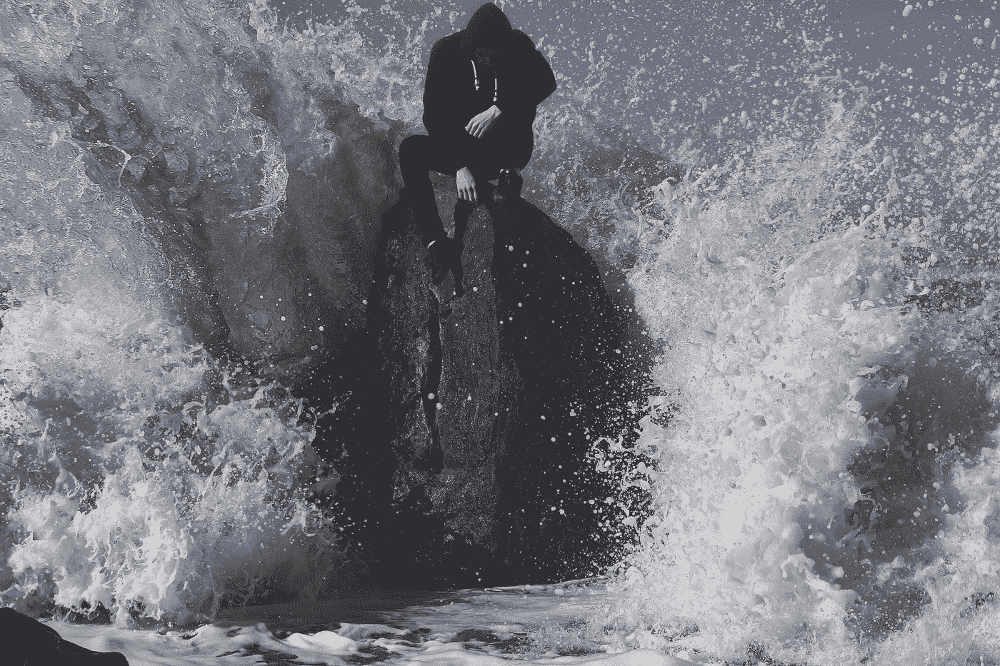

# 更好的机会等待着冒险者

> 原文：<https://medium.com/swlh/better-odds-await-the-risk-taker-fa75d75c3c2b>

生活总是给我们带来艰难的选择。我应该接受这份新工作吗？我应该约她出去吗？我应该告诉他我的感受吗？该不该自己创业？我们应该在这个月推出吗？我应该独自旅行吗？我应该上传这个视频吗？我们应该结婚吗？我们应该要孩子吗？

我们所做的每一个选择，或大或小，或容易或困难，每天或很少，都有潜在的利益和风险。 ***很多时候，我们知道自己想做的是什么，但还是不去做。这是为什么呢？***

# 安于现状

根据《勇敢的 T4、勇敢的 T6 和 T7》一书的作者、国际演说家玛吉·沃瑞尔的说法，我们人类天生害怕把自己的脆弱放到危险的边缘。目前的情况，即使我们不喜欢它，也可以看起来像一个更容易、可忍受和节约的选择。随着脑成像技术的发展，我们现在可以证实人类天生就有对抗风险的能力。

因此，换句话说，我们发现闭上嘴、低下头比做出改变、抓住机会、大声疾呼和参与更容易满足于现状。当我们认为采取行动可能会让我们容易失败或失去金钱、社会地位、骄傲、尊重或声誉时， ***我们天生倾向于在评估风险时误判四个核心要素。***

# 1.高估负概率

丹尼尔·卡内曼在他的书《思考，快与慢》中提到，在评估风险时，潜在的损失往往会大于潜在的收益。我们更倾向于关注可能出错的地方，而不是可能正确的地方。无论我们关注什么，我们都会放大我们的想象力，导致我们误判和高估它发生的可能性。

事实上，事情出错的风险往往远非我们所猜测的那样— ***事情进展顺利的几率，往往要好得多。***

# 2.当事情变糟时夸大后果

我们脑海中浮现出可怕的、戏剧性的最坏情况的画面，我们知道这是真的。如果事情开始偏离轨道，我们不是想象我们会迅速采取行动阻止或缓解局势，而是屈服于我们灾难性的形象，想象一切都不光彩地失控，而我们被动地永远为我们的失败感到羞愧袖手旁观。

好吧，也许我太过分了。也许我们没有那么可怕和戏剧化。尽管如此，这并不意味着我们应该忽视这样一个事实，即我们每个人都有神经上的联系。当我们有消极的心态时，如果我们的计划没有成功，它只会放大糟糕的事情会升级，并且我们无法欣赏我们干预以防止进一步影响的能力。

# 3.低估我们自己的能力

太多时候，我们对自己是否具备成功的条件的怀疑战胜了我们。生活中还会发生的是，我们既不会接受新的挑战，也不会主动追求新的机会。这都是因为我们对自己的能力没有足够的信任。

问问你自己，你有多长时间无法判断自己的风险承受能力，比如承担更大的角色或追求一个巨大的目标？如果你问我，这太频繁了。

# 4.否认不作为的代价

我们有多少次误导自己，期望我们的环境会随着时间的推移变得更好或自行解决？我们有一个习惯，那就是找借口留在目前的情况下，在这种情况下，安全行事是“可行的”，不将自己置于失败的风险中是“明智的”

最终，我们会意识到当事情进展不顺利时，随着时间的推移只会变得更糟，而不是更好。我们的关系和生活中的未言明的问题只会越来越大，而不是越来越小。

正如 Margie Warrell 提到的，这四种人类倾向解释了为什么许多所谓的聪明人发现自己生活在自己潜力的受约束的循环中。他们无法摆脱对事业的持续不满，无法摆脱他们的关系，无法摆脱他们从未选择过的生活，因为他们在玩安全游戏。

# 克服安全游戏

那么，我们如何识别哪些风险值得冒呢？从问我们自己这些问题开始:

1.  如果我更有勇气，我会做什么？
2.  如果我什么都不做，一年后不作为会让我付出什么代价？
3.  为什么我的 [*对失败的恐惧*](https://ye-chen.com/what-if-you-knew-you-couldnt-fail/) 会阻碍我承担对我或我的企业有益的风险？

无论你想到什么答案，都要注意。它们为你指明了一个光明的未来，只有当你承诺采取更果断、更勇敢的行动时，你才能创造这个光明的未来。会有风险吗？当然了。但是请记住，你天生就会高估风险的大小，低估自己处理风险的能力。

> "你比你想象的更有能力。"——老子

恐惧比失败更让人后悔，因为历史已经表明，胆怯比大胆更容易导致失败。

*原载于 2018 年 6 月 13 日*[*【ye-chen.com】*](https://ye-chen.com/better-odds-await-the-risk-taker/)*。*

## 这篇文章发表在 [The Startup](https://medium.com/swlh) 上，这是 Medium 最大的创业刊物，拥有 335，210 多名读者。

## 在这里订阅接收[我们的头条新闻](http://growthsupply.com/the-startup-newsletter/)。

