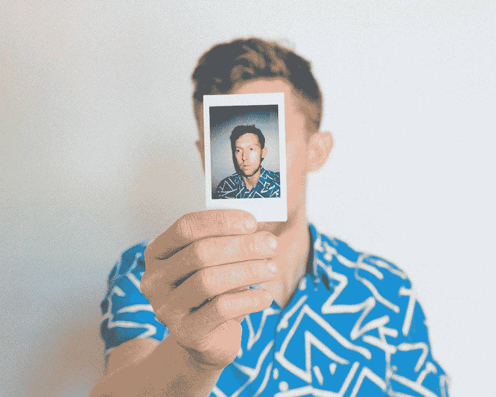

# 当心:这个世界扼杀了你的雄心

> 原文：<https://medium.com/swlh/beware-the-world-kills-your-ambition-c4f0b4c4c978>

[Credit](https://unsplash.com/photos/OzVhD1jt4y4)

## 如何让自己的生活重回正轨？

> 你有没有觉得你对自己的未来有更好的期望？
> 
> 小时候，你想成为宇航员、医生、电影明星或超级英雄？

今天，你有一份朝九晚五的工作，给你带来食物和住所。

灵魂不在那里。

它发生了。这也发生在我身上。

首先，你应该后退一步。

这完全没问题，**你可以改一下。**

[神经科学](https://en.wikipedia.org/wiki/Neuroscience)和[性格剖析](https://whatis.techtarget.com/definition/personality-profile)尤其能帮助你理解这是如何发生的。

当你还是个孩子的时候，你的个性会受到环境的很大影响。

这意味着同样的基因，不同的父母、老师、朋友，会是完全不同的版本。

有四种著名人格类型。

你可以找到更多，这取决于你的哲学，但这些是最常见的:

## 主导
影响
稳定
顺从

[**圆盘**](https://www.discprofile.com/what-is-disc/overview/) 简称。

每一种人格都是你的一部分。

在一个理想的世界里，一个人将会是每张唱片的 25%的个性。

我们不是在一个理想的世界里。

作为免责声明我想坚持，性格没有好坏之分，都是好的。

他们就是你。

[Credit](https://unsplash.com/photos/MbPDSi0ILMo)

为了让你更好地适应自己，了解你是谁以及你的性格类型是很重要的。

记住，你们是他们四个。有的更强，就是这样。

放弃你的野心。

野心的个性是支配欲。

通常两个支配型人格会为一个主要目标而争斗。只有一个能活下来。

不是你。

可能是父母告诉你 B+不够好。

它可以是一个你没有做正确的事情的伙伴。

支配型人格不喜欢失败。经常需要被告知他/她做得有多好。

所以很容易，**要找回那种雄心，努力提高你的统治力。**

## 你会怎么做？

嗯，理想情况下，你会得到一个教练或导师，他们会给你所需要的支持。

我们每个人都是独一无二的，不要指望找到像这样适合每个人的东西。

我很好，但我不是魔术师。

我还能给你几招。

如果你强烈的个性是影响者，说服自己要有更多的乐趣，你需要更好的项目。

当然这很难，但是你有很多想法，你的关系网肯定会支持你。

如果你坚强的个性是**坚定**，你必须明白第一次尝试不成功也没关系。

你很聪明，你有知识。对自己有信心，但更要相信别人。

他们可能没有你知道的多。没关系。生活中没有人能独自成功。试试就好，不一定要完美。

甚至钻石也不是第一次被发现。

如果你的强势性格是**顺从**，你应该学会如何说**不**和**是**。

不，*“嗯，其实我也不太清楚原因，可能是……咳咳……”*

**是，否**

说不是没关系的。只有先帮助自己，你才能帮助别人。

你有发言权，利用它。

你可以在这里做你的测试，它是免费的:

 [## 光盘个性测试|参加 123test.com 在线免费光盘类型测试

### 123 测试光盘个性测试根据光盘类型确定您的个性特征。了解您的得分情况…

www.123test.com](https://www.123test.com/disc-personality-test/) 

## 三二一…开拍！

[You can reach me HERE](http://nickbnns.com)

 [## 癌症杀死了我爸爸

### 我怎么能原谅它呢？

medium.com](/@nicolasserial/have-you-lost-a-close-one-to-cancer-too-df46fe67557c)  [## 你相信奇迹吗？

### 什么是奇迹？

medium.com](/@nicolasserial/do-you-believe-in-miracles-a08c7842ee11)  [## 为什么我会免费蔻驰你？

### 当正常价格是 1497 美元。

medium.com](/@nicolasserial/why-do-i-coach-for-free-2073574d383d) 

## 这篇文章发表在 [The Startup](https://medium.com/swlh) 上，这是 Medium 最大的创业刊物，拥有+ 382，862 名读者。

## 在此订阅接收[我们的头条新闻](http://growthsupply.com/the-startup-newsletter/)。

