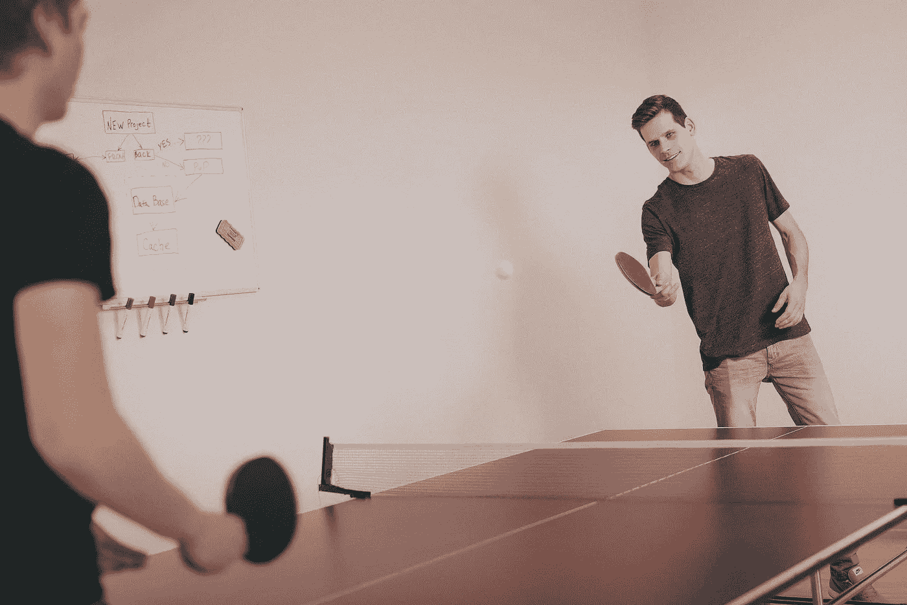

# 乒乓球桌之外:如何避开陈词滥调，建立一个你喜欢的团队

> 原文：<https://medium.com/swlh/beyond-ping-pong-tables-how-to-dodge-clich%C3%A9s-and-build-a-team-you-love-4d116a9510ca>

Originally published on [**JOTFORM.COM**](http://jotform.com)

那是五月的一个星期四下午。

我们的队伍刚刚骑车穿过金门大桥。我们从渔人码头出发，然后穿过普雷斯蒂奥国家公园，来到了 Vista Point。

我仍然屏住呼吸，下了自行车，目瞪口呆地看着远处的旧金山和东湾。游客们正在抢购…