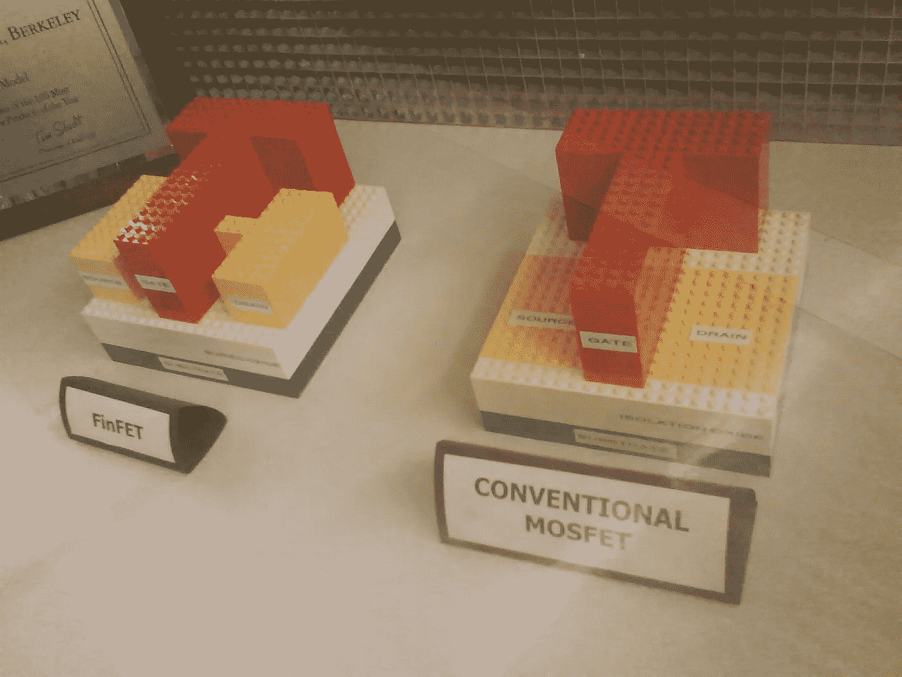

# 在墙外

> 原文：<https://medium.com/swlh/beyond-the-wall-3fe5bb7a65b2>

On the right : planar transistor, on the left : advanced 3D FinFET transistor (photo by F. Javid)

在之前的一篇文章中，我们回顾了硅谷的起源以及第一批晶体管是如何出现的。经过半个世纪的创新，晶体管今天已经缩小到几个原子的大小，使摩尔定律面临物理极限的墙壁。本文介绍了与集成电路制造相关的挑战。

## 十亿美元宝贝

首先，建立一个先进的半导体代工厂(或晶圆厂)的投资已经变得如此巨大(几十亿美元)，以至于只有像英特尔、TSMC 或三星这样的几个大玩家才能玩这个游戏。事实上，一个现代半导体工厂包括数十台*沉积*、*光刻*、*蚀刻*、*和离子注入*机器，每台价值数百万美元。这些机器大多安装在防震装置上，以防止制造过程因日常微地震而产生最轻微的振动。然后，每台设备都被安装到*洁净室*，洁净度等级接近 1 级(意味着每立方英尺体积中最多可容纳 100 个大小为 0.3 微米的颗粒)，因此在晶圆厂最关键的区域不再欢迎满身灰尘的人。

在这些设备中，光刻设备近年来经历了大量创新，波长低至 10 纳米的 EUV 光(极紫外)有望用于亚 10 纳米节点。领先供应商 ASML 公司开发的一台 EUV 光刻设备价值 1 . 1 亿美元，它包括非常光滑的镜子，上面最大的缺陷相当于德国 1 毫米的面积。然而，EUV 技术在 5 纳米之前不会完全投入大规模生产。

## 产量下降的诅咒

产量下降是一个大问题，它是整个制造过程中发生的数百万个微小缺陷结合的结果。

对于新的制造流程，*产量学习*需要 2 年时间。这个时期就像探索遥远的西部:没有规则，没有知识，危险无处不在。制造工程师，现代牛仔，努力制定完美的烹饪配方，以获得最美味的硅片。这项工作包括构建假芯片，以了解制造过程如何影响组件和互连。产量学习投资如此巨大，以至于当 Globalfoundries 刚刚放弃竞争 7 纳米竞赛时，甚至英特尔也推迟了其 10 纳米工艺制造。

然后，在大规模生产期间，半导体工厂的生产能力达到每月 10K 晶片，每个晶片值 1K 美元:这里没有出错的余地…然而，上面提到的机器会稍微(但肯定)偏离它们的最佳行为，因此产量将…下降。考虑到确定根本原因和解决问题的时间，加上浪费的晶片和无用运行的机器的成本，产量下降通常会使每个制造商每年损失 1 亿美元。

## 数据，新的石油

今天，一家半导体工厂每天产生 5T 字节的数据，使这种工业设施成为全球最大的数据发生器之一。这些数据由每台处理机产生，然后由传感器收集。不多不少。

实际上， *MES* 软件(制造执行系统)使用少量的这些数据来为制造工程师提供关于正在进行的过程的仪表板。但这还远远不够…半导体工厂需要高效的数据挖掘系统来提高产量和优化整个制造流程。TSMC 和数据挖掘公司已经开始这方面的努力，有很大的改进空间。

## 下一步是什么？

正如兰尼·卢因博士喜欢说的，“FinFET CMOS 正在耗尽气体”。使用 FD-SOI 鳍片结构的新型晶体管架构(见上图)以及后来的纳米片 CMOS，使器件能够在可接受的性能下按照摩尔定律进行缩放。像碳纳米管这样的新材料，结合设计和制造的共同优化，有望突破那堵该死的 CMOS 墙。

## 这篇文章发表在[《创业](https://medium.com/swlh)》上，这是 Medium 最大的创业刊物，拥有+385，320 名读者。

## 订阅接收[我们的头条新闻](http://growthsupply.com/the-startup-newsletter/)。

