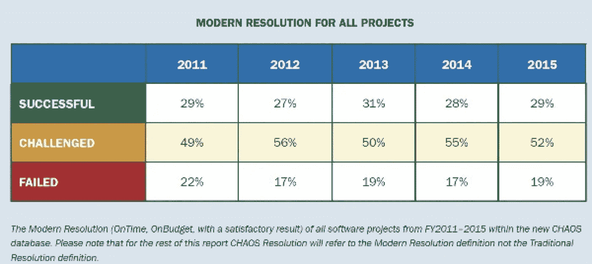

# 大数据不是一个问题

> 原文：<https://medium.com/swlh/big-data-is-not-a-matter-of-it-38c3e7d8c206>

大数据分析项目为什么会失败？管理大数据项目和管理 IT 项目一样吗？哪个部门最适合实施大数据项目？不掌握所涉及的技术技能，能负责大数据项目吗？

这篇文章的标题可能会吓到一些人，但它的唯一目标是重新思考大数据分析项目的重点，由于其技术成分，这些项目默认情况下往往会落入 IT 部门的手中。大数据不是 IT 的事，**至少不是独占**。

我们必须承认，当谈到大数据分析的主题时，我们大多数人仍处于襁褓之中，尽管数据分析一直存在，并且已经做了很多工作。谷歌和亚马逊等公司的出现为我们提供了例子、基础和必要的工具，使我们能够以更有效的方式从更大量的数据中分析和提取结论。基本上，通过重新审视科学和统计学，增加计算能力和低成本的组成部分。

在迈出第一步近 20 年后，问题是:在我们的组织中采用大数据分析的过程中，我们做错了什么？[首席信息官关于普华永道和铁山报告的文章](http://www.cio.com/article/3003538/big-data/study-reveals-that-most-companies-are-failing-at-big-data.html)“[组织如何从他们持有的信息中释放价值和洞察力](http://www.ironmountain.com/Knowledge-Center/Reference-Library/View-by-Document-Type/Landing-Pages/P/PWC.aspx)”，揭示了大多数公司在大数据项目中失败。

数据令人恐惧。**只有 4%的公司在实施大数据分析项目中取得了真正的成功**，而 43%的公司表示他们从中获得了很小的收益，23%的公司没有获得相应的收益。几乎更令人惊讶的是，报告显示，研究中四分之三的组织缺乏实施数据分析的技能和必要技术，四分之三的组织尚未聘用数据分析师，而在聘用了数据分析师的组织中，只有四分之一的组织能够胜任使用数据分析师。

那么，大数据项目为什么会失败呢？大数据专家 Bernard Marr 在他的文章“[大数据项目失败的地方](http://www.forbes.com/sites/bernardmarr/2015/03/17/where-big-data-projects-fail/#78cb4ef6264e)？”中解释道由于缺乏足够的规划，超过 50%的大数据分析项目将获得低于预期的结果。根据他在实施这类项目方面的丰富经验，他评论了最常见的错误:

1.  从不明确的业务目标开始。我们必须开始问“为什么”,然后继续问“如何”。
2.  **没有一个好的商业案例。**在考虑技术之前，我们必须清楚哪些是我们的业务需求。
3.  **项目管理中的失败**。缺乏经验、不了解技术含义或不良的变更管理会扼杀任何好的项目。
4.  **项目和结果沟通不畅。我们必须始终考虑信息将发给谁，以及我们如何确保信息到达用户手中。**
5.  **不具备项目所需的技能**。目前，很难聘请到优秀的数据分析师，因为他们既昂贵又稀缺。

历史会重演。IT vs 商业的老问题。自从计算开始以来，公司对新技术的采用已经引起了很多讨论。以至于即使在今天，令人印象深刻的数字仍在被考虑，因为根据 Standish Group 的 2015 年混沌报告，只有 29%的 IT 项目被认为是成功的。另一方面，**麦肯锡**与**牛津大学**“[按时、按预算、按价值交付大规模项目](http://www.mckinsey.com/business-functions/business-technology/our-insights/delivering-large-scale-it-projects-on-time-on-budget-and-on-value)”合作的一份报告确保大型 IT 项目平均 45%的时间偏离预算，7%的情况偏离时间，而在 **56%的情况下，它们提供的价值低于最初估计的**。

这些数字表明，项目的实施存在一个根本问题:我们想要处理非常复杂的项目，却不了解其需求、资源和影响。**我们不具备从战略角度解决数据分析的必要成熟度**，因为我们将数据分析视为技术问题，而实际上，他们的迭代发现过程更具科学性。

事实是，公司在捕捉数据方面进行了大量投资，但在使用数据并从中提取价值时，它们很快就放弃了。在许多场合我们从两个错误的观点出发:

**数据被认为是活动**的副产品，而不是作为公司的战略资产。

责任在于 IT 和数据架构师，而不是公司的交叉资源。

我们正面临一个根本性的范式转变:**数据不是 IT 的问题，而是公司在技术层面之外的宝贵资产。**

研究和技术趋势中的参考资料， [Gartner](http://www.gartner.com/technology/home.jsp) 在其出版物“[如何防止大数据分析失败](http://www.gartner.com/smarterwithgartner/how-to-prevent-big-data-analytics-failures/)”中告诉我们需要**制定可行的战略，以增加大数据项目的业务价值**。Gartner 的方法是从人才和资源入手，通过规划和获取或发展必要的技能和专业化。一旦定义了关于技能的策略和优先级，我们就可以保证进行大数据分析。其实施的一个关键成功因素是组织有能力建立、发展和维持一个多学科团队来解决已确定的业务问题。

在这一点上，**管理有一个关键性的作用**。您必须停止像内部客户一样思考，并通过领导各自领域的数据分析项目来采取行动。领导者需要将精力集中在如何通过战略分析和消化这些内部使用的数据上，确定数据源，理解分析信息对其他部门的重要性，并创建结构化的计划。管理控制的问题在于，很大一部分高管不知道所有可用的信息，也不知道数据如何在公司流动，以及它如何帮助他们的团队。最糟糕的是，当其他人接管控制权，关键时刻到来时，他们不会完全信任这个人。

这绝对不是指责某人有罪，并在部门之间挑起战争，看谁获得荣耀，**我们必须考虑谁是执行大数据分析项目的最合适的人，并开始为我们的数据奠定坚实的战略基础**。同时，这不是雇佣人才，然后等他们来解决我们业务的问题。我们在大数据分析项目中的第一步不是雇佣数据科学家或创建分析部门。每个公司都有自己的世界。我们从非常不同的经历、资源和情况出发。这是一个不断变化的现实，这就是为什么我们必须停下来分析什么样的策略最适合每种情况和精确的时刻。

大数据分析在科技创业背景中有**许多** **的成功案例，原因很多，但如果我必须强调两个，那就是:**数据驱动的人才和文化**。这在一定程度上与 CIO 文章的一个结论不谋而合，该文章称，取得 4%成功的公司的共同特征是一致的政府模式、渐进的复杂性和基于数据的文化。**

在我看来，有三个选择:赋予 IT 一个业务愿景，为业务视角提供一个技术视角，或者是最连贯和最符合逻辑的视角**绕过通常的标签，创建能够在全球层面面对重大挑战的动态混合团队**。无论什么形式。所有这些都取决于组织、其资源和需求。看起来很清楚的是，大数据分析项目对初创公司来说更像是技术管理本身，至少在一开始是这样。**创建多学科团队、明确的战略定义、变革管理、项目管理和知识管理等任务是具有高增长潜力的新公司的“面包和黄油”**。如果我们停下来想一想，数据呈指数级增长，在许多情况下，对数据的分析和使用构成了一种竞争优势，尤其是当数据是在具有特定目的的垂直行业中生成时。是时候我们开始在公司内部创建真正的创业公司了吗？**我们是否准备投资业务中的高潜力和高风险项目？**

我们生活在一个通过数据分析科学及其工具在管理和技术之间架起桥梁的时代；**现在就看我们如何勇敢跨越，获得结果**。

如果你认同以上任何一种方法，请不要犹豫，留下你的评论。您将如何管理大数据分析项目？你认为什么对你的组织最有利？您如何看待自己在大数据生态系统中的未来？

## 这个故事发表在 [The Startup](https://medium.com/swlh) 上，这是 Medium 最大的企业家出版物，拥有 286，184+人。

## 在这里订阅接收[我们的头条新闻](http://growthsupply.com/the-startup-newsletter/)。

