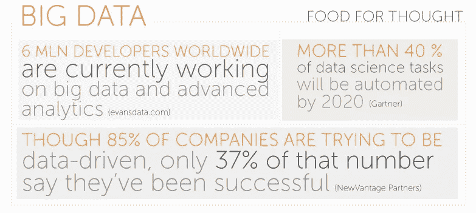

# 2018 年要寻找的大数据趋势

> 原文：<https://medium.com/swlh/big-data-trends-to-look-for-in-2018-20fbdc19f892>

[大数据](https://www.ciklum.com/our-expertise/big-data-analytics/)就是将事实和数字转化为洞察力，但就行业本身而言，预测未来仍然取决于人类。以下是我们对 2018 年该行业发展的预期。

# 关于分析的一切

迄今为止，关于大数据的宣传大多是定量的，大胆宣称处理的千兆字节数或处理速度。虽然这对于业内人士衡量他们各自的成就来说是一件好事，但还没有对公众开放。他们只是看着大量的数字，想知道这意味着什么。期待大数据公司在 2018 年通过采取一种新的方法留下印记:展示分析大数据如何带来启示，给人们的日常生活带来可识别的变化。

# 流式传输成功

让我们诚实地说:对于 2018 年的趋势，我们可能更多地谈论的是旅程而不是目标。这个目标就是真正的流分析:能够处理和分析任何正在创建的数据集。这意味着无需复制数据集就能获得最新的见解。目前，这通常意味着通过限制数据集大小或允许延迟来妥协，但 2018 年将使我们更加接近消除这些限制。

[**阅读案例研究:为四大专业服务公司**](https://www.ciklum.com/case-studies/big-four-professional-services-firm/) 构建实时分析解决方案

# 计算数字

大数据公司有时太沉迷于技术，以至于很难把自己放在客户的心目中。决策者需要证明选择的合理性，例如使用数据分析和硬数据通常是这一过程的关键。寻求服务提供商提供工具，使运行分析带来的好处和节省更容易用金钱来衡量，从而使客户更容易处理部门预算的内部政治。

# IT 到 IoT

对于亚马逊 Echo 和谷歌 Home 等设备是否真的会突破主流，目前还没有定论，但大牌品牌的参与表明，企业和消费者将越来越多地使用除普通电脑和手机之外的互联网连接设备。“物联网”的蓬勃发展意味着更多的数据被创造出来，从而有更多的分析潜力。2018 年可能不会成为一个巨大的赚钱机会，但绝对是公司应该领先潮流的一年。

物联网的扩张伴随着网络安全问题，安全问题也随之出现。例如，网络犯罪分子可以侵入电网、交通系统或任何其他带有敏感数据的互联系统，从而关闭整个城市。

# 安全局

无论是卧室黑客还是国家支持的网络战，众所周知，企业越来越担心网络威胁。这为大数据公司提供了真正的机会。2018 年可能会看到更多的提供商开发和营销利用数据分析作为工具来检测甚至预测网络威胁的产品。

*感谢阅读！关于数据分析有什么问题吗？我们很乐意在 Twitter*[*@ Ciklum*](https://twitter.com/ciklum)*或* [*上提供帮助，直接给我们发邮件*](mailto: ciklum@ciklum.com) *。*

*原载于 2017 年 11 月 30 日* [*Ciklum 博客*](https://www.ciklum.com/blog/) *。*

## 这个故事发表在 [The Startup](https://medium.com/swlh) 上，这是 Medium 最大的企业家出版物，拥有 277，994+人。

## 在这里订阅接收[我们的头条新闻](http://growthsupply.com/the-startup-newsletter/)。

