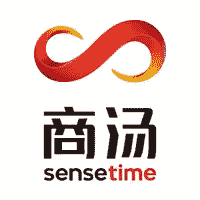

# 2018 年最大的人工智能创业公司

> 原文：<https://medium.com/swlh/biggest-artificial-intelligence-startups-2018-6722f4c733e2>

人工智能仍然是一个不断增长的领域，是资金最充足的类别之一。该领域的初创公司提供从非结构化来源的自动数据收集到实时数据分析和综合的服务。这里有 6 个世界上最大的人工智能初创公司。

# [头条](https://www.toutiao.com/)——31 亿美元

中国。成立于 2012 年，张一鸣

类别:分析、大数据、数据挖掘、互联网、机器学习、社交网络

今日头条是一个内容平台，它使人们能够发现由人工智能技术驱动的内容世界。利用自然语言处理和计算机视觉，今日头条从每条内容中提取实体和关键词作为特征。订阅源阅读器应用程序试图通过分析从用户的社交网络帐户获得的数据来逐渐了解读者喜欢什么，从而为用户整合最相关的内容。

今年早些时候，今日头条[加入 Buzzfeed](https://qz.com/1189950/toutiao-and-buzzfeed-the-clickbait-kings-of-china-and-the-us-are-joining-forces/) ，向今日头条的 1.2 亿中国观众分发娱乐内容，想必是要接受该公司 1 万多名内部审查人员的审查。

# [感应时间](https://www.sensetime.com/)——16 亿美元

中国。成立于 2014 年，许晓兰

类别:人工智能、计算机视觉、图像识别、软件

Facial Feature Point Positioning

商汤科技开发的人脸识别技术可以应用于支付和图片分析，例如，可以用于银行卡验证和安全系统。在 2017 年中国货币网中国人工智能十大排名中[排名第五，商汤科技目前为 300 多家公司提供人脸识别技术，包括中国移动通信有限公司、中国银联、华为技术有限公司、小米公司和 JD.com 公司。](https://www.chinanewswire.com/pr/201703101715244317/china-money-network-launches-china-top-10-ai-ranking/)

商汤科技表示，其人脸识别技术的错误率低于十万分之一。它还为移动互联网公司、金融服务和安全公司提供文本、车辆和图像识别。

# [阿尔戈艾](https://www.argo.ai/)——$ 1B

美国。成立于 2017 年，布莱恩·萨勒斯基，彼得·兰德

类别:人工智能、自动驾驶汽车、机器人

Argo AI 的成立是为了解决自动驾驶汽车在计算机科学、机器人和人工智能领域最具挑战性的应用之一。Argo 正在开发和部署人工智能、机器学习和计算机视觉方面的最新进展，以帮助构建安全高效的自动驾驶汽车，实现这些转变及更多。

# Kreditech——4.973 亿美元

德国。成立于 2012 年，亚历山大米勒，塞巴斯蒂安迪默

类别:银行、大数据、金融、金融服务、金融科技、借贷、个人金融

Kreditech 集团的使命是通过使用技术来改善银行服务不足者的财务自由。该公司将非传统数据源和机器学习相结合，旨在为数字银行服务提供更好的信贷和更高的便利性。这些产品包括消费贷款、数字钱包和个人理财经理，旨在帮助客户管理他们的信用评分和规划他们的支出。Kreditech 还提供“贷款即服务”模式，允许合作伙伴通过 API 将 Kreditech 的信贷产品集成到他们自己的平台和服务中。

# [橡子](https://www.oaknorth.com/)——4.863 亿美元

英国。成立于 2015 年，乔尔·帕尔曼，里什·科斯拉

类别:人工智能、银行、大数据、商业借贷、金融、金融服务、金融科技、借贷、机器学习、个人金融、中小企业

ACORN OakNorth 是一家金融科技公司，专注于利用其数据和技术平台 ACORN machine 在全球范围内释放定制中小企业贷款的潜力。

ACORN machine 是一个金融科技平台，有助于在整个贷款生命周期中利用流程优化、机器学习和数据驱动的决策来实现流程自动化。该平台收集了各种参数、行业和市场的数百万个中小企业数据项，并使用机器学习算法来识别数据，贷款人需要这些数据来通过详细的单项承保做出更明智的信贷决策。ACORN 的信用分析师和数据科学家团队管理这一过程，训练机器学习算法。

橡子机器的概念通过 OakNorth 得到了证明，oak north 是一家屡获殊荣的挑战者银行，成立于 2015 年，旨在解决英国中端市场的资金缺口。

# [sound hound](https://soundhound.com/)——2.15 亿美元

美国。成立于 2005 年，詹姆斯·霍姆，凯万·莫哈杰尔，马吉德·埃马米

类别:人工智能、音频、移动、自然语言处理、语音识别

SoundHound Inc .是语音人工智能和对话智能技术的领先创新者。

sound hound Inc .[Houndify](https://www.houndify.com/)是第一个独立的人工智能平台，使开发者和企业主能够在任何地方部署它，并保持对其品牌和用户的控制，同时实现差异化和创新。Houndify 提供语音和 AI 集成，包括世界上最快的语音识别和最复杂的自然语言理解。

SoundHound Inc .的语音搜索和助手应用程序 [Hound](https://soundhound.com/hound) ，在消费者应用程序体验中利用了他们的语音到含义和深层含义理解技术。

[SoundHound](https://soundhound.com/soundhound) 音乐识别应用将技术应用于听觉体验，使人们能够发现、探索和分享音乐。

娜塔莉亚·库库什金娜撰写

## 这篇文章发表在 [The Startup](https://medium.com/swlh) 上，这是 Medium 最大的创业刊物，有 340，876 人关注。

## 在这里订阅接收[我们的头条新闻](http://growthsupply.com/the-startup-newsletter/)。

