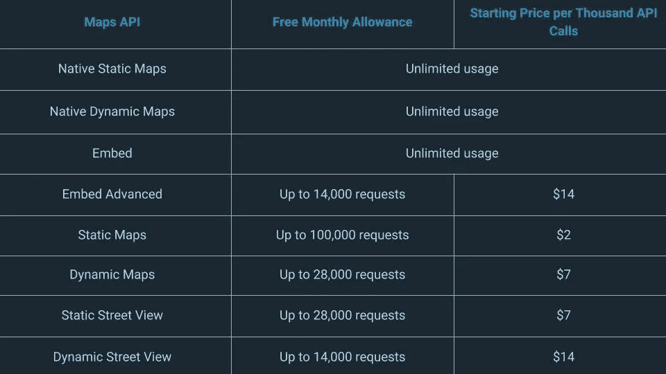
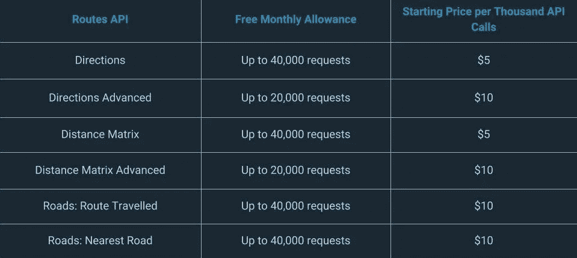

# 面向所有人的计费:谷歌地图 API 价格上涨

> 原文：<https://medium.com/swlh/billing-for-all-google-maps-api-price-rise-f80cdd9e5017>

如果你正在使用谷歌地图作为你的网络存在的一部分，无论是通过在你的网站上嵌入地图还是将其内置到移动应用程序中，那么你可能已经意识到，正如鲍勃·迪伦所说，他们的时代正在发生变化。

这是因为谷歌最近宣布推出新的谷歌地图平台，该平台“引入了对其产品、定价和支持的改变，以提供……更大的灵活性、透明度和控制力。”这些变化将影响到每一个使用谷歌地图及其 API 来增强网站功能的个人和公司。这就是为什么让你的头脑适应这些变化并理解它们对你的业务意味着什么是如此重要。

> Zfort Group 是一家软件开发公司。我们提供符合成本效益的最佳解决方案来满足您的需求。[联系我们](https://www.zfort.com/contacts?utm_source=MEDIUM&utm_medium=The_StartUp&utm_campaign=Billing_for_All:_Google_Maps_API_Price_Rise)免费咨询。

考虑到这一点，我们制作了本指南，带您了解所有重大变化。我们将解释它们对您的业务意味着什么，以及您可以做些什么来最小化 Google Maps 集成对您网站的负面影响。只要确保你什么都没做！

# 谷歌地图平台:有哪些变化？

对谷歌地图的更改于 2018 年 6 月 11 日开始，要求用户为使用谷歌地图显示数据的每个 web 项目创建一个有效的 API 密钥。你还需要启用信用卡账单，就像你需要在运行 Google AdWords 之前添加你的信用卡信息一样。谷歌表示，通过这样做，你还可以更容易地扩大和缩小规模，减少停机时间，减少网站的性能问题。

这些新要求意味着谷歌已经停止对任何不包含 API 密钥的请求提供支持。现在这些变化已经发生，对地图 JavaScript API 和街道视图 API 的调用只返回带有水印的低质量地图。对地图静态 API、方向 API、距离矩阵 API、地理编码 API、地理位置 API、地点 API、道路 API 和时区 API 的无效请求都将返回错误。

对于网站所有者来说，这意味着他们要么需要重新开发他们的网站来使用竞争对手的服务，要么为谷歌地图创建一个计费账户和一个附带的 API 密钥。他们还需要更新他们网站上的各个小部件，以确保他们使用新的 API 密钥发出所有请求。

# 公司已经开始抱怨了

当然，所有这些变化意味着不是每个人都开心。网络开发人员不得不打电话给他们的客户询问信用卡信息，公司不得不立即重新设计他们的网站，谷歌自己也面临着博客评论区的强烈反对。一位用户抱怨说，“你不能接受一项已经免费多年的服务，然后一旦每个人都承诺使用它，就开始收费”。

谷歌的问题是，全球 41%的互联网用户使用谷歌地图，这意味着对该平台进行任何类型的改变都会引发争议。但是，由于通过谷歌地图进行的查询如此之多，而该公司又没有真正的方法像通过搜索结果赚钱那样赚钱，该公司被迫免费提供越来越多的资源。至少到目前为止。

然而，这些变化并不都是坏的。例如，谷歌已经将十八种不同的 API 简化为三种产品:地图、路线和地点。从长远来看，这将使开发变得更简单，也允许他们更好地组织他们的数据，并确保互操作性。这些更新经过精心设计，无需开发人员进行任何更改即可立即生效。更好的是，一些用户会撇开这个问题。

# 并非所有谷歌用户都会受到影响

谷歌地图 API 的新更新是为大公司设计的，用户将每月获得 200 美元的免费地图、路线和地点资源。这对于较小的网站和本地企业来说已经足够了，但是很快就会被那些通过谷歌服务发出更多 API 请求的大公司所吞噬。

这些资源将仅在启用计费并批准有效的支付方式后提供。这让人想起了 Dropbox 的工作方式，一定数量的资源将免费提供，只有当你浏览它们时才会收费。如果你希望仅仅依靠免费资源，那么你需要考虑你离资源极限有多近。如果你用完了，那么你将被自动收费。

事实是，使用 Maps API 的每个人都会受到这些变化的影响，因为他们需要生成一个 API 密钥并输入他们的账单细节。只是不是每个人都要付钱。这完全取决于你消耗了多少资源。

# 价格变化是主要更新的一部分

到目前为止，您可能想知道新的定价结构是什么样的。好消息是，有大量的资源允许免费使用，在达到这个资源限制后，它会切换到你的 200 美元的免费资源。只有当您超出这两组资源时，才会向您收费。

让我们来看看你能期望支付多少。

**查看地方 API 成本对比**和**阅读进一步**此处:【https://www.zfort.com/blog/google-maps-api-price-rise/】T4

> 如果您想了解更多，请不要犹豫，请联系来自顶级外包软件开发公司 [Zfort Group](https://www.zfort.com/?utm_source=MEDIUM&utm_medium=The_StartUp&utm_campaign=Billing_for_All:_Google_Maps_API_Price_Rise) 的专家。自 2000 年以来，我们一直在各个行业提供定制软件开发服务。[联系我们](https://www.zfort.com/contacts?utm_source=MEDIUM&utm_medium=The_StartUp&utm_campaign=Billing_for_All:_Google_Maps_API_Price_Rise)或填写表格，让我们知道如何为您提供帮助。

最初发表于[zfort.com](https://www.zfort.com/blog/google-maps-api-price-rise?utm_source=MEDIUM&utm_medium=The_StartUp&utm_campaign=Billing_for_All:_Google_Maps_API_Price_Rise)

## 这个故事发表在 [The Startup](https://medium.com/swlh) 上，这是 Medium 最大的创业刊物，拥有 348，974+人关注。

## 在此订阅接收[我们的头条新闻](http://growthsupply.com/the-startup-newsletter/)。

