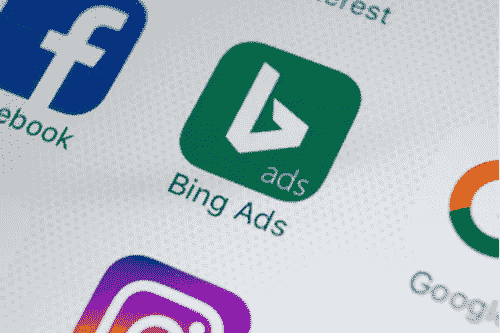

# Bing:被低估的 PPC 平台有可能让你的潜在客户量翻倍

> 原文：<https://medium.com/swlh/bing-the-undervalued-ppc-platform-that-could-potentially-double-your-lead-volume-953f259f9d08>

我最近强调了营销工作多样化的重要性。

今天，我想谈谈一个被低估的 PPC 平台，只需点击一下按钮，它就有可能为你的企业带来双倍的商机。

我说的是必应广告。

是的，这个经常被鄙视的搜索引擎，尽管缺乏流行的吸引力，却设法占有 33%的搜索量…这是许多 Agora 企业没有开发的 33%的市场。

# 你真的能忽视 33%的潜在客户吗？

根据 ComScore 的数据，Bing 广告受众中有三分之一的家庭收入在 10 万美元或以上。更不用说，他们更有可能在 55-64 岁年龄段…典型的 Agora 目标市场。

如果这还不足以成为你研究 Bing 的理由，这里还有一些其他因素需要考虑:

首先，必应不像谷歌那样是一个拥挤的营销平台。这意味着竞争减少，往往会导致成本下降。

此外，Bing 仍然在顶部广告位置的同时提供侧边广告位置，这意味着您的文案有更多的屏幕空间-更好的曝光率！事实上，在谷歌改变他们的 SERP 布局并删除侧边广告之前，我经常发现侧边广告空间比首页顶部广告空间对我的业务更有效。

如果你考虑一下，Bing 会向你提供他们的优质房产。

到目前为止，使用 Bing 的好处包括受众(高收入)、位置(黄金房地产)和成本(较低的广告成本)，这些都符合你的营销目标。

听起来像是板上钉钉的事，对吧？

然而，对我来说最重要的是你可以通过简单的点击按钮将你的谷歌广告导入必应。

这么容易的起点，你为什么不想在 Bing 上做广告呢？

我花了几年时间在 Bing 广告平台上工作，公平地说，有几个元素你确实需要知道。

首先，你需要关注送达率指标。在过去，我已经注意到，对于必应广告，我的投递能力受到了影响。这种可送达性是电子邮件地址的结果，可以直接追溯到通过 Bing 广告获得的线索。

但是如果你的清单卫生达标，这不应该是一个主要的症结。

事实上，这是一个可靠的建议。确保你定期将未签约的用户清理到一个重新签约的 IP，并将他们从你的文件中清除。你不想被发现处理垃圾邮件陷阱。

除了卫生保健，必应较小的市场份额意味着你的潜在客户量可能会更低。实际上，这意味着你想从世界各地的谷歌开始，当你已经看到成功的时候，再把业务扩展到必应。

事实是，尽管必应的市场份额普遍较低，但它仍然是一个非常有价值的市场份额。

但是，如果你真的很缺钱，把你的谷歌广告直接导入 Bing 是一个简单的交易。

# 你已经扣动了扳机，开始了必应广告的宣传活动。现在，您能做些什么来让它们发挥最佳性能呢？

我知道，我说过这是一个“一次点击”的机会…如果你真的时间紧迫，但想多样化，这仍然是因为你可以直接从谷歌 AdWords 导入，让活动照原样运行。

然而，如果你想在 Bing 上最大化你的性能，下面的提示将帮助你做到这一点:

1.  当你从谷歌上导入你的营销活动后，花几分钟浏览一下你的负面关键词列表。Bing 广告不允许广泛匹配负面关键词。所以你需要检查你的搜索词，并创建负面搜索词列表。但是不要走极端。请记住，您可能会接触到不同的受众，他们可能会以略微不同的方式进行搜索。所以，优化必应搜索，而不是谷歌搜索。
2.  面对不同的受众，可能会有不同的广告创意表现出色。可以肯定的是，你想从谷歌上表现最好的广告开始，但也要注意随着时间的推移 Bing 上的效果。一条不同的信息在必应上可能比在谷歌上得到更好的回应。
3.  最后，自定义您的出价到冰。对于 Bing 上的相同关键词，你在 Google 上的出价可能太高或太低。

我想你会发现，一旦你的活动启动并运行，必应为你的业务提供了一个有价值的线索来源和额外的收入来源。

感谢阅读。

***克里斯蒂娜·克拉普***

AIM 客户经理。

附言:如果你有兴趣利用专业直复营销团队数十年的知识、测试和专业技能，请立即订阅我们的每周简讯。[你可以在这里报名](https://readyfireaim.eu/free-ready-fire-aim-eletter/?utm_source=medium&utm_medium=ps&utm_campaign=bing)。

## 这篇文章发表在 [The Startup](https://medium.com/swlh) 上，这是 Medium 最大的创业刊物，有 303，461+人关注。

## 订阅接收[我们的头条新闻](http://growthsupply.com/the-startup-newsletter/)。

