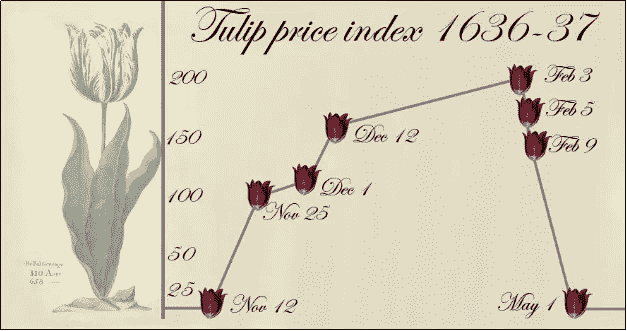

# 比特币:21 世纪的郁金香狂热

> 原文：<https://medium.com/swlh/bitcoin-a-tulip-mania-of-21th-century-c37946340135>

作者:Harshit Gujral，Raamesh Gowri Raghavan 和 Sukant Khurana

你花多少钱买一束郁金香？也许几美元，有时一百美元，但肯定不是一百万美元！然而，历史上有很多例子表明，由于大部分人进行投机性投资，郁金香、房地产或网络股票等商品的售价远远高于其内在价值。在每一个这样的例子中，价格都呈指数增长，并突然恶化。

17 世纪，荷兰进入荷兰黄金时代。到 17 世纪 30 年代，阿姆斯特丹是一个重要的港口和商业中心。荷兰东印度公司从亚洲大量进口香料，通过在欧洲销售赚取利润。这导致了熟练的商人和商人的增长，他们通过住在被花园环绕的巨大宅邸来展示他们的繁荣。郁金香的需求量特别大。

郁金香被认为是一种外来的花，因为它们是用船只从东方进口的；此外，郁金香很难种植，因为一朵花可能需要数年才能开花。这种情况由于郁金香破裂病毒(马铃薯 y 病毒科病毒家族)的爆发而进一步升级，这种病毒通过给花瓣衬上五彩缤纷的火红条纹而使精选的花朵更加优雅。这些精选的郁金香比普通郁金香更稀少:结果，这些花的价格和受欢迎程度开始随着人类理性的下降而上升。很快，郁金香风靡全国，郁金香热由此诞生。郁金香价格陷入了正反馈循环，投资者因期货投机而陷入炒作。最终，它将价格推高至远远高于其实际内在价值，从而制造了泡沫。渐渐地，大家都意识到郁金香的价格远远超过了它们的实际价值，这使得价格降到了令人震惊的低点，导致了狂热的结束和泡沫的破裂。

2010 年代初，随着数字银行的出现和交易缺乏隐私，比特币广受欢迎。2016 年 5 月 Wanna Cry 病毒的爆发极大地促进了比特币的流行。黑客要求用比特币支付赎金，以隐藏他们的交易痕迹。此外，从 10 月到 11 月，人民币对美元贬值。这使得比特币成为全球轰动，其汇率从 2016 年 5 月的 450 美元飙升至 2017 年 12 月 15 日的 17，900 美元。

著名的交易者吉姆·罗杰说过，“价格可以超出你的想象！”。对统计学家来说，预测泡沫破裂和狂热结束的准确时间总是非常具有挑战性，而且几乎是不可能完成的任务。杰克·d·施瓦格在他的书《市场奇才》中说，“*我们可以预测市场的方向，但不能预测幅度*”。杰西·利弗莫尔，一位著名的美国投资家和证券分析师宣称，“*投机是古老的。今天在股票市场上发生的任何事情以前都发生过，而且还会再次发生。我从来没有忘记过那个*”。只有时间才能决定比特币是泡沫还是一场全球性的货币革命。

**参考文献**

1.安德鲁·贝蒂,《市场崩溃:郁金香和球茎狂热》( 1630 年代), https://www.investopedia.com/features/crashes/crashes2.asp[书店有售](https://www.investopedia.com/features/crashes/crashes2.asp)

2.Dash，Mike (1999)，《郁金香狂:世界上最令人垂涎的花的故事及其引起的非凡激情》，纽约:三河出版社，ISBN 978–0–307–56082–7

3.Prateek Singh (2015)，什么导致了经济泡沫？— TED-Ed，可在[https://www.youtube.com/watch?v=I5ZR0jMlxX0](https://www.youtube.com/watch?v=I5ZR0jMlxX0)获得

4.阿莱西奥·拉斯塔尼(2017)，《比特币泡沫——它将如何终结？在[https://www.youtube.com/watch?v=NjkDQKeguZA](https://www.youtube.com/watch?v=NjkDQKeguZA)有售

5.威尔·赫顿(2017)，比特币是一个泡沫，但其背后的技术可能会改变世界，可在[https://www . the guardian . com/commentis free/2017/dec/24/bit coin-a-bubble-the-technology-behind-can-transform-world](https://www.theguardian.com/commentisfree/2017/dec/24/bitcoin-is-a-bubble-the-technology-behind-could-transform-world)

**关于:**

Harshit Gurjal 是一名攻读工程学位的计算机科学学生。他是库拉纳博士团队的一名研究人员，负责开发用于加密货币分析的新工具。

Harshit Gujral

 [## 哈什特·古杰拉尔|职业简介| LinkedIn

### 查看哈什特·古杰拉尔在全球最大的职业社区 LinkedIn 上的个人资料。哈什特有 5 份工作列在…

www.linkedin.com](https://www.linkedin.com/in/harshit-gujral-05022b130/)  [## 哈什特·古杰拉尔(@哈什特·古杰拉尔)|推特

### Harshit Gujral 的最新推文(@Harshitgujral)。人权活动家|太空好奇|政治|作者…

twitter.com](https://twitter.com/Harshitgujral) 

拉梅什·戈里·拉格哈万先生是一位获奖诗人、著名的广告专业人士、历史学家和探索科学与艺术界面的研究者。他还支持大规模的抗抑郁和预防自杀活动。

您可以通过以下网址了解更多关于 Raamesh 的信息:

[https://sites.google.com/view/raameshgowriraghavan/home](https://sites.google.com/view/raameshgowriraghavan/home)

https://www.linkedin.com/in/raameshgowriraghavan/?ppe=1

下面是拉梅什讲述他的人生故事:

拉梅什和苏坎特正在合作几个关于科学、技术和艺术交叉的项目，以及关于心理健康的项目。

T4 博士苏肯特·库拉纳经营着一个学术研究实验室和几家科技公司。他也是著名的艺术家、作家和演说家。你可以在[www.brainnart.com](http://www.brainnart.com)或[www.dataisnotjustdata.com](http://www.dataisnotjustdata.com)了解更多关于 Sukant 的信息，如果你希望从事生物医学研究、神经科学、可持续发展、人工智能或数据科学项目以造福公众，你可以在 skgroup.iiserk@gmail.com 联系他，或者通过 LinkedIn[https://www.linkedin.com/in/sukant-khurana-755a2343/](https://www.linkedin.com/in/sukant-khurana-755a2343/)联系他。

这里有两个关于 Sukant 的小纪录片和一个关于他的公民科学努力的 TEDx 视频。

 [## Sukant khu Rana(@ Sukant _ khu Rana)|推特

### Sukant Khurana 的最新推文(@Sukant_Khurana)。创始人:https://t.co/WINhSDEuW0 和 3 家生物技术创业公司…

twitter.com](https://twitter.com/Sukant_Khurana) 

## 这个故事发表在 [The Startup](https://medium.com/swlh) 上，这是 Medium 最大的企业家出版物，拥有 293，189+人。

## 在此订阅接收[我们的头条新闻](http://growthsupply.com/the-startup-newsletter/)。

