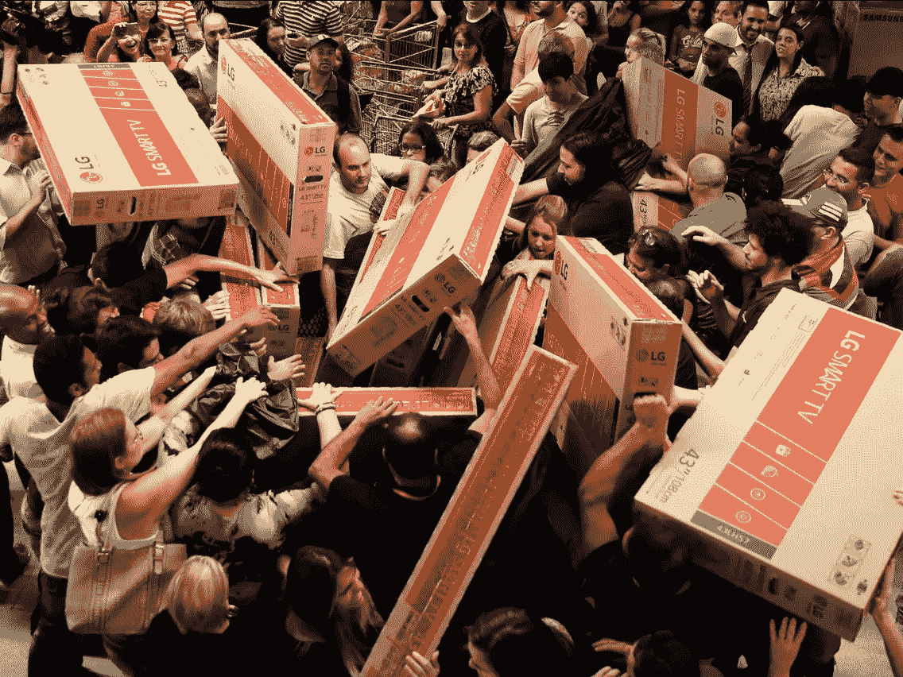

# 黑色星期五、购物中心和纽约颠覆性的电视福音传道者

> 原文：<https://medium.com/swlh/black-friday-consumerism-and-nycs-subversive-televangelist-a03d50fd92e4>

Americans attend Services on the largest Christian holiday of the year: Black Friday. As part of the sacrament, worshippers gather — hands raised — at the altar of LG Smart TV. Image credit: Nacho Doce/Reuters

在我的基督教传统中，我们一直生活在对天启的恐惧中。《圣经》预言了种种迹象:当所有国家联合在一个由被称为反基督的邪恶领袖统治的“一个世界的政府”之下时，世界末日即将来临。

在现实中，我们可能永远不会有一个世界政府，甚至不会有一种共同的语言。但是我们的星球已经…