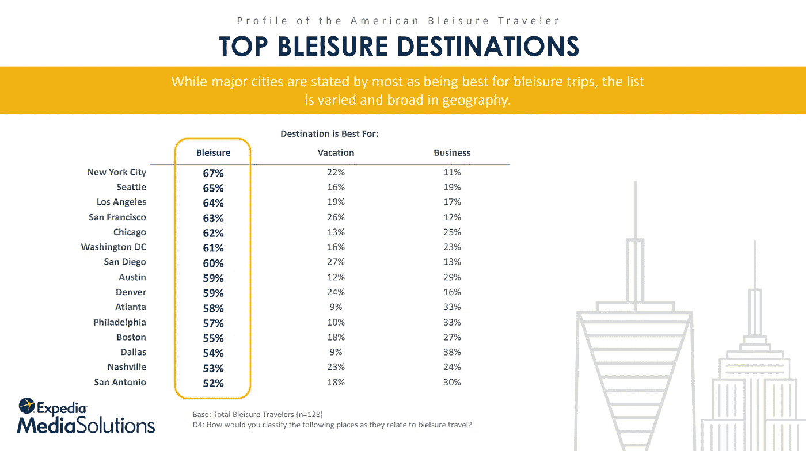
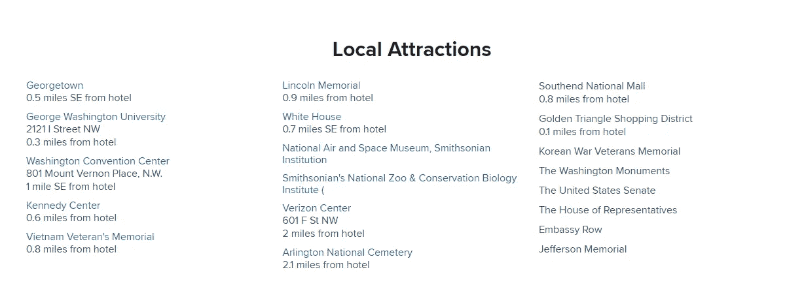

# Bleisure Travel:如何利用逗留休闲的商务旅客

> 原文：<https://medium.com/swlh/bleisure-travel-how-to-capitalize-on-business-travelers-that-linger-for-leisure-8210039c7820>

即使是在办公室工作的专业人士也可能会觉得他们正在失去工作生活和社交生活之间的平衡。如果你不关掉智能手机的网络，坐地铁上下班会把一天变成马拉松式的轮班。发送电子邮件，与同事交流信息，在上下班途中或其他时候列出一天的任务清单——每个人都经历过。

更不用说更积极追逐生活工作平衡梦想的自由职业者和远程团队成员了。这样的工作者倾向于找到一个舒适的地方工作、休息和交流。他们可能呆在家里，在一个共同工作的地方租一张桌子，或者在一家咖啡店的摊位前。

模糊工作与生活界限的趋势也影响了大公司的运营方式。今天的管理阶层对工作流程的看法与他们的前辈不同——在公司工作不仅仅是为了工作，也是为了休闲。

员工喜欢高档的工作场所、会议室和餐厅、健身房、休息室、游戏室、电影院和露台。而且，由于所有的额外津贴，如果需要的话，他们可能不会介意多呆几个小时。

在这方面，人们在工作旅行时最有可能将商务和休闲结合起来。如果他们每年出差几次，加班，或者不确定是否有一个像样的假期，他们这样做的机会就更大了。真的，在经过几天的谈判后，如果不在海滩上呆上几天，或者在一个陌生城市的街道上闲逛，那将是一种犯罪。那些同意这种说法，并且在填写 Booking.com 上的搜索表格时很难选择未来旅行目标的人可以称自己为 bleisure 旅行者。

# 什么是 bleisure？

Bleisure 是将工作承诺与娱乐相结合的旅行趋势。它在近八年前出现，并在继续增长。越来越多的人考虑在商务旅行时探索新的地方。根据全球商务旅行协会(GBTA)教育和研究分会的最新调查，67%的北美商务旅行者认为在 2016 年的旅行中增加休闲很重要。百分之三十七的人这样做了。

这一趋势可以为旅游和酒店业带来新的机遇。这种旅行需要更周密的计划。例如，有人必须找到一个在工作日和周末都可用的套房，阅读该地区的资料以安排休闲活动，并预订回家的机票。在这种情况下，旅行者可以从在线旅行社、酒店和其他旅游提供商那里获得帮助。

这篇文章解释了什么是 bleisure 旅行者，以及旅游企业如何满足他们的需求。你将发现如何发现潜在的旅行者，并激励他们在商务旅行中增加私人时间。

# 1.定义潜在的蓝色旅行者

要了解商务旅行者是否有动机延长休闲旅行，您可以分析他们的行为以及他们在寻找旅行选项时提供的个人信息。你也可以依靠这些互补的类别为某个客户提供他或她可能会接受的交易。

**行程时间范围。**来自 [Expedia Media Solutions 和 Luth Research](https://info.advertising.expedia.com/hubfs/Content_Docs/Premium_Content/pdf/Bleisure_2016_FINAL-2017-09.pdf?t=1513355578644) 的美国专家得出结论，持续三天或以上的旅行变成休闲旅行的可能性增加 30%。他们还报告说，那些在周一至周二或周四至周五抵达目的地的人通常会延长逗留时间。旅行越接近周末，越有可能成为一次轻松的旅行。这些顾客首先预订机票，然后寻找住处。

Carlson Wagonlit 旅游分析师[强调](https://www.carlsonwagonlit.com/content/dam/cwt/pdf/insights/20160712-solutions-group-white-paper-bleisure.pdf)blei sure 旅行包括“在旅行开始或结束时，或两者兼而有之，在目的地停留一个周六晚上。”

**目的地和路线长度。66%的旅行者同意目的地很重要。如果商务会议在旅行者个人必看的城市举行，他或她可能会延长旅行几天。**

当进行国际长途旅行时，人们希望沉浸在不同的文化中。国际旅行(52 %)比国内旅行(46 %)更高的观光率证明观光吸引力取决于旅行路线和出发城市。例如，伦敦人喜欢游览旧金山(24%的游客)，而后者的居民则喜欢英国首都(23%的游客)。

长途旅行和高旅行费用之间的关系也适用于国内旅行。请记住，一些目的地更适合商务旅行，而另一些则非常适合度假。在由 Expedia 和 Luth Research 进行的调查中，主要城市是根据吸引力来排名的。

**性别。**[CWT 调查](https://www.carlsonwagonlit.com/content/dam/cwt/pdf/insights/20160712-solutions-group-white-paper-bleisure.pdf)按性别划分的休闲活动显示，男性比女性进行更多与工作相关的旅行(70%比 30%)。与此同时，在排名前 100 位的商业目的地中，分析人士测量出女性(8.5%)比男性(6.8%)更容易出错。研究人员通过计算每个游客的年均旅游次数来解释这一结果。事实证明，男女都一样(1.4)。然而，由于女性通常比男性进行更少的与工作相关的旅行，她们的疲劳率更高。

**年龄范畴。刚刚开始职业生涯的年轻员工比他们有经验的同事更有冒险精神。根据同一份 GBTA 报告，48%的受访千禧一代(25 岁至 35 岁)在完成工作承诺后会呆几天。这一代人大多遵循数字生活方式，可能没有与家庭相关的责任，因此更加灵活。**

第二大群体(33%)是 X 世代员工(36-54 岁)。只有 23%的婴儿潮一代称他们进行了休闲旅行。

**婚姻状况。一些研究强调，有家庭和孩子并不是拒绝休闲旅行的理由。在 Bridgestreet Global Hospitality 的调查中，略多于一半的商务旅行者(54.4%)说他们可能会带着爱人一起去。**

**专业活动。**关于休闲率和出行频率相关性的报告统计数据不同。CWT 旅游调查总结说，每年旅行 20 次或更多的频繁旅行者进行 bleisure 旅行的可能性不到 5%。

根据 Expedia 和 Luth research 的报告，bleisure 旅行者经常旅行:其中 32%的人每月出差一次或两次，38%的人每 2-3 个月出差一次。GBTA 研究的受访者表示，他们每年有近 7 次出差。

虽然这些员工在不同的行业工作，但大多数(26%)与技术有关。总的来说，他们全职工作，年薪近 79，000 美元，大多担任中层管理职位(42%)。

你应该把重点放在细分技术上，以更好地了解你的客户群，也许你可以对你的商务旅行者的行为进行自己的研究。你可以在我们关于[旅行个性化和细分](https://www.altexsoft.com/blog/datascience/customer-experience-personalization-in-travel-and-hospitality-using-behavioral-analytics-and-machine-learning/#utm_source=MediumCom&utm_medium=referral)的文章中阅读更多关于具体细分技术的内容。

# 2.展示目的地城市和地区的信息

Expedia 和 Luth Research 的代表强调说:“目的地是第一研究主题和主导决策，观光和餐馆场景是关键影响因素。”。使用特定的内容和发布渠道可以说服商务旅客在酒店多呆几天进行休闲活动。

## 酒店和 OTA 网站上的“我们的区域”部分

每次旅行，你可能都想知道你的住房所能提供的所有休闲选择。您的商务旅行客户也不例外。他们阅读有关便利设施的内容，滚动照片，查看评论，并仔细研究地图，以了解某个位置是否合适。帮助他们快速轻松地搜索目的地。

如果你经营一家酒店，并且已经有了一个网站，你可以[通过提供关于酒店设施、预订细节和位置的附加信息来利用直接预订](https://www.altexsoft.com/blog/travel/how-to-drive-direct-bookings-online-back-to-your-hotel/#utm_source=MediumCom&utm_medium=referral)。我们的*区*将为商务旅客提供逗留更久的理由。列出景点、活动场所、健康和购物中心、餐馆等。记下他们的地址、离酒店的距离和联系方式。

华盛顿万豪乔治敦酒店的网站提供了关于该地区的详尽信息。游客可以获得天气预报、要参观的地标列表，以及运动、健身和家庭活动的地方

33%的 Expedia 受访者表示，如果该地区有活动，他们很可能会进行休闲旅行。在这种情况下，您可以在*我们的区域*部分为正在进行的文化和体育活动、音乐会或戏剧创建一个附加章节。

Airbnb 不仅为他们的客户提供房产搜索，还为他们的休闲活动提供计划。在*体验*部分，房主宣传他们自己的旅游和工作坊。一个商务旅行者发现许多令人兴奋的地方离住处只有几步之遥，通常不再只考虑工作。

## 社交媒体网络

社交媒体的存在有助于建立追随者基础。与 it 部门交流以共享服务信息。脸书在最有效的在线营销平台中排名第一，因为 T2 62%的数字营销人员表示他们会选择它。他们的选择是合理的:每个月有超过 20 亿人[积极使用脸书。](https://www.statista.com/statistics/264810/number-of-monthly-active-facebook-users-worldwide/)

例如，希尔顿的脸书主页拥有 170 多万粉丝。当然，连锁酒店页面上的内容是针对所有顾客群体的。但是谁说不能给潜在的休闲旅客发帖子呢？例如，贴一张芝加哥市区的照片，提及著名的地标或即将举行的活动。您也可以邀请人们参观目的地，住在酒店，或使用您的网站进行预订。

社交网络为商业页面提供了一个推广选项。后置升压就是其中之一。根据地点、年龄、性别、兴趣等类别，以及对上述潜在游客的了解，确定目标受众。正如脸书团队建议的那样，你也可以利用你已经拥有的联系人或者基于已经对你的页面表现出兴趣的人的相似受众来创建一个自定义受众。

# 3.提供优惠

GBTA 和 Expedia 的调查发现，大多数旅行者(82 %- 84 %)在旅行的最后一段时间会住在同一家酒店或公寓，这是为了方便。对于刚刚完成重要工作任务的人来说，去一个新的研究领域、重新预订住房、打包、拆包和搬到另一个地方的需要看起来并不像是休息和放松。如何鼓励旅行者在休闲部分逗留更长时间？

## 折扣计划

根据 Expedia 的报告，住宿变化的最大驱动因素是高房价(72%)，选择与住在该地区的家人或朋友住在一起(58%)，以及酒店远离休闲活动(54%)。

通过提供折扣或额外住宿，您可以将价格作为延长入住的理由。根据学术研究，76%的商务旅行者会很乐意接受这些优惠。例如，五晚优惠，第四晚和第五晚免费，或周末价格，要求周五或周六入住。

## 为商务旅客的家人和其他人提供折扣

那些有家人或重要的人的旅行者说，如果酒店提供以折扣价带这些人的选择，他们会让旅行变得轻松。在这种情况下，来自 Expedia 和座谈会调查的数字有所不同(分别为 44%和 76%)。您可以提供一个套餐，12 岁以下的儿童可以免费入住，第二个成人每晚可以享受 20%的折扣。

## 额外津贴

Bleisure 的额外津贴包括当地地标之旅、旅行者子女的主题公园打折门票或情侣水疗中心礼品卡。

请注意，全职员工通常会在一周开始时计划职业旅行。这就是为什么[旅游网站在周一的正常工作时间(上午 9 点到下午 3 点)获得大部分流量。晚上 8 点以后，接近周末时，这种活动也会增加。](https://info.advertising.expedia.com/hubfs/Content_Docs/Premium_Content/pdf/Bleisure_2016_FINAL-2017-09.pdf?t=1513355578644)

对用户数字行为的了解将有助于你理解何时以及如何部署你的营销武器。

# 4.与其他旅游公司合作

[AARP research](https://www.aarp.org/content/dam/aarp/research/surveys_statistics/life-leisure/2017-travel-trends.pdf) 预测今年 41%的旅行预订将在网上进行。每个月，谷歌都会进行超过 1000 万次与旅游相关的搜索。根据这一搜索数量，前 10 大在线旅行社的网络访问量约为 300 万人次。与 OTA 的合作为旅游和共享经济公司、酒店和业主提供了接触大量 bleisure 旅行者的机会，这些旅行者喜欢通过访问最少的网站来规划旅行。换句话说，这些公司可以让搜索路径变得更短更快。但也有具体的选项。

## 与旅游管理公司的伙伴关系

通过与旅行管理公司合作，你可以向在使用旅行管理解决方案的公司工作的旅行者提供 bleisure 套餐。这些解决方案有一套软件开发工具，允许将他们的差旅费管理与您的酒店或 OTA 应用程序集成。

例如，Airbnb 与 Concur 合作。这家住宿共享公司在 Airbnb 服务上推出了[商务旅行，以迎合 10%的商务旅行者顾客。使用](https://blog.atairbnb.com/business-travel-airbnb/) [TripLink](https://www.concur.com/en-us/triplink) 服务，商务旅行者可以直接在 Airbnb 或其他供应商上预订酒店，并在 Concur 中自动预填他们的支出报告。

Airbnb 通过这项服务分享 bleisure 交易。客户可以选择使用商务旅行就绪搜索过滤器租赁整栋房屋。员工可以在同一个地方工作和放松，在新的社区像当地人一样生活。

## 运输公司和酒店之间的伙伴关系

美国航空公司已经与 21 家酒店集团达成协议，发展其[忠诚计划](https://www.aa.com/i18n/aadvantage-program/miles/partners/hotels.jsp#featuredhotels)。乘坐该航空公司航班的旅客可以用入住酒店来换取里程。他们可以从几十家酒店中进行选择，包括希尔顿全球控股、洲际酒店、万豪、凯悦酒店及度假村和喜达屋酒店及度假村等主要酒店集团的酒店。旅行者获得的奖励取决于他们选择的酒店。例如，每次入住凯悦酒店，您都可以赢取 500 里数。

然而，最大的奖励——每晚高达 10，000 英镑——提供给在 rocket miles OTA 上预订酒店的顾客。因此，出差旅行的人可以延长他们的停留时间，以节省他们在回家的航班上的费用。

# 5.整合旅游、景点和餐桌预订 API，以获得有针对性的推荐

API 代表应用程序编程接口。这是一个允许向旅游服务提供商发送关于其预订能力的请求并从他们那里接收响应的软件。换句话说，[travel API](https://www.altexsoft.com/blog/engineering/travel-and-booking-apis-for-online-travel-and-tourism-service-providers/)提供了对第三方供应商服务的即时访问。

通过集成的 API，您可以提出有针对性的建议来参观该地区的地标或景点，甚至让旅行者可以选择直接从您的网站上预订。

## 旅游和景点

为商务旅行者提供工作结束后如何度过空闲时间的建议。您可以使用旅行预订 API 来创建个性化的优惠，并通过移动应用程序或电子邮件中的通知来推广它们。像 [Expedia Things To Do](https://hackathon.expedia.com/docs/public/api/Things%20to%20do!/) 或 [Viator](https://www.viator.com/about/work-with-viator/distribution-partners#mm_4583) 这样的 API 会返回所选日期和地点的活动、事件和旅游请求的结果。

## 餐桌预订

了解你的客户出差去哪里，你可以建议他们体验当地的美食。提出量身定制的建议，在目的地最好的餐馆或酒吧为团体或单身游客预订餐桌。例如，你可以使用[开放式餐桌应用编程接口](https://community.opentable.com/t5/Website-Apps/OpenTable-Affiliate-Program/ta-p/400?profile.language=en)来简化最近餐馆的餐桌预订。

# 布雷苏尔的未来

公司内部企业文化的变化给工作生活带来了灵活性，使得 bleisure 成为商务旅行者的常见做法。人们不会错过缓解压力和探索新目的地的机会。根据 Booking.com 的最新调查，30%的员工承认他们甚至愿意接受一份薪水较低的工作，如果这能保证他们能更多地出差的话。旨在保持工作和休闲之间平衡的新一代员工将保持这一趋势并蓬勃发展。

***喜欢这个故事吗？为我们鼓掌，让更多的人可以找到它！***

***原载于 AltexSoft 的博客:***[***blei sure Travel:如何利用商务旅客逗留休闲***](https://www.altexsoft.com/blog/business/bleisure-travel-how-to-capitalize-on-business-travelers-that-linger-for-leisure/#utm_source=MediumCom&utm_medium=referral)

**

## *这个故事发表在 [The Startup](https://medium.com/swlh) 上，这是 Medium 最大的企业家出版物，拥有 291，182+人。*

## *在这里订阅接收[我们的头条新闻](http://growthsupply.com/the-startup-newsletter/)。*

**