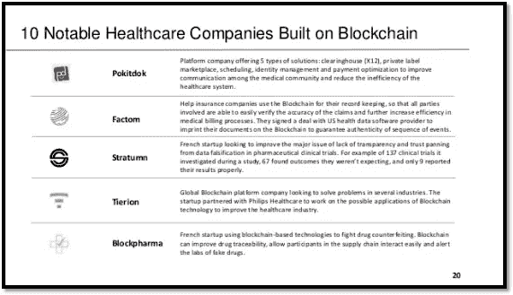

# 区块链科技准备重组医疗保健行业

> 原文：<https://medium.com/swlh/block-chain-technology-is-ready-to-restructure-the-health-care-industry-df3278f037b9>

*   作者萨扬·巴萨克、[拉维尚卡尔·拉马钱德兰](https://medium.com/u/ef5c0b29bf10?source=post_page-----df3278f037b9--------------------------------)、[苏坎特·库拉纳](https://medium.com/u/6d41261644a8?source=post_page-----df3278f037b9--------------------------------)

Sayan 是加尔各答大学高分子科学与技术系的三年级学生

由于比特币的迅速崛起，它在区块链世界的日子令人兴奋不已——数月来，创造和失去财富的消息一直占据着报纸的头版。但公众也开始明白，区块链的潜力远远不止帮助精明的加密投资者致富。

不仅仅是管理数据的新方法。

区块链为许多行业提供了一种全新的存储和管理数据的方式，因此有望彻底改变这些行业，进而改变世界，就像亨利·福特的装配线突然彻底改变了汽车，从而改变了我们的整个社会。

区块链比医疗保健更具破坏性吗？

可能没有哪个行业比医疗保健业面临来自区块链的更大干扰。该行业代表了经济的巨大部分——服务部门预测，到 2025 年，医疗保健支出将占美国国民经济的近 20%。当然，这个行业对普通人的生活质量有着非常实际的影响。在未来几年，如何利用区块链来颠覆和改善医疗保健行业？

图片来源-[https://www . slide share . net/AlexTsado/区块链-医疗保健](https://www.slideshare.net/AlexTsado/blockchain-in-healthcare)

提高病历的可用性。

医生办公室为每个病人准备一个文件夹的大档案室的日子已经一去不复返了。根据现代医疗保健，96%的医院已经采用了电子医疗记录系统。

这些记录系统基本上复制了以前的纸质文件夹，允许医生记录患者就诊期间的健康信息，并轻松搜索患者健康史中的不同因素。但是电子病历系统仍然有一个主要的问题:它们通常是不兼容的，并且是特定于机构的。

《麻省理工技术评论》最近报道，波士顿的医院和医疗服务提供商使用了 26 种不同的电子病历系统，每种系统都以不同的方式表示数据。当然，这些兼容性问题是不方便的，但它们也会扼杀挽救病人生命所需的信息流。

根据健康标准，区块链为 EMR 困境提供了一个可行的解决方案。区块链可以作为一个集中的公共账本，就像比特币交易一样，可以作为病人数据的不可改变的全面记录。

拆除研究筒仓。

医疗保健数据是一种有价值的东西，就像任何有价值的东西一样，它可以被囤积起来，对公众造成损害。机构将数据“储存”起来，不让其他人访问，阻碍了协作和发现。

出于隐私考虑，这对于一些数据类别来说可能是合理的行为，但对于许多其他数据组来说，孤立，无论是有意的经济策略还是低效数据管理的结果，都会阻碍医疗保健研究和进步。《福布斯》最近认为数据孤岛是“医疗保健行业无声的耻辱”。

再次使用区块链的不变公共分类账，存储在区块链的研究数据可以被普遍访问和搜索。通过区块链技术可以减少甚至消除重复的研究工作和“遗漏的联系”。

图片来源-[https://medcity news . com/2017/10/区块链-物联网-医疗保健-行业-需求-知晓/](https://medcitynews.com/2017/10/blockchain-iot-healthcare-industry-need-know/)

人工智能。

因此，假设医疗保健数据变得越来越智能和庞大，对于任何提供商或研究人员来说，突然有了更多兼容的信息可供查阅。除了人工搜索，这些数据还有其他应用吗？绝对的。人工智能旨在帮助包括医疗保健在内的许多行业进行数据分析。一个机器学习的人工智能程序可以比任何人都更快地通过整理数百万个数据点来识别新的创新领域。谷歌和英特尔等公司已经在探索人工智能的数据分类能力。

纳米视觉

一些公司正在为医疗保健问题提出有希望的区块链解决方案。一家特别创新的初创公司是 Nano Vision。Nano Vision 正在创建一个全球化、去中心化的区块链经济，可用于在分子水平上存储健康数据。他们与世界领先的半导体知识产权公司 Arm 合作，生产比针头还小的复杂芯片。

研究人员、医生和普通“公民科学家”可以在各种环境和设备中使用片上系统架构来收集关于超级细菌或心脏病等健康问题的数据。

芯片收集的所有数据都在纳米传感区块链上进行编码，创建了一个不可变的、普遍可访问的重要医疗数据数据库。Nano 的平台使用人工智能和机器学习来不断分析不断增长的数据集，它看的数据越多，就越智能。

人工智能最终将能够预测未来医疗保健研究的新趋势和合作领域，绘制普通人类搜索者可能难以在如此海量的数据中找到的联系。在不久的将来，研究人员和人工智能的合作可能会取得科学突破。

Nano Vision 通过在数据收集芯片上铸造专用加密货币来维持其区块链生态系统。纳米代币可以像其他加密货币一样买卖，在纳米经济中，用户可以分配资金进行对他们特别重要的研究。

最后的想法。

基础设施开发和隐私问题都是区块链医疗保健中断的巨大障碍，但它们并非不可能克服。关键是要关注区块链世界真正的创新者，他们正在探索这一革命性技术的最佳可能用途。纳米视觉是这些创新者之一。

参考文献-

1.[https://www . CMS . gov/news room/MediaReleaseDatabase/Press-releases/2017-Press-releases-items/2017-02-15-2 . html](https://www.cms.gov/Newsroom/MediaReleaseDatabase/Press-releases/2017-Press-releases-items/2017-02-15-2.html)

2.[http://www . modern health care . com/article/2016 05 31/NEWS/160539990](http://www.modernhealthcare.com/article/20160531/NEWS/160539990)

3.[https://www . technology review . com/s/608821/who-will-build-the-health-care-区块链/](https://www.technologyreview.com/s/608821/who-will-build-the-health-care-blockchain/)

4.[http://health standards . com/blog/2017/08/09/medical-record-区块链/](http://healthstandards.com/blog/2017/08/09/medical-record-blockchain/)

5.[https://nanovision.com/](https://nanovision.com/)

6.[http://hanriverconsulting . com/could-区块链-技术-修复-基础-医疗保健行业中的问题/](http://hanriverconsulting.com/could-blockchain-technology-fix-fundamental-problems-in-the-healthcare-industry/)

## 这篇文章发表在 [The Startup](https://medium.com/swlh) 上，这是 Medium 最大的创业刊物，有 320，131+人关注。

## 在此订阅接收[我们的头条新闻](http://growthsupply.com/the-startup-newsletter/)。

