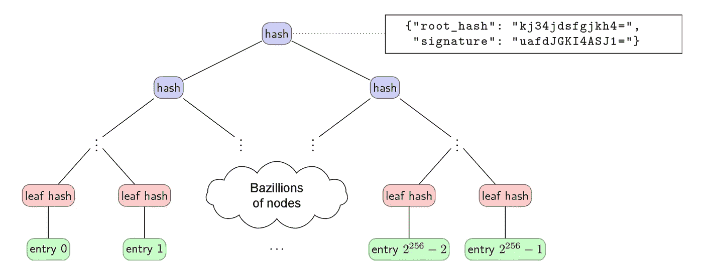

# 区块链替代品

> 原文：<https://medium.com/swlh/blockchain-alternatives-b21184ccc345>

A [Merkle Tree](https://github.com/google/trillian/blob/master/docs/VerifiableDataStructures.pdf)

**适合工作的工具**

*本帖与* [*阿利斯泰尔·波特*](https://medium.com/u/224ac83ad787?source=post_page-----b21184ccc345--------------------------------) *合著。表达的观点是我们自己的，不一定代表我们雇主的观点。*

# 介绍

区块链到底擅长什么？，我们探讨了区块链的优势，并提出了一个评估建议用例的简单框架:

1.  系统是否要求**跟踪全局状态**？
2.  去中心化是用于抵制审查还是系统采用，在这些方面有意义的不同吗？
3.  是否正在实施**最低必要权力下放水平**？

这篇文章进一步探讨了第三个问题:当我们需要防范集中式系统的风险时，我们可以使用哪些工具，我们应该使用哪些工具？

# 集中化的风险

在上一篇文章中，我们将更详细地探讨权力下放的好处。出于我们当前的目的，我们将简化并使用术语“欺骗”来表示与集中化相关的所有类型的不良行为，无论是审查还是系统管理员方面的其他不当行为。例子包括:

1.  审查或禁止该系统的用户
2.  收取不合理的高额系统使用费(寻租)
3.  改变系统规则(例如开始收费)
4.  撒谎或故意篡改数据
5.  犯错、被黑或倒闭

任何高度集中的系统都面临这样的风险，降低这些风险会使系统更加健壮，对潜在参与者更有吸引力。这是一个非常有价值的目标。问题是，我们怎么做？

分散系统(或其中的关键部分)是一个明显的风险缓解策略，但是从系统复杂性和效率的角度来看，它通常是昂贵的。在去中心化的极端，区块链提供了最大限度的保护来对抗中心化的风险，但是也招致了极大的复杂性、低效率和经济浪费。虽然当前围绕区块链的兴奋让许多人认为减轻集中化风险仅仅意味着“尽可能地分散”，因此“使用区块链”，但事实上还有许多替代工具可用。通常这些工具会更有效地完成工作。

我们将这些工具分为三类:防止作弊、发现作弊和从作弊中恢复。我们依次查看每一个，然后尝试将它们综合成一个框架，以评估使用哪一个。

# 防止作弊

我们首先从防止作弊的工具开始。请注意，稍后考虑的工具，可以捕捉作弊并帮助从作弊中恢复，还具有减少作弊动机的额外好处。

**处罚**

惩罚作弊的简单机制有助于阻止作弊。例如，我们可以要求每个参与者缴纳保证金，如果发现他们作弊，保证金将被没收。

另一种方法是让参与者公开承诺不作弊。例如，平台管理员可以公开承诺永远不收费，这将使以后这样做非常痛苦。

**中立第三方**

在某种程度上，我们可以通过让中立的第三方管理系统来防止作弊。例如，互相不完全信任的公司通常会聘请一家与系统无关的独立公司作为系统管理员。当然，还必须管理与中立第三方相关的集中化风险，但这通常相对较低。

# 抓住作弊

在许多系统中，知道欺骗何时发生就足够了，因为(a)表现不好的一方可以被忽略和/或制裁，以及(b)识别欺骗可以允许恢复。此外，作弊的人经常会在这样的事件中损失惨重，作弊的可见性本身就足以抑制作弊。因此，抓住作弊有助于从一开始就防止作弊。为了抓住作弊，我们依赖于可验证性、透明度和审计等品质。

**数字签名**

非对称(即公钥)加密允许我们创建数字签名来证明数字消息的完整性和发送者，使得以后不可能篡改或否认该消息。这是一个非常有价值的工具，我们认为它没有被系统设计者所重视。

例如，在系统中存储一些信息时，我们可能需要一个签名的数字收据。如果信息后来不知何故消失了，我们可以拿出收据作为系统管理员收到信息并且行为不正常的证据。

类似地，我们可以要求在对消息采取行动之前，由可信方对消息进行签名，这允许我们在它造成损害之前捕捉到任何试图欺骗的行为。

**可验证的数据结构**

Merkle(又名 hash)树是一种二叉树，树叶代表数据集，每个内部节点是从其子节点构建的散列。整个数据集可以用一个散列来表示，我们可以有效地证明一个特定的数据片段在树中，并且没有被删除。

这允许我们构建透明的、可证明的仅附加数据结构。这些[可验证的数据结构](https://github.com/google/trillian/blob/master/docs/VerifiableDataStructures.pdf)可以用来使一个中央数据库完全透明和可审计，因此任何作弊行为都可以被迅速抓住。例如，[证书透明性](http://certificate-transparency.org/)使用 Merkle 树来确保证书被正确存储，永远不会被删除或篡改。如果发生任何作弊行为，网络中的所有参与者都会看到。

基于 Merkle 树的系统比像区块链这样完全分散的系统更有效率。例如， [Trillian](https://github.com/google/trillian) 是一个开源的 Merkle tree 系统，每个实例每秒可以处理数千笔交易(相比之下，整个比特币网络每秒只能处理一位数的交易)。

**验证器**

我们可以通过对参与者进行验证来增加发现作弊的机会，这些参与者一直在观察作弊行为，并且能够发出警报。系统的独立验证者越多，我们就越有可能发现作弊。

# 从欺骗中恢复

设计良好的系统还可以降低作弊的风险，当作弊发生时，可以有效地恢复。此类工具可减少对系统的损害。首先，他们也降低了作弊的可能性，因为潜在的作弊者知道作弊是(相对)无效的。

**容错**

为系统增加冗余(例如，多个参与者操作数据库)并使用一致算法来确保内聚性可以提供对抗欺骗的弹性。

没有必要要求无限的冗余——只要足以使欺骗需要几个独立参与者的妥协。容错是自动的也不是必须的。在欺诈很少发生的情况下，甚至一个重量级的恢复机制，如人工对帐，可能就足够了。

**未经认证的参与者**

一种极端形式的容错向未经认证的参与者开放系统。这可能会增加参与者的数量和独立性，使参与者无法有效地合作作弊。

这种程度的权力下放是最近才有可能实现的，这要归功于区块链，它通过工作证明或其他共识机制，为行为得当的参与者提供经济激励。这带来了巨大的额外成本和复杂性，但作为交换，作弊变得极其困难。例如，理论上你可以对比特币发起 51%的攻击，但要做到这一点，你需要聚集巨大的计算能力(大约每秒 13 万亿次运算[目前为](https://data.bitcoinity.org/bitcoin/hashrate/6m?c=m&g=15&t=a))。

**驱逐作弊者**

将作弊者从系统中驱逐出去的能力既是对作弊的抑制，也允许系统将自己与进一步的不良行为隔离开来。建立驱逐机制通常需要容错和某种治理机制来触发驱逐。

**开源数据/代码**

系统运行所依赖的软件和数据的开源使得参与者很容易放弃作弊。当没有驱逐作弊方的机制时，这是一个有价值的方法。这种结果的威胁通常足以从一开始就调整激励措施并防止作弊。应该注意的是，如果只有系统的一部分是开源的，而系统的重要组件仍然是封闭的，那么这种方法提供的实际保护非常少。

# 多大程度的分权才算足够？

为了过分简化，我们可以大致考虑三个层次的去中心化:集中、部分去中心化和完全去中心化的系统。从一个级别移动到下一个级别通过允许我们使用以上讨论的更多工具来提供额外的保护，但是会带来额外的成本和复杂性。通过考虑减轻集中化风险实际上需要哪些工具，我们可以选择满足我们需求的最佳系统设计。

**集中系统**

最简单、最有效的架构是集中式数据库。这显然意味着集中化风险，但是我们可以使用一些工具来降低这些风险:

1.  **数字签名**可以让伪造数据或事后撒谎变得不可能
2.  **可验证的数据结构**可以使数据透明和不可变
3.  添加验证器可以增加发现作弊的机会
4.  **开源**软件和数据可以让参与者在需要时离开系统
5.  处罚此类托管资金或公开承诺可以增加对欺诈的抑制
6.  拥有强大治理规则的中立第三方可以成为可信的系统管理员

**部分分散系统**

如果集中式架构可用的工具不足，将系统分散到几个已知的参与者中可以提供额外的保护，但代价是复杂性增加:

1.  **容错**通过共识机制为作弊参与者提供弹性
2.  **驱逐骗子**随着时间的推移提高系统可靠性

**完全分散系统**

最后，如果上述保护仍然不够，我们可以考虑完全分散系统:向无限数量的未认证参与者开放。虽然这会带来额外的成本和复杂性，但在任何级别的集中化风险都不可接受的情况下，这可能是值得的。

1.  允许未经认证的参与者可能会让作弊变得代价高昂

# 结论

即使在只有一个管理员的系统中，也有许多降低系统集中化风险的技术。我们认为，这些技术中有许多没有得到充分重视，导致许多人错误地认为区块链是任何级别的集中化风险的合适解决方案。

虽然分散化确实提供了一些额外的保护，但它是以增加复杂性和低效率为代价的。区块链实现了前所未有权力下放，提供了进一步的保护，但相关的成本要高得多。

我们建议系统设计人员仔细研究一下，这里讨论的工具的什么组合能够充分降低集中化风险，然后选择能够支持这些工具的最简单、最有效(因此，通常是最不分散的)的系统。

## 这篇文章发表在 [The Startup](https://medium.com/swlh) 上，这是 Medium 最大的创业刊物，有 315，028 人关注。

## 在此订阅接收[我们的头条新闻](http://growthsupply.com/the-startup-newsletter/)。

