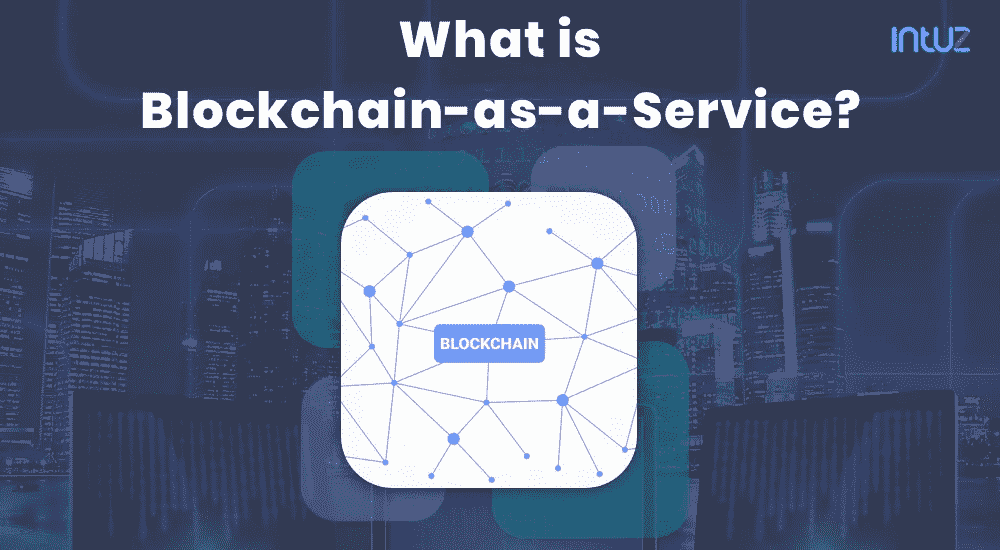
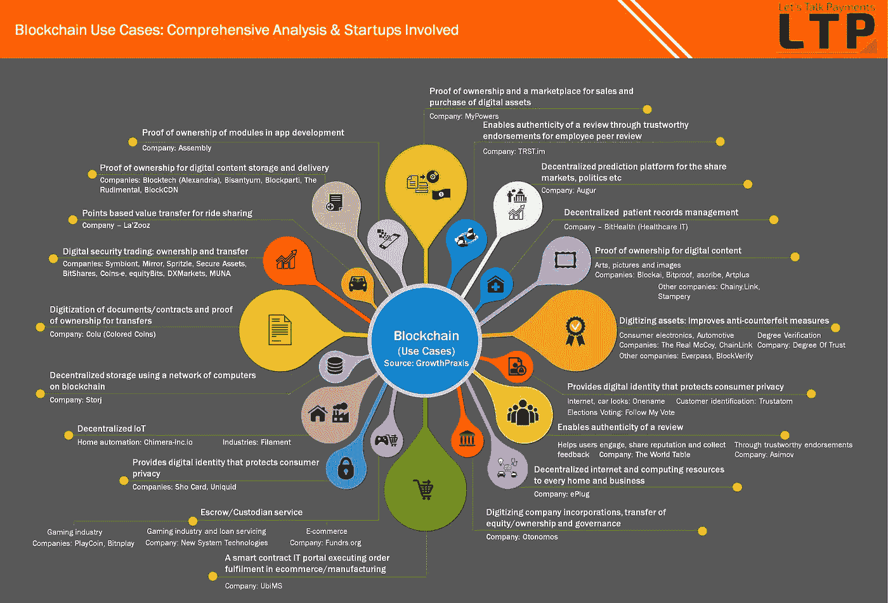

# 区块链即服务如何推动全球企业创新的新阶段？

> 原文：<https://medium.com/swlh/blockchain-as-a-service-platforms-5f8c97850d92>

由于其革命性的主张，区块链技术正在继续颠覆几个行业领域。根据 Gartner 的数据，区块链成为其平台上第二大搜索关键词，搜索量在 12 个月内增长了 400%。对[区块链解决方案](https://www.intuz.com/blockchain)日益增长的兴趣为服务提供商简化 block 技术铺平了道路，也为寻求实施该技术以简化运营的公司铺平了道路。

> [2019 年，](https://www.researchandmarkets.com/reports/4557735/blockchain-as-a-service-market-growth-trends?utm_source=dynamic&utm_medium=BW&utm_code=zfvzsl&utm_campaign=1391711+-+Blockchain-as-a-Service+(BaaS)+Market+Outlook+to+2025%3a+Growth%2c+Trends%2c+Companies&utm_exec=joca220bwd)区块链即服务的全球市值为 4205 亿美元，目前预计到 2025 年底将增至 9828 亿美元，CAGR 也将比 2020 年至 2025 年的预测期高出 15.2%。

随着微软在 2015 年推出区块链即服务，为那些希望在投入巨资开发区块链解决方案之前熟悉该技术的公司开辟了一条新的途径。本质上，区块链即服务允许公司外包区块链平台的开发、运营和维护，并在不偏离核心业务功能的情况下利用其优势。

# **BaaS:这对企业意味着什么？**

为了互动和利用区块链为您的业务，您将不得不建立一个区块链平台上的节点，并维护相同的。这一技术上复杂且繁琐的过程会使企业无法实施高效的区块链系统来进行运营。

科技公司提供区块链即服务，以帮助企业处理复杂的区块链后端。这种参与模式与 IT 行业的其他模式(如软件即服务)类似，正在推动企业快速采用区块链。

# **区块链即服务:寻求变革的现代企业的福音**

BaaS 提供商将为您的企业设置区块链连接节点，并通过处理技术方面的事情来加快采用速度。换句话说，BaaS 使企业能够从托管提供商那里雇佣区块链，该提供商将负责在他们自己的服务器上为您的企业部署和配置区块链。

由于运营规模、集成和部署问题，企业软件的部署并不容易。区块链即服务使企业能够在推出前试用新技术，以降低成本并从一开始就消除复杂性。企业可以在定制解决方案时，首先检查解决方案及其效用，而不是做出昂贵的遗留系统升级的决定。

# **通过区块链即服务推动创新**

区块链技术有无限的应用潜力。从金融到数据管理，从数字化到制造和物流，区块链拥有推动多个行业创新的内在潜力。随着区块链解决方案的推出，区块链已经在全球范围内推动创业文化。

## **区块链创业公司&创新**

Blockchain Use Cases & Startups — [LetsTalkPayments](https://letstalkpayments.com/)

在诸如 BaaS 这样的服务的帮助下，已建立的以及萌芽中的企业可以利用现代技术来转动创新轮，并为社会带来有价值的东西。由于区块链即服务使得获得区块链应用并随着公司的增长而扩展成为可能，它还确保了企业不会在没有可靠的可扩展性证明的情况下进行投资。

**面向企业解决方案的顶级 BaaS 平台**

科技行业中一些最大的公司已经推出了他们专用的企业 BaaS 平台。从基于以太坊的平台到基于 hyperledger 的 BaaS 产品，生态系统已经非常拥挤，让你的公司很难选择一个可靠的提供商。为了帮助您做出决策，我们招募了顶级 BaaS 平台:

*   **Azure 上的微软区块链**

作为市场上第一个区块链即服务平台之一，Azure 上的微软区块链以最少的技术知识促进了区块链网络的部署和配置。该平台非常用户友好，只需点击一下即可完成部署，使公司能够在几分钟内完成区块链网络拓扑的部署。该平台基于以太坊财团区块链，根据网络、存储等消耗的资源向一家公司收费。

*   **IBM 区块链平台**

IBM 的区块链平台使企业能够轻松开发、管理和运营多机构网络。该平台的企业计划提供对交易订购服务、认证机构和网络对等方的访问，是业内最独特的 BaaS 产品之一。最近，IBM 宣布了一种可插拔架构、一种新的共识算法和高级身份管理，使其平台成为最强大、最安全和高度可定制的 BaaS 解决方案之一。

*   **甲骨文区块链云服务**

甲骨文推出了区块链云服务，作为其平台即服务组合的一部分。它使企业能够创造新的收入来源，并通过提供在业务网络上执行安全交易的内部应用程序来降低成本。Oracle 的解决方案嵌入了集成的应用程序、示例代码、设计模式和模板，加快了跨业务网络和应用程序套件的区块链集成，有助于在全球范围内实现快速部署和更快的可扩展性。

*   **AWS 区块链模板**

亚马逊的 AWS 区块链模板使企业可以轻松建立以太坊或 Hyperledger 结构兼容的区块链网络。AWS 模板可以作为开源框架，加速区块链应用程序和分散式网络的部署、配置和开发。凭借分布式共识算法和多种访问控制功能，AWS 区块链模板有望让企业能够开发安全稳定的区块链网络的多个方面。按需启动和关闭功能确保企业可以根据不断增长或减少的需求定制平台。

**组织为什么需要 BaaS 服务？**

许多 IT 组织越来越多地采用区块链技术，该技术具有一系列战略性优势。区块链即服务可能被视为解决小公司在采用区块链技术时面临的所有问题的最强有力的解决方案。你需要做出正确的选择，选择一家能够为你提供区块链开发服务最佳协助的机构。熟练的 BaaS 合作伙伴将始终在项目结束时为您提供最佳结果。

**BaaS 模型是如何工作的？**

BaaS 合作伙伴将依靠所需的资源，并利用所需的技术和基础设施，代表客户设置和维护区块链连接的节点。根据客户的要求，BaaS 合作伙伴在任何分布式分类帐(如比特币、以太坊、R3 Corda、Hyperledger Fabric、Chain Core 或任何 BlockApps)上配置区块链网络。随后，区块链作为服务合作伙伴维护所有关键的区块链相关工件，并保持基础设施处于运行状态。

**企业 BaaS 的优缺点**

节省了项目开发中的大量成本

从开发人员的角度来看，技术易于使用

纯粹专注于根据项目要求定制不同的东西

需要更少的员工，优化资源，为项目增值

由有限的技术深度知识组成

缺乏处理技术和业务解决方案的可见性和控制力

*   面临许多不同的数据合规性挑战

**以下是选择 BaaS 合作伙伴时需要考虑的几点-**

BaaS 合作伙伴应具有开发和部署区块链技术的良好记录，类似于您计划执行的技术。

质量保证是 BaaS 合作伙伴在执行项目时应该掌握和展示的一个重要因素。

安全是实施整个计划时需要考虑的另一个重要因素。重要的是要认识到一个小错误可能会造成严重的问题。

供应商必须在为类似于您组织的操作系统部署基于云的解决方案方面拥有足够的经验。

在雇佣任何 BaaS 合作伙伴之前分析定价选项，并寻找部署后选项。

未来的 BaaS 平台将出现在金融服务、医疗保健和供应链管理等行业领域。由于 BaaS 平台提供的优势，它们将成为区块链技术在全球广泛采用的催化剂。

毫无疑问，由于 BaaS 平台，区块链技术的易用性将使企业能够试验、发展和创造更好的解决方案。越来越多的人采用区块链解决方案，这将推动创新，利用区块链的潜在使用案例，为未来的企业家和消费者生态系统带来好处。如果你准备好成为这场革命的一部分， [***你可以与 Intuz***](https://www.intuz.com/get-started?utm_source=Medium&utm_medium=baasarticle&utm_campaign=BAAS_Medium) 的专家交谈，他们对利用 BaaS 平台实现业务增长有着深刻的见解。

## 这篇文章发表在 [The Startup](https://medium.com/swlh) 上，这是 Medium 最大的创业刊物，拥有+368，366 名读者。

## 在这里订阅接收[我们的头条新闻](http://growthsupply.com/the-startup-newsletter/)。

