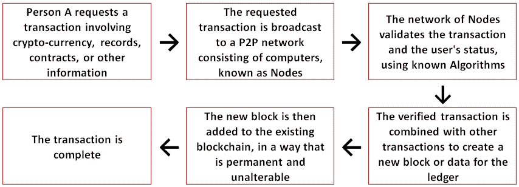

# 基于区块链的日常问题解决方案

> 原文：<https://medium.com/swlh/blockchain-based-solutions-to-everyday-problems-7c0bb3cb83dc>

**-作者萨姆韦德·巴拉德瓦伊**

区块链是世界上第一种加密货币比特币的匿名创始人的创意，中本聪经常被称为“新互联网的支柱”。区块链最初是在 2008 年为比特币提出概念的，现在已经在其他几个领域找到了它的用途。

# **什么是区块链？**

区块链是一个开放的分布式账本，可以以可验证和永久的方式记录双方的交易。交易数据一旦记录，就不能在不改变所有后续数据块的情况下进行追溯修改。这也允许用户在没有太多成本的情况下验证和审计交易。

区块链是一个不断增长的记录列表，使用密码术(防止第三方或公众读取交易数据的秘密代码)进行链接和保护，其中每个区块都包含时间戳和交易数据，由点对点 P2P(用户对用户)网络管理。

**这里要记住的一点是，交易数据没有物理形态，只存在于网络上，对第三方没有内在价值。**

很简单，区块链是一个自主管理和定期对账的数字账本，它不仅可以记录金融交易，还可以记录一切有价值的东西。区块链能够在没有货币和信息仲裁者的任何集中中介的情况下实现价值交换。这是一种自我审计的分类账，每 10 分钟核对一次。

# **相对于集中式数据库的优势:**

集中式数据是可控的，因此数据容易被操纵和窃取。另一方面，在区块链中，不存在信息被黑客攻击和破坏的集中易受攻击点。由于在整个区块链网络中存储了相同的信息块，因此它不能由单个实体控制，没有单点故障，因此不能被追溯修改。区块链上发生的任何事情都是整个网络的功能。

此外，区块链减少了流程的 TAT，而且由于是分布式的，它使数据对所有相关人员都是透明的。区块链技术有助于使传统流程更快、更准确、更安全，同时大幅降低数据库管理的成本。

区块链技术中唯一被报道的问题是由于人为错误和不良意图，而不是因为技术中的任何缺陷。

**区块链在印度的应用:**

区块链的分布式特性使得基于它的任何东西都更加经济、高效和安全。它可用于升级许多经济和社会系统，如:

**一、银行业**:

大多数(如果不是全部的话)银行系统都是围绕中央数据库建立的。数十亿笔交易的对账和处理所涉及的成本、人力、时间和欺诈风险是银行业面临的一个挑战，即使在经历了如此多的升级之后，也无法解决这个问题。比特币和其他加密货币在全球的成功向银行系统展示了区块链技术在减少网上银行欺诈方面的优势。

区块链可以为解决 KYC 验证、尽职调查和信用核保所涉及的成本提供最终解决方案，允许一个实体进行的独立 KYC 验证、尽职调查报告和个人或公司的信用历史被所有其他组织访问。这也可用于反洗钱。

区块链还可以让清算和结算更快、更便宜，甚至比现在更安全。

许多银行已经投入大量资金，研究如何将银行系统迁移到区块链网络。

# **二。在物业注册处保存记录:**

如果现有系统升级到区块链或类似的技术，实施财产欺诈和使用黑钱买卖财产的情况会大大减少。安得拉邦政府已经与瑞典初创企业 Chromaway 合作，建立一个基于区块链的土地所有权系统，以消除土地欺诈和腐败。

# **三世。公共部门数据管理:**

关于 Aadhaar 数据库的安全性和安全性，以及对监控的恐惧，已经有了大量的争论。Blockhain 可以消除这些风险，还可用于存储与出生、死亡、选民登记、PAN 卡和驾驶执照的发放、车辆所有权、法院案件、警察投诉等有关的信息。个人和其他实体将拥有属于他们的数据。

# **四世。股市交易:**

区块链可以降低股市交易中欺诈和操作错误的风险。这里不要忘记，交易几乎是瞬间完成的。纳斯达克和澳大利亚证券交易所已经在探索区块链，以降低成本，提高效率。

**五、云存储**:

区块链提供了数据不会丢失或损坏的额外安全性。

**六。供应链:**

区块链为供应链网络建立了共享、安全的信息流记录。它支持买家、卖家和物流提供商之间更快、更许可、更可审计的 B2B 交互。事件的共享版本提高了供应链效率，改善了多方协作，并简化了纠纷的解决方案。

**七。医疗保健:**

区块链可以通过追踪药品制造商、批发商、药剂师和患者之间的每一笔交易，帮助解决假药问题。它还可以用于在共享的基础上改进和验证健康记录，以获得更好的治疗。

**viii。知识产权:**

区块链可以用于以数字安全的方式对知识产权进行编目和存储。它有可能解决知识产权所有权的认证问题，并允许所有者看到谁在使用他们的作品。

**九世。音乐分发:**

与知识产权类似，音乐家可以以数字安全的方式对他们的音乐进行分类和存储，并在音乐被购买/播放时获得报酬。除此之外，协作和许可也将变得更加高效。它将致力于点对点音乐共享的概念，音乐人的知识产权受到保护，他们的辛勤工作得到报酬。

**十、社交网络:**

区块链可以让社交网络对用户来说更加隐私和有利可图。它可以帮助社交网站和应用程序的用户决定哪些数据可供第三方查看和使用，并为此获得报酬。那不是很有趣吗？这不是梦，而是现实与 ***曜使者*** 。

**xi。实时拼车:**

想象一下一个自我管理的实时乘车共享应用程序，作为 Ola 和优步的替代方案，司机因提供共享乘车服务而获得奖励。总部位于以色列的初创公司 La Zooz 正处于测试阶段，预计将成为全球范围内优步的廉价替代品。

**印度区块链初创企业的总结和融资:**

人们对区块链的了解，在很大程度上，仅限于比特币。然而，在印度见证利用技术解决结构问题的创新解决方案的时代，区块链已经为初创企业和小企业设计和采用基于区块链的解决方案敞开了大门。如果你的企业面临系统性或结构性问题，明智的做法是看看区块链的解决方案是否可行。毕竟，需要是所有发明之母！！！

对于致力于区块链概念的初创企业来说，债务(商业贷款)和私募股权融资选项很容易获得。参观 https://msmemitra.com,为你的区块链创业公司做出最合适的融资选择。

如果您已经为任何世俗问题开发了一个基于区块链的解决方案，并且正在寻求筹集资金以扩大规模，您也可以通过 support@msmemitra.com 联系我们

感谢您的阅读。

—

作者简介:萨姆维德·巴拉德瓦杰是 LLP Msmemitra.com 咨询服务公司的管理合伙人。

***与 MSMEmitra.com 一起，对最适合您企业的融资方案做出明智的决定，利用行业的利益，需要中央政府针对您企业的具体方案和补贴。***

***通用研究来源:***[***https://block geeks . com/guides/what-is-区块链-technology/***](https://blockgeeks.com/guides/what-is-blockchain-technology/)*[***【https://en.wikipedia.org/wiki/Blockchain***](https://en.wikipedia.org/wiki/Blockchain)*

***免责声明:***

****本文整理自各种公开资料和二手数据，MSMEmitra.com 对其内容不享有任何版权，也不保证其准确性。****

**

## *这篇文章发表在 [The Startup](https://medium.com/swlh) 上，这是 Medium 最大的创业刊物，有+ 370，107 人关注。*

## *在这里订阅接收[我们的头条新闻](http://growthsupply.com/the-startup-newsletter/)。*

**