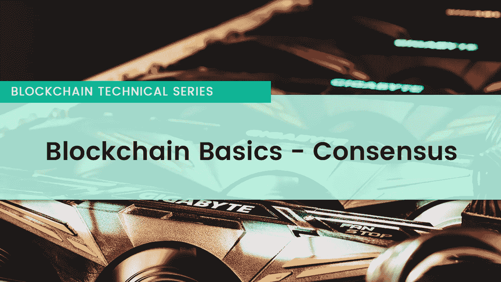

# 区块链共识——你应该知道的

> 原文：<https://medium.com/swlh/blockchain-consensus-what-you-should-know-6b3c858d189a>

区块链技术系列(5 部分系列—第 2 部分)

先说对“共识”这个词的根本理解。达成共识仅仅意味着就某事达成一致。为了达成共识，人们通常会首先从各个角度分析他们希望达成一致的任何事情(无论是物质上的还是意见上的)，测试它，最后得出一个共同的结论。

如果有歧义，你可以选择做更多的测试，以便接受或不接受。有时，你也可以请你信任的人帮你督促和检查。因为我们是人，人们可能会选择通过说谎或说服他人接受他们的说法来影响共识。

正如你所看到的，“信任”是有问题的，这些挑战会对达成共识产生负面影响。区块链通过使你能够以独立的方式达成协议来解决这个问题。那么，区块链是如何达成共识的？

Image: [rawpixel.com](https://www.pexels.com/@rawpixel)

## 区块链共识

这里涉及两件事:共识和算法。当你将这两个概念结合起来时，你最终会得到一套规则和一系列步骤，这些规则和步骤将使你在一群个体中达成广泛接受的决策。

共识算法不仅是区块链技术的重要组成部分，也是指导所有事件序列的网络规则的配方。简单来说，算法布局:当“X”发生时，那么“Y”就会发生，以此类推。通过这种方式，共识算法验证、认证并跟踪块的事务。交易有很多种。它们包括:金融交易，例如使用比特币，访问 [dapps](https://coinsutra.com/dapps-decentralized-applications/) ，交换所有权，交易数据等等。

共识机制在防止重复支出问题上发挥着至关重要的作用。简单来说，双重消费可以比作用数字方式发送一张照片。你寄了一份拷贝，但仍保留着原来的照片。随后，两个人以相似的画面结束。现在想象一下，如果这发生在加密领域！人们会各自进行同样的交易，变得异常富有，最终，整个网络会被摧毁。共识机制在防止这种欺诈方面非常有用。

接下来，让我们来看看区块链常见的共识算法:

## 工作证明

PoW 是最常见的共识评估方法。PoW 的特殊之处在于，它不要求所有节点(网络中的各方)提交它们的特定结论来达成共识。

相反，它使用数据块中的加密交易(散列函数)来创建这样的情况(数学方程，很难求解，但很容易验证其正确性)，其中网络中只有一个参与者被允许分享他们关于所提交信息的结论(数学问题的解决方案)。网络内的其他参与者仅验证结论。散列函数被编程为拒绝虚假信息。

在使用 PoW 的比特币中，公开验证正确答案的一方将获得新挖掘的比特币。寻找和验证有效和正确的哈希值的过程被称为比特币挖掘。向比特币矿工提供激励增加了更广泛的兴趣和参与。一个庞大的参与成员网络创造了一个强大而安全的区块链，在这里你可以轻松匿名地进行交易。

然而，PoW 的缺点是计算的巨大能源成本。采矿机器消耗大量电力，被认为对环境不友好。此外，要成为参与者，你必须在网络中拥有股份。

## 股权证明

PoS 系统使用算法代替哈希计算，从而降低了能源成本。他们也被认为更环保。他们使用简单的数字签名来验证所有权或股权的证明。然后，系统选择一个参与者来验证数据库中的新交易，并创建一个新块。

选择标准基于参与者的持股或股份。你的赌注越多，被选中的几率就越高，反之亦然。PoS 还提供激励措施来帮助建立一个庞大的爱好者社区。

Peercoin 就是一个很好的例子。它使用 PoS 并以交易费奖励成功的验证者，而不是新的“铸造”硬币。铸币是在 PoS 中创造硬币，就像在 power 中采矿一样。虽然用更高的股份奖励参与者将鼓励参与者获得更多的股份，但这也增加了集中化的风险，因为富人越来越富，拥有更多的控制权。

## 委托股权证明(dpo)

DPoS 系统使用所谓的代议制民主。参与者使用他们的硬币赌注为他们的代表投票，该代表将在数据库中验证交易并接收新铸造的硬币。然后，该代表根据一个投票人相对于投票给同一代表的其他投票人所用硬币的多少来与投票人分享硬币。

DPoS 提供了多轮投票的灵活性，参与者可以改变他们的投票，并投票给一位新的代表，如果他们觉得他/她有更好的声誉。DPoS 算法还采用了一种称为 shuffle equation 的功能，这种功能使选择代表的过程变得有点复杂，从而降低了系统事务干扰的风险。

dpo 达成共识的速度也比 PoS 或 PoW 快得多，因为它只有一小部分代表可供选择。然而，这带来了集权的风险，因为代表们可能形成卡特尔或秘密勾结。此外，它旨在给予持有更多硬币的人更多的投票权(就像在 PoS 中一样)，这可以将更多的影响力转移给更少的利益相关者，从而增加集中化的风险。

## 可供选择的事物

更有希望！新的区块链到处涌现，创造了新的共识算法。有些是对现有算法的调整，而另一些则是全新的。我们将简要检查三个。

## 有向无环图

也被称为区块链杀手，这种共识算法不在区块链上运行，并声称由于其超低的交易成本而具有无限的可扩展性。它仍处于试验阶段，一些项目如 Nano 和 IOTA 已经在使用它。

## 授权证明(PoA)

在这种算法中，网络管理员验证并批准交易。它高度集中，但也非常高效。这可能适用于二等兵区块链，那里的成员相互了解，相互信任。

## 实用拜占庭容错(PBFT)

拜占庭式的普遍问题在所有分散式系统中都存在，因为它们接受来自网络中所有各方的交易，即使有些方可能不怀好意。处理这个问题的一种方法是使用 PBFTs。

有三个区块链依赖 PBFT；超账本，涟漪和恒星。在 PBFT 下，必须基于给定网络中的参与者的所有决定达成一致的决定，这些决定是单独地和匿名地做出的。

## 结论

共识算法的重要性怎么强调都不为过。它们有助于防止重复支出，建立信任，保持区块链的完整性。

由于匿名和没有中心化，区块链系统有自己的制衡机制来建立和维护共识。战俘、参与组织和残疾人组织已经取得了一定成功。他们鼓励会员进行交易验证，这保证了他们的区块链的安全。

然而，很明显，前三种共识模型都有其固有的风险，没有一种是完美的。因此，越来越多的模式被创造或改进，以保持区块链的分权精神。

区块链技术系列(第一部分):[采矿生态系统的简单指南——GPU、池和合并采矿](/swlh/a-simple-guide-to-the-mining-ecosystem-gpu-pool-and-merge-mining-ab8870b4597c)

渴望了解更多关于 FundYourselfNow 的信息吗？在我们的 [*电报*](https://t.me/fundyourselfnow) *群上加入我们的众筹革命对话，或者在* [*推特上关注我们。*](https://twitter.com/fundyourselfnow)

## 这个故事发表在 [The Startup](https://medium.com/swlh) 上，这是 Medium 最大的企业家出版物，拥有 356，974+人。

## 在此订阅接收[我们的头条新闻](http://growthsupply.com/the-startup-newsletter/)。

