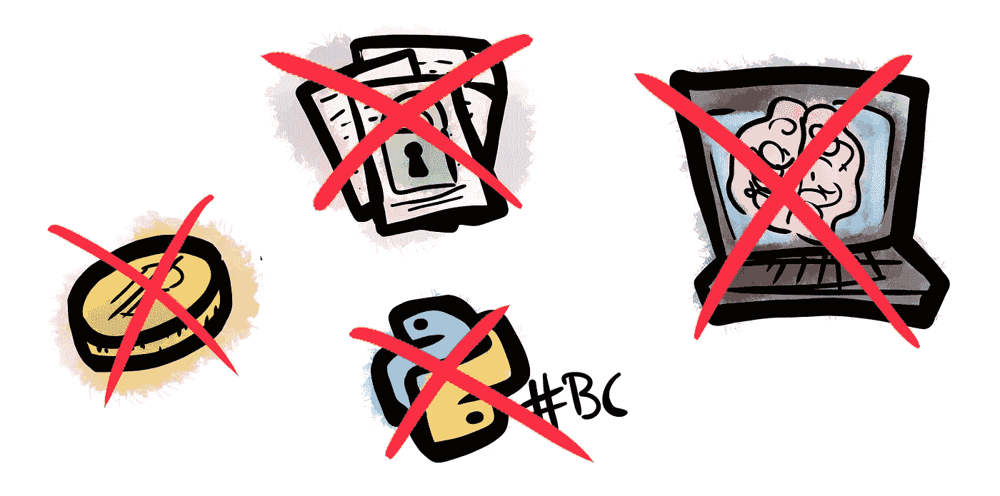
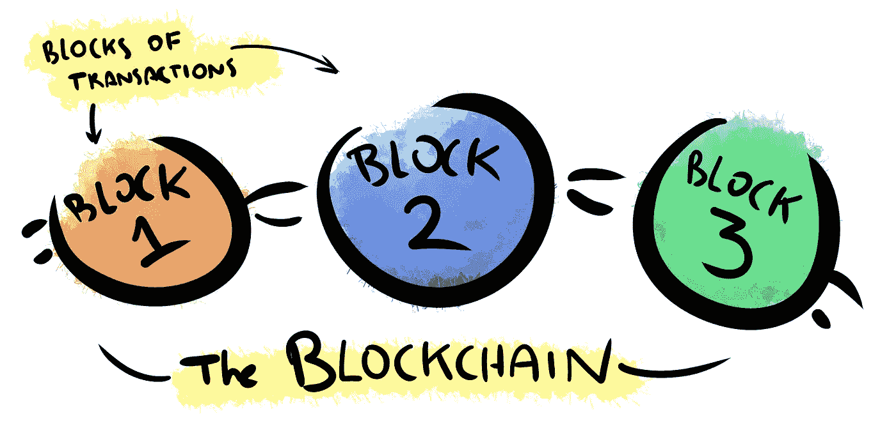
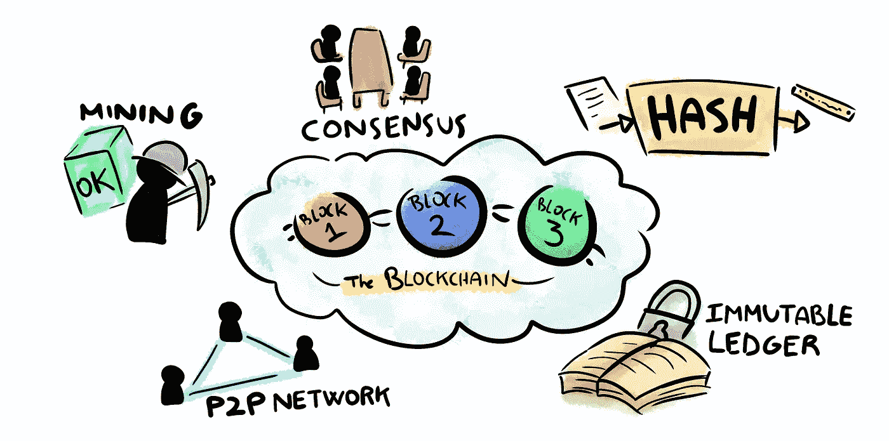
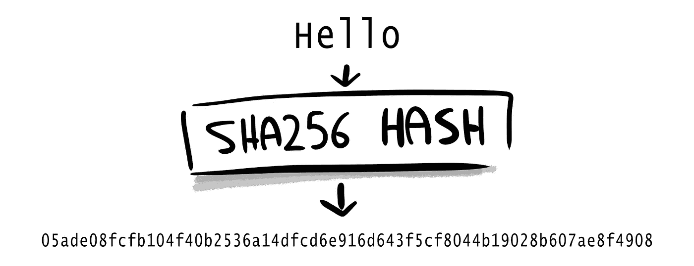
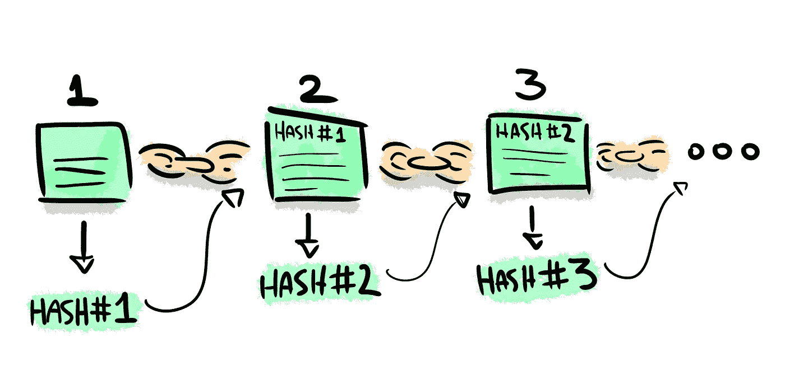
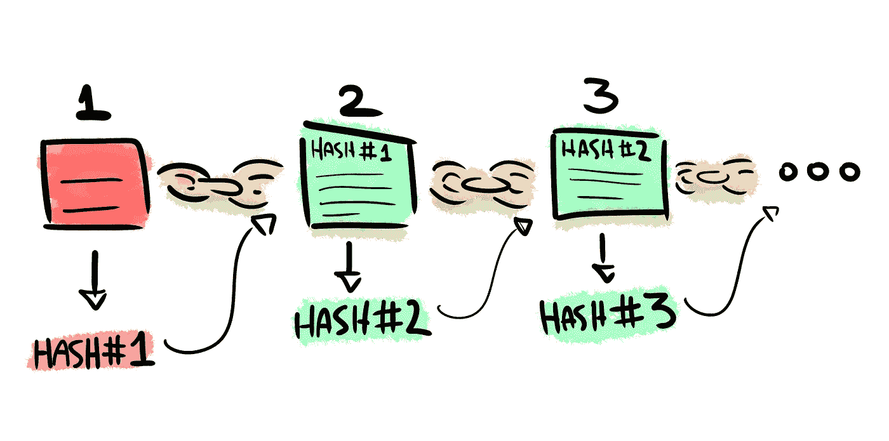
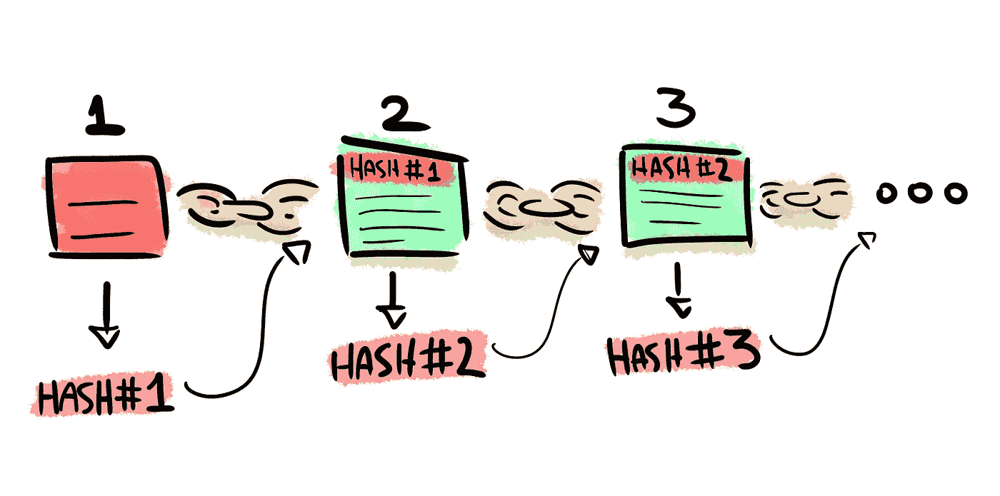
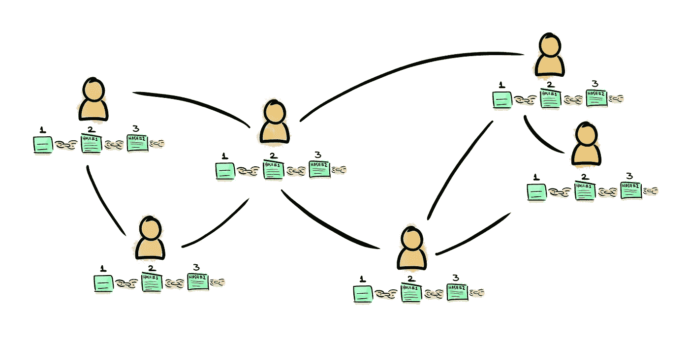

# 假人区块链

> 原文：<https://medium.com/swlh/blockchain-for-dummies-d3daf2170068>

## 理解什么是区块链的五个关键

It 你很有可能在去年听说过“**区块链**这个词。即使我们都倾向于对它有一个模糊的概念，事实是我们大多数人都无法解释为什么每个人都在**的每个创新和技术论坛**上谈论它。

这篇文章总结了**理解区块链**最重要的概念，让你可以参与任何关于此事的对话，而不会在第一句话就迷失。实际上，这篇文章会给你所有你需要的信息，让你**开始思考你自己使用**区块链的案例。你将了解它是什么，以及它是如何工作的。

# 1.什么不是区块链

在描述区块链之前，我们先开始澄清什么是**不是**区块链。许多人误解了这些术语和概念，导致了如下典型错误:

*   区块链**不是加密货币**。

> “区块链是一项技术。比特币仅仅是其潜力的第一个主流体现。”马克·肯尼兹伯格。

*   区块链**不是编程语言。**
*   区块链**不是密码编纂**。
*   区块链**不是 IA 或者机器学习技术。**
*   区块链**不是 Python 库**或者框架。

如果你认为区块链符合之前的想法，不要担心。你很快就会明白为什么你错了。

# 2.区块链:什么事？

**区块链**是一种全新**技术**的名称。顾名思义，它是由 **块**或事务组构成的**序列，这些事务被链接在一起并分布在用户中。**

> “区块链是一个不朽的经济交易数字账本，可以通过编程不仅记录金融交易，还记录几乎所有有价值的东西。”亚历克斯·泰普斯科特。

最终，它作为**一个不可变的交易记录，** **不需要依赖外部权威**来验证数据的真实性和完整性。交易通常是经济的，但是我们可以在块中存储任何类型的信息。

即使当我们称之为“新技术”时，它的起源也被认为可以追溯到 1991 年，当时 Scott 和 Stornetta 在*密码学杂志*上发表了“[如何给数字文件](https://www.anf.es/pdf/Haber_Stornetta.pdf)加时间戳”。然而，由于比特币和其他加密货币的成功，现在它的受欢迎程度有所增加。

早在 2009 年，中本聪就出版了《比特币:一个点对点的电子现金系统》。从那一刻起，区块链就进入了每个人的视野。

# 3.区块链:它是如何工作的？

区块链技术的价值来自于系统的分布式安全。出于这个原因，有几个特征对于开发或使用区块链是完全必要的。

根据区块链的 [SuperDataScience](https://www.superdatascience.com/blockchain/) 课程，我们描述了作为区块链技术基础的 5 个关键概念:

*   加密哈希
*   不可变分类帐
*   P2P 网络
*   共识协议
*   块验证或“挖掘”

Five keys to understand Blockchain

## 加密哈希

**散列是一个加密函数**，它将任何输入数据转换成固定长度的数字串。哈希函数的每一次输入都会产生不同的输出，**结果是确定性的**:如果使用相同的输入，输出值将总是相同的。

散列函数最重要的特性之一是**转换是单向的**:你不能反转函数来生成原始输入。

The Hash function generates a unique code from every different input

有许多算法可以创建不同的散列变体。你可以在这里查看 [SHA256 哈希算法是如何工作的](https://www.freeformatter.com/sha256-generator.html#ad-output)。对于每个输入，算法都生成完全不同的输出，并且不可能预测输入变化将如何影响输出。

**区块链节点使用哈希函数**创建任何交易区块的唯一标识符。每个块都包括前一个块的哈希值。

## 不可变分类帐

这个特性与前一个紧密相关。由于链中的每个块都包含前一个块的散列，**不改变整个链**就不可能修改任何块。因此，这个链条就像一个不变的数字账本。

让我们看一个例子。我们有下面的链，其中每个块都经过哈希处理，哈希包含在下面的链中:

如果匿名攻击者删除、添加或修改第一块中的任何事务，散列#1 将改变:

散列#1 被包括作为块 2 中内容的一部分。因此，HASH#2 也会改变，并且错误会传播到受到攻击的块之后的链中的每个块。然后，用户将声明该链无效。

## 对等(P2P)网络

区块链**不需要任何外部或内部的信任机构**。这是可能的，因为**区块链数据分布在所有用户**中。每个用户都有自己的事务和散列块副本，并且**他们将任何新事务的信息**传播到整个网络。这样，任何人都不可能改变链中的信息，因为它不是由单个实体存储的，而是由*节点*用户的整个网络存储的。

一旦交易块被验证，它就被添加到链中，并且每个用户更新他们的本地信息。即使**攻击者要修改你的本地链**，**网络也不会接受来自被修改的区块链的任何拦截**。

## 共识协议

但是什么是真正的*区块链？**在添加更多块之前，用户需要满足关于链**有效性的协议。*

每当一个节点添加一个新的块时，所有用户都必须通过使用一个公共协议来验证该块。典型地，节点通过 ***工作证明*或*利害关系证明*** 方法达成关于新块正确性的共识。

节点**检查新块是否满足其*证明*方法**的必要条件**，包括块内所有事务**的验证。如果区块有效，他们会将其视为区块链的一部分，并不断添加新的区块。

Every user has its own copy of the Blockchain, and they share any update with the other users

在不同的用户有不同的链明显有效的情况下，他们将丢弃较短的一个，而**选择最长的链作为主区块链**。如同在任何一个 [***拜占庭错误引用*【BFT】**](http://pmg.csail.mit.edu/papers/osdi99.pdf)系统中一样，在总节点数至少 2/3 没有恶意的情况下，它们会满足一个关于正确链的协议。

## 块验证或“挖掘”

对于区块链来说，这一功能实际上**并不完全必要**，正如我们可以从像[信用](/@credits/is-a-blockchain-without-mining-possible-9db40edec8b0)平台这样的例子中看到的那样。然而，由于比特币链，这可能是**关于区块链最著名的事实之一。**

术语“挖掘”指的是**满足*工作证明*要求的行为，用于向区块链添加具有待定交易的新区块**。有许多不同的挖掘方法，因为它们是为链定制的。

PoW 方法通常要求用户创建一个对其散列码有限制的块。由于散列码是不可预测的，“矿工”必须在满足要求之前测试任何可能的组合。这些限制定义了网络的难度。

 [## 比特币案例研究:将基本数字信号处理应用于金融数据

### 简要分析我们可以使用简单的 DSP 概念从金融历史数据中提取的知识。

medium.com](/drill/btc-case-study-applying-basic-digital-signal-processing-into-financial-data-ec34cd47c77b) 

一旦“挖掘者”节点找到了 PoW 问题的解决方案，它们将块添加到链中，并且**每个其他节点根据它们的共识协议**检查 PoW 的有效性。如果区块是合法的，他们会将其包含在自己的区块链本地副本中。

# 3.结论

区块链技术正在**永久进化**。然而，我们可以找到一些关键的支柱来维持这项技术的附加值。

区块链允许用户创建一个**可靠且不可变的系统，用于记录**任何种类的交易或**信息**。不需要外部或内部权威:**每个用户都依赖于技术本身，**遵循预定义的规则来满足共识并确保数据的完整性和真实性。

 [## 互联网变了:HTTP/3 将不再使用 TCP

### QUIC 是下一版本 HTTP 的基础协议

medium.com](/drill/the-internet-changes-http-3-will-not-use-tcp-anymore-427e82eeadc0)  [## 理解事件驱动架构(EDA):未来的范例

### EDA 会对你的数字业务有什么贡献？

medium.com](/drill/understanding-event-driven-architectures-eda-the-paradigm-of-the-future-7ae632f056bb) 

## 这篇文章发表在 [The Startup](https://medium.com/swlh) 上，这是 Medium 最大的创业刊物，拥有+394，714 读者。

## 在这里订阅接收[我们的头条新闻](http://growthsupply.com/the-startup-newsletter/)。

