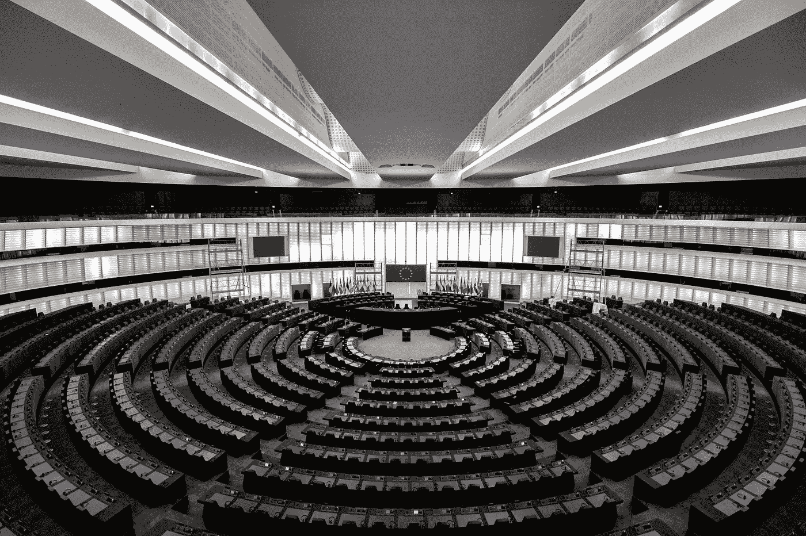

# 欧洲的区块链:希望的召唤

> 原文：<https://medium.com/swlh/blockchain-in-europe-a-beckon-of-hope-f1f84702c4ae>

Source: Frederic Köberl, Unsplash

随着欧洲认真采取措施接纳区块链，它已成为最受关注的大陆之一。不同于某些国家的反应，好像这种技术在我们的未来不会存在，欧盟已经在评估分布式账本技术的潜力方面处于领先地位(DLT)。

**创世纪**