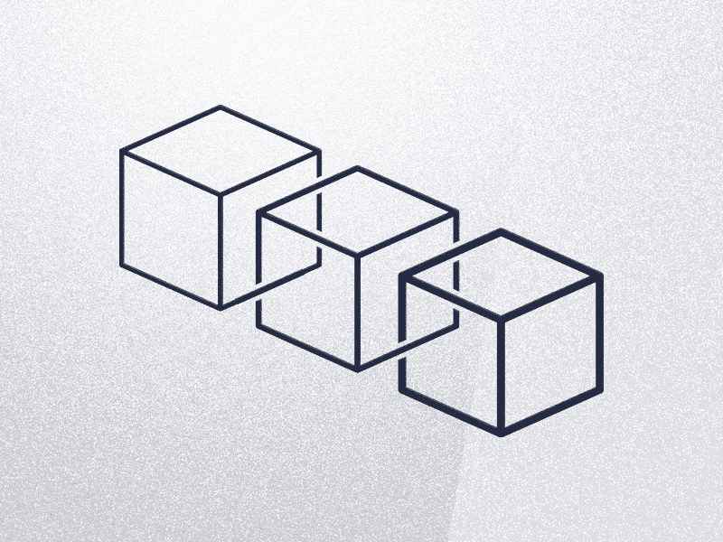
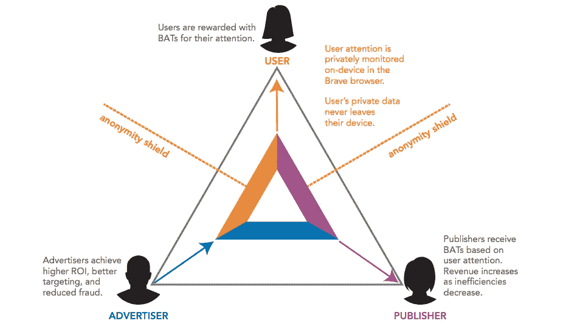
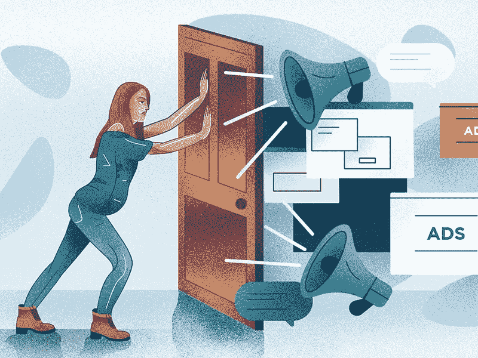

# 区块链驱动的广告颠覆数字营销

> 原文：<https://medium.com/swlh/blockchain-powered-ads-to-disrupt-digital-marketing-e690d75f9839>

没有很多东西像营销技术一样变化如此之快，对街上的话语如此敏感。尤其是数字营销，是最有争议的话题。不管你喜欢它还是讨厌它，你都不能否认这样一个事实，那就是如果你经营任何类型的业务，你都需要它。数字营销话题两极分化的原因是其方法和结果的可变性。在市场上没有万能的成功策略，但是有各种各样的方法可以达到目的。

# 为什么传统广告需要改变

给予企业家前所未有的曝光数字广告是有一定代价的。妥协的伦理是在每个社会和政治层面提出的问题。因为互联网无处不在，对每个人来说，询问信息保存在哪里，谁使用它，谁从这一切中受益是公平的。

> 毫不奇怪，数字营销正被那些获得最多数据和运营最大曝光平台的人所控制。这给了这些大公司影响其他所有人营销演变的杠杆。

这可能不一定是一件坏事，但它肯定不是互联网曾经的公平竞争环境。数字广告中错误和腐败行为的可能性是不可避免的。他们说，“即使是坏了的钟，一天也有两次是对的”，我们已经在广告中见证了这一点。

Image credit: [GQ](https://www.gq.com/)

在我们最近的一篇帖子中，我们谈到了互联网上旧的数字营销的消亡，以及是时候[拔掉我们所知道的网络广告的插头了。在这篇文章中，我们将介绍营销产品和服务的新方法。尤其是区块链广告。](https://shakuro.com/blog/time-to-pull-the-plug-on-web-ads/)

问题是:区块链能颠覆数字营销吗？如果是这样，又是如何做到的？它能经受住大笔资金、驯服的尝试和立法吗？数字营销会从平台奴役中解放出来，避免为了过程而不是结果去推巨石上山吗？这与加密货币和比特币无关，所以如果你喜欢那种类型的区块链，也许这不适合你。如果你是一名正在寻找新领域的营销人员或企业家，你可能会有兴趣进一步研究这个话题。

# 然而，区块链是什么？

有许多定义都与该技术的不同应用相关，但简而言之，区块链是由各种用户创建、保存和认可的潜在的无限数字记录集。

> *区块链的力量不仅在于加密货币，还在于在网络上做事和使用网络的创新方法。*

到目前为止，应用于各行各业的区块链技术已经成为一股不可忽视的力量。主要由于全新的安全方法，区块链已经在经济的金融和数据驱动领域产生了很大影响。

区块链是一组按固定顺序连续分组的记录。这些记录持续记录块内的每个事务以及新块的添加。每当一台新电脑加入区块链数据库，它就会得到一份存储在区块链上的所有信息和交易数据的副本，直到那一刻。每个块都相互依赖，这使得所有改变事务(删除或撤销)的尝试都不切实际和不合理。区块链的本质使得数据在设计上是安全的。这些记录不是存储在一个地方，而是分布式的，因此不会被关闭、转售、干预等等。

> “一个完全由单一实体控制的区块链几乎不会带来额外的好处。”——菲尔·戈麦斯

# 数字稀缺

尽管如此，一个合理的担忧出现了:既然数字对象有无限的潜力，我们如何将它与有限的物理对象联系起来？阻止我们复制数字货币的最终力量是什么？我们如何确保“数字稀缺”并一致遵循一个共同的规则集？

使区块链成为可能的第一件事是缺乏任何一种管理政策的中央权威。如果没有单一源听写值，则该值是双方同意的。由于没有权威机构能够降低数字资产的价值，它的价值就和我们认为的一样高。

截至目前，我们习惯于将这些稀缺的数字资产视为金钱，因为当我们谈到有限的有价值的实体时，这是最有意义的。然而，这个概念远远超出了金钱。我们对复制的数字媒体没有意见，甚至倾向于容忍我们自己的数字身份在各种平台上被复制。现在想象一下，你生产的每一件东西或分享的每一个数据都以一种所有权得到数学验证的方式交付。这重塑了我们所知道的所有权和财产的概念。

> *区块链赋予我们拥有独一无二的数字资产的能力，无论它是什么，都不会以非法的方式丢失。*

为了将区块链的特征缩小到与数字营销相关的特征，让我们抓住以下思路:

*   区块链是无权限的。让任何人加入区块链并不需要权威。
*   区块链是透明的。它带有所有节点上的可见时间戳数据。
*   区块链是不可变的。这些数据不能被删除或更改，因为它们都有副本。
*   区块链是分布式的。数据可以在多个地方访问。
*   区块链是自愿的。所有相关方需要就数据状态达成一致。
*   区块链是可持续的。相关各方不能以破坏性的方式影响系统。

Image credit: [Liz Broekhuyse](https://dribbble.com/Theysaurus)

区块链是由匿名科学家或一群人发明的，他们的唯一目的是将互联网提供的基本便利设施去制度化。由于缺乏对垂直市场的信任，区块链的支持者不情愿地引诱机构进入区块链技术。我们还没有看到高度标准化和监管的混合机构拥抱一些开放的区块链特征。截至目前，区块链正在各种行业和应用中积极实施，导致更多的曝光率和更快的公众意识增长。

# 区块链的营销策略是什么？

用广告轰炸消费者的大量产品和服务是生产和促销技术发展的直接结果。然而，事情并不总是这样。以前，制造商会生产他们认为对客户影响不大的相关产品。在有限竞争的条件下，你可以忽略*想要的*，而专注于*需要的*。但是随着竞争的不断加剧，企业意识到销售顾客*想要的东西*更加有利可图。

最重要的是，如果你能刺激*想要*的欲望，你可能会找到主矿脉。结果，产品出现了分支，创造了大量旨在取悦我们的感官和提供实用性的产品。这使得市场营销从宣传你生产的产品转变为

> *识别客户需求并将其转化为可销售产品的科学。*

同样的技术进步使得更好的产品被制造出来，也扩大了它们的存在范围。厂商购买后不再下台。与客户保持联系，不断向他们推销新产品，提供更新等等，是现代数字产品的足迹。

许多营销人员认为，如果与加密货币骗局无关，区块链与他们所做的相去甚远。部分原因是不明真相的人立即采用了这种技术，部分原因是可信信息不足，但区块链是你在策划营销活动或制作广告时最不会想到的事情。

如上所述，我们甚至还没有接近展现区块链的全部潜力。据我们所知，区块链可用于营销，原因如下:

*   区块链提供的透明度和安全性吸引了所有主要行业和为它们服务的框架。
*   利用区块链营销可以从区块链获益的产品或服务是双赢的。
*   区块链拥有成为营销领域颠覆性创新的所有工具，在这种情况下，它将重塑现有范式，并允许更低成本的替代品和更小的生产商拥有发言权。

如果留住客户不再是一个巨大的挑战，吸引新用户仍然是一个挑战。最古老和最有效的方法之一就是广告。这可以说是营销过程中最昂贵的部分。

> 由于稀缺性，广告必须在正确的时间、正确的地点吸引顾客。

广告必须保证顾客满意。他们只有一次射门机会，没有权利射偏。如果广告真的击中要害，为了使产品有效，关于产品营销的其他一切都必须准确无误。难怪公司希望在最大曝光度的资源上建立他们的广告活动。这让这些平台拥有了根据自身需求影响市场的终极杠杆。这与区块链被迫面对的制度化和中央集权是一样的。

Image credit: [Alexei Vella](https://dribbble.com/alexeivella)

传统系统旨在从参与者进行的交易中获利。想象一下，一个国家的部分领土被一条巨大的天然气管道占用。该国可能不生产这种气体，但事实上，它允许这种气体通过其领土，这是咬一口真正的生产者，最终，客户的原因。

从这个意义上说，在谷歌上开展广告活动是在为其提供的中介服务买单。不能保证最终客户会喜欢你的产品。不能保证你会对你得到的曝光感到满意。唯一利益得到保障的是谷歌。

> *区块链有能力改变这种情况，它将第三方排除在等式之外，并打破互联网早期创建的分层系统。*

如果我们将这一概念视为最高价值，区块链技术可以为更好的产品营销带来一系列更切实的优势。

# 品牌真实性

假冒和盗版产品是当今工业的祸根。大量侵犯版权的数字内容和充斥市场的假冒品牌对每个人来说都是一个巨大的问题。知名企业不得不应对这一问题，规模较小的生产商也不得不面对这样一个事实:他们所在的细分市场中存在大品牌仿冒品。

区块链可以打破这种不健康生态系统的方法之一是与物联网(IoT)运动联合起来。这种组合能够通过建立和促进参与者的生态系统来减少山寨产业，这些生态系统旨在维护产品身份和声誉的分散共识。简单来说，它是这样工作的:

> *一个生产商给每件产品赋予一个唯一的键。该密钥被绑定到追踪物品历史并提供附加真实信息的区块链记录。*

例如， [Chain of Things](https://www.chainofthings.com/) 是一家开发集成区块链和物联网硬件解决方案的公司，旨在解决物联网在身份、安全性和互操作性方面的问题。如上所述，他们正在解决的问题非常明显:身份，安全，隐私，开放数据倡议的一致性，以及区块链必须提供的好处的完全清晰。

大多数技术复杂的产品在二级市场上都有较长的生命周期。通过使用具有区块链交易记录的唯一标识符，可以提供透明的所有权链，并且在某些情况下增加某些二手真实商品的价值。

像 [Grailed](https://www.grailed.com/) 这样非常重视真实性和二次使用的商店，可以从他们创造的关于原产地和以前所有权的不可更改的记录的互动体验中受益。

作为用户，我们可以获得产品制造的时间和地点的信息，但不能知道产品是如何到达我们手中的，产品运输过程中是否发生了任何不道德的事件，运输条件是否得到了适当的遵守，等等。与物理领域的交叉在这里尤其重要，因为基于传统提单系统的运输存在遭受欺诈和盗窃的问题。物联网正在研究一种协议，在这种协议中，运输中的关键法律文件(提单)可以在区块链上数字化，运输合同的条款可以根据包裹随附的物联网设备(智能代理)提供的实时数据以代码形式执行。

> *智能提单会指定某些设备作为运输合同中某些条款的监控代理。这些设备将简单地将数据中继到智能 BoL，充当装运条件数据的“硬件 Oracle”。*

我们提到的区块链特色只涵盖了它们为营销提供的一点点机会。在现实中，我们不断受到产品和数据的轰炸，我们已经变得脸皮很厚，但这并不总是好的。这确实节省了大量的时间和精力，但它也过滤掉了小生产者的努力，把他们误认为囤积的一部分。偶尔，一封好的电子邮件会被标记为垃圾邮件。

带宽解决方案无法实现生产的分散化，需要独特而透明的产品开发方法。区块链在其中根深蒂固的方法。

# 扰乱广告

数字营销的一个已被证明的优点是能够根据从用户处接收到的/关于用户的信息来定向广告。数字广告作为一种昂贵的媒体，需要所谓的相关广告来优化成本，并从每天从多个平台扔给用户的大量可用广告中脱颖而出。

数字广告的流通涉及三方:

*   广告客户
*   出版者
*   用户

这些团体之间的联系创造了营销关系的生态系统，并决定了广告的成功。不幸的是，这种架构通常过于复杂，不符合团队工作的标准。信任问题、欺诈、不一致只是这个生态系统中的一些不利因素。it 透明度不仅是一种奢侈，而且几乎是不可能的。

一个合理的问题出现了:为什么制造商和客户之间的关系变得如此纠结，并充斥着中间商？答案很简单，今天的制造商无法自己接触到他们的客户。他们需要有人按照指定的地址传递信息。然后，广告行业为提供商和客户之间的代理产生了一个角色。

> *在这个注意力成为货币的世界里，营销人员不得不应对像用户口味和情绪一样多变而短暂的东西。*

对于广告商来说，这意味着他们必须完全依赖分析数据来做出更好的营销决策。因此，分析数据成为另一种商品，并导致更多的黑幕、偷猎和不道德的收购。最重要的是，这些数据没有经过验证，这使其达到了盲目营销的水平。这最终会对品牌产生反作用，违背整个营销目的。从广告用户和消费者的角度来看，不道德地使用和获取他们的个人数据是导致不满的一个关键因素。

因此，很明显，数字广告运行着一个恶性循环，不断暴露出多个漏洞。可验证的数据是这些问题的核心。

> *公司之所以开始在广告中采用区块链原则，是因为区块链教的本质总是得到验证且难以修改。*

基于区块链的技术在数据隐私、透明度和安全性方面所能提供的，可以极大地改变数字广告。一个创新的广告系统可以帮助用户重新获得对其个人数据的控制，并且只在适当的激励下提供这些数据。这为广告商创造了一个更健康的环境，使他们能够更有效地接触目标受众，并消除代理人的影响。

Image credit: Basic Attention Token

# 区块链解决广告问题

面对巨型媒体公司的互联网使得免费信息的获取公开化。为了将人们联系起来，让每个人都有发言权，为他们提供各种方式来表达他们的数字自我，企业必须为互联网的技术发展买单。这些成本反映在公司追逐收益以弥补这些预付款上。

## 隐私

随着广告越来越受欢迎，公司开始收集用户信息，以便提供更有针对性和相关性的广告体验。首先，这些是用来解读人口统计和兴趣的行为数据。后来，它变成了所有可供收集的个人数据。

> 媒体公司陷入了一个漏洞，他们拥有一种资源，人们会把他们的信息带到那里，并在没有称赞用户的情况下将这些信息转化为有形的利润。

从技术上讲，他们收集的数据不属于任何人。就像我们的眼睛捕捉开阔视野中的景象。也就是说，拥有自己的个人数据是用户的基本权利，因此对其隐私有控制权。

在实践中，这可能意味着建立点对点的信息交流平台。用户数据将被安全地存储在区块链上，受到加密技术的保护。这些信息放在那里比放在有兴趣收集信息的公司的数据库里更安全。理论上，区块链是可以被黑客攻击的，但它比大多数用来存储信息的平台要安全得多。

## 广告特异性

另一个对大多数广告产生不良心理影响的大问题是，大多数广告都不相关。

> *这个问题对双方都有影响，因为它没有提供客户价值，也没有积极影响投资回报率。adblock 是这种装置的直接结果。*

甚至个性化的广告也不总是击中目标，主要是因为缺乏有意识的用户参与广告。试图根据未经核实的数据找出广告是浪费资源。事实上，如果我们接受这个事实(我们也应该接受),即用户是他们数据的所有者，那么广告就应该只基于他们提供的数据。

Image credit: [Berin Catic](https://dribbble.com/berincatic)

这样，营销人员只接触到对特定广告相应感兴趣的用户。基于区块链的营销系统通过引入广告主、出版商和用户的分散网络来解决这一问题，这些人都对有价值的交易感兴趣。

> *区块链方法是这样一个系统的核心。它运行智能合同，促进激励机制，在需要时引入分散的加密货币选项，并安全地存储流程中涉及的所有数据。*

# 结论

区块链承诺的所有好处都是非常实际和合乎逻辑的。一个单一来源、透明且可信的生态系统解决了如此多的虚假账户、数据机器人和重复数据问题。一些现在根本不可能做的事。

> *区块链几乎提供了数字广告的自我净化机制。*

目前还没有大公司投资这项技术，区块链市场的大部分都是由小公司运营的，他们更多的是技术背景，而不是创业背景。大多数人仍然对区块链驱动的解决方案持怀疑态度，这给了这个行业很大的实验和探索空间。

## 这个故事发表在[的创业](https://medium.com/swlh)上，这是 Medium 最大的创业刊物，有 355，974+人关注。

## 订阅接收[我们的头条新闻](http://growthsupply.com/the-startup-newsletter/)。

