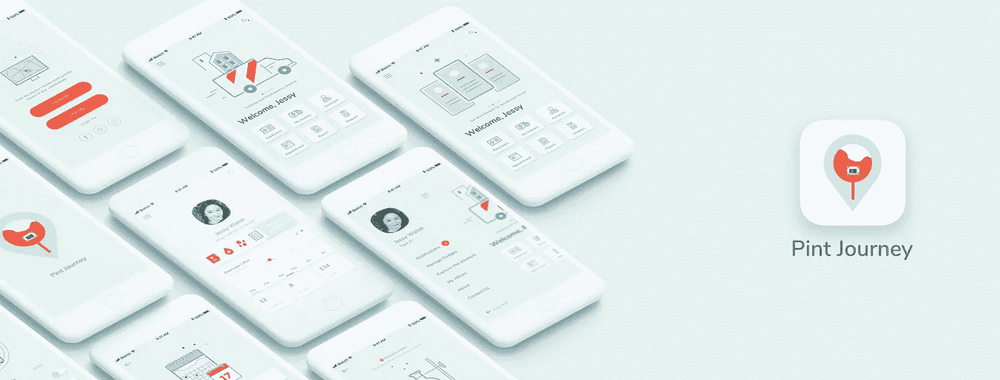
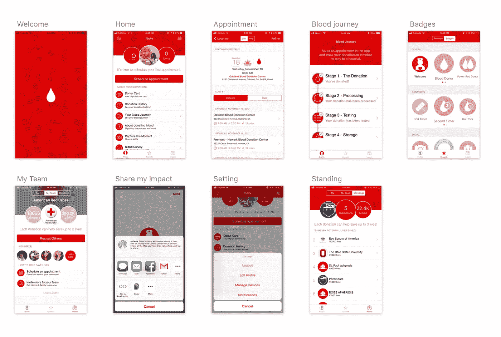
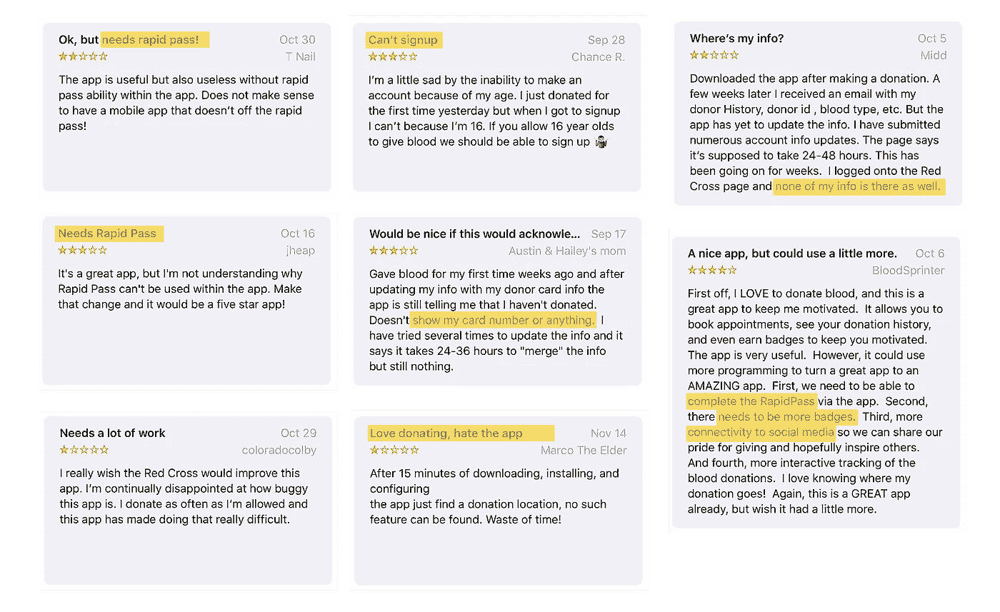
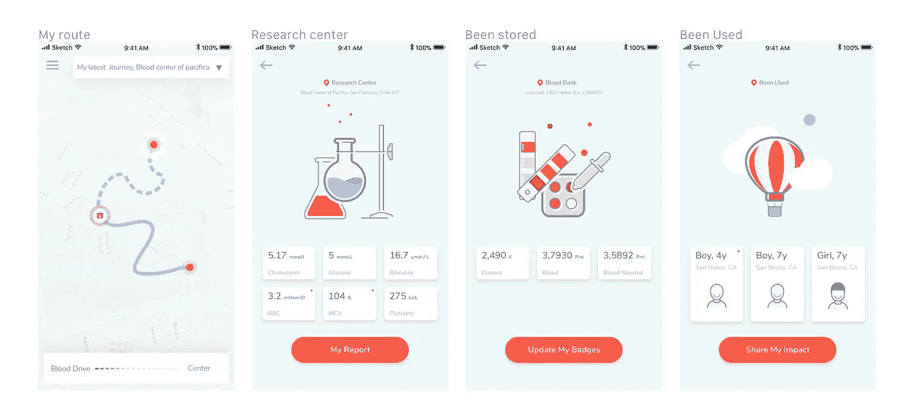
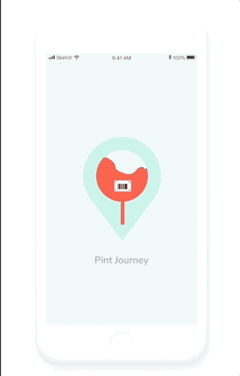
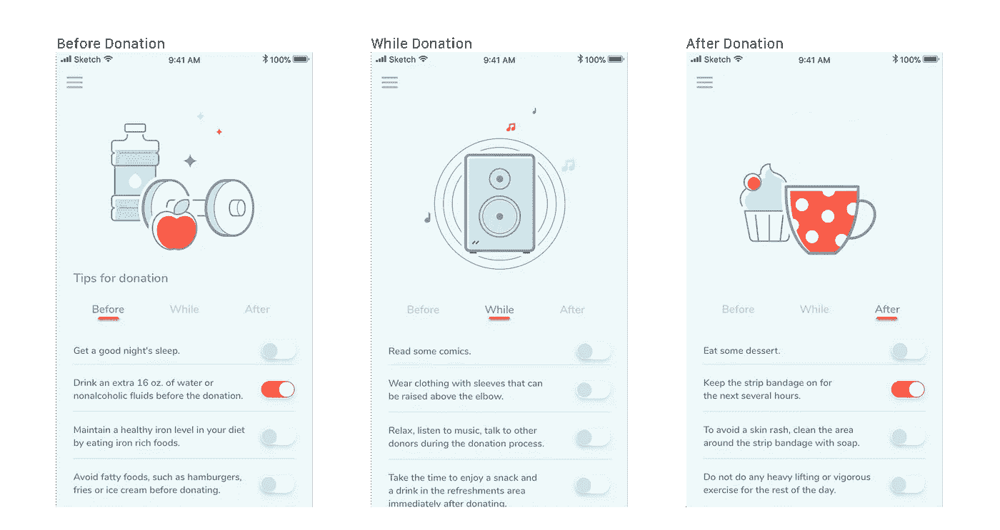
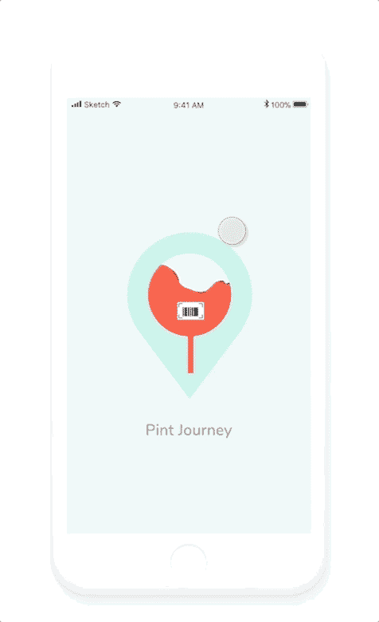
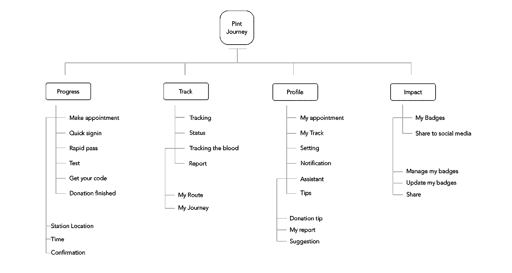

# 献血体验再设计案例研究

> 原文：<https://medium.com/swlh/blood-donor-app-redesign-case-study-4e0325d3a346>

我第一次献血的经历发生在我大学一年级的时候。我认为这是一个帮助别人的机会。当我到达献血车时，我必须填写许多表格，然后才能提供我的血样。手术后给了我牛奶和饼干，但我没有收到任何关于我的血液可能对谁有帮助的信息。

我认为这是一个干预的机会，我想知道，我们如何让献血者和受血者参与进来？我们如何为新献血者创造愉快的体验？答案可以在这个献血者应用程序重新设计项目中找到。经过大量的用户研究和观察，**我增加了两个相当受欢迎的功能:跟踪&个人助理。**

# 设计评论

美国红十字会献血者应用程序是连接献血者和献血系统的强大平台。他们将拯救生命的力量放在用户的手中，使献血变得更容易。该应用程序允许用户找到附近的红十字会献血活动，安排预约，创建或加入社区，并在全国排行榜上跟踪他们的影响。除了我的经历，我了解到献血是一种陌生而新鲜的经历。然而，当我第一次打开这个应用程序时，我被整个红色的页面震惊了。我感觉整个页面都是 CTA 的内容:预约。**从我的角度来看，最初的视觉设计感觉有点太混乱、太压抑、太吓人了。交互设计的某些部分也可以改进。**

## 不足之处

**视觉:**

*   **手术过于暴露(许多人将血液与危险联系在一起)**
*   **不一致的图标(象形文字、同位素、平面、轮廓)**
*   **按钮样式不一致(平面、渐变)**
*   **无文本对齐(数字，CTA)**

**交互:**

*   **新用户不友好(要填写的表格太多)**
*   **用户不能直接分享信息**
*   **缺乏效率(签到时间太长)**
*   **缺少徽章**

## 会很好的…

**添加新功能:**

*   **追踪你的血液(更多详情)**
*   **向助手咨询技巧(个人接触)**
*   **领取新徽章(激励)**
*   **登录更快**

# 设计目标

这个项目的两个目标是**改善整体用户体验和增加人们想要的新功能**。对于第一阶段，我想通过审查应用程序商店评论来解决现有的用户界面/UX 问题。第二阶段，我专注于优先考虑和添加人们喜欢的新功能(跟踪、助手、快速通过或其他人们想要的功能)。

如果我在这个团队工作，将应用商店的应用评级从目前的 3.5/5 星提高到 4/5 星可能是可衡量的目标之一。另一项措施是扩大献血者的群体。

# 解决存在的问题

我访问了太平洋血液中心(这是一个商业血液中心)，并采访了各种献血者，以了解他们的献血经历。我了解到我遇到的每一位捐献者都曾捐献给其他中心，于是我问他们是否可以比较一下他们的经历。从这一点上，我了解到他们想更多地了解他们的血液流向何处，以及血液将帮助谁。

我还与不喜欢献血的人交谈，问他们为什么。大多数反应包括对血液本身的恐惧，以及他们不喜欢红色。我认为这是一个潜在的视觉机会，可以在这个案例研究中探索。

# 用户访谈

## **第一部分:应用用户，但不是捐赠者**

*   “这个应用程序看起来像 Yelp，红色太多”
*   “我很想献血，但这个界面让我觉得很恐怖”
*   “很难预约”
*   “在使用该应用程序并查看所有徽章和影响后，我没有动力献血”
*   “他们不关心我，他们只关心我的血”

## **第二部分:捐赠者**

**献血者——第一次**

“我感到有点压力，因为人们靠得很近。我知道我的血将会帮助某人或者被送到实验室做一些研究。如果他们不用我的血，我想知道原因。”

**红细胞捐献者—第一次**

“在捐赠过程中，我感到紧张和好奇。我很想继续关注我的血液。我想我会很高兴看到我的血是否拯救了某人的生命。”

**血细胞捐献者—第二次**

每次我献血时，我都要验血单。那样的话，我感觉自己做了体检，却拿不出抽血的报告。我可以接收跟踪血液的消息，但如果我能获得更具体的信息，我将不胜感激。

# App store 评论分析

# 改进

在这个过程中，我进行了额外的采访，让人们解释为什么他们不去血液中心。大多数反应包括对血液本身的恐惧，以及他们不喜欢红色。我把这种恐惧作为灵感，创造了一个视觉设计，使红色显得友好和平易近人。我将红色和浅色进行了对比，并探索了各种不会引起献血或针头恐惧的插图。

# 优先考虑新功能

当我们谈到献血时，我们大多数人都把它视为一项任务，而不是真正地帮助别人。我们没有这样做的动机，我们没有意识到我们的血是需要的。首先，一些受访者告诉我，如果他们知道自己的血液被使用，他们会有更多的动机去献血。此外，当他们每年进行两次包括血液测试在内的身体检查时，他们在进行血液测试时并没有感到不舒服。那么，如果我们能把验血和献血结合起来，也就是说一旦你献血了，你就能收到一份关于你的血液的报告，那会怎么样呢？

## 功能#1:跟踪

**用户案例 1:查看我的血路**

## 功能#2:助手

**用户案例二:准备献血**

# 信息架构

# 我学到的东西

## 使用行为模型找到更好的解决方案

当我开始做这个项目时，我不知道如何让更多的人参与献血。在我阅读了行为设计理论并使用了福格行为模型后，我试图通过提高他们的社会影响来增加动机，并通过快速通过来简化活动。通过这种方式，我们可以找到一个更好的解决方案来扩大献血者群体。

## 颜色很重要

由于害怕红色，很多人不想使用原来的应用程序，我尝试使用一些柔和的颜色来适应用户友好的体验。

*如果你喜欢这篇文章，请随意点击那个按钮👏帮助其他人找到它。*

## 这篇文章发表在 [The Startup](https://medium.com/swlh) 上，这是 Medium 最大的创业刊物，有 290，182+人关注。

## 订阅接收[我们的头条新闻](http://growthsupply.com/the-startup-newsletter/)。

